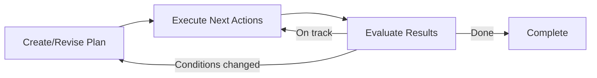

# Action Policies

Action policies are the decision-making core of Colony agents. They determine what actions an agent takes at each step, how it plans to achieve its goals, and how it adapts to new information. Agents can use custom action policies by implementing the `ActionPolicy` interface. Colony's main implementation is `CacheAwareActionPolicy`, which uses Model-Predictive Control (MPC) for iterative planning and execution. `CacheAwareActionPolicy` uses a LLM-based planner that examines (*at every step*) the planning context (including relevant memory entries) and action descriptions (exported by the agent's `AgentCapabilities`) enabled at that step. The LLM planner selects the next action, and the dispatcher executes it where the results are automatically written to memory, thus closing the loop between planning, execution, and learning.

## The LLM as Planner

Colony does not emphasize rigid plan graphs, state machines, or rule-based orchestration, although these approaches can be provided as `ActionPolicy` implementations. Instead:

1. The framework gathers context (goals, constraints, execution history, available actions)
2. The LLM reasons about what to do next
3. The framework executes the chosen action
4. Results feed back into context for the next iteration

A "plan" in Colony is the LLM's current thinking plus execution history -- not a fixed sequence. The LLM can revise or abandon its plan at any point based on new information.

!!! tip "Real-Time Adaptability"
    Strategies can adapt to data at runtime rather than following prescribed workflows.


## `ActionPolicy` Base Class

`polymathera.colony.agents.base.ActionPolicy` defines the contract:

```python
class ActionPolicy(ABC):
    async def execute_iteration(
        self, state: ActionPolicyExecutionState
    ) -> ActionPolicyIterationResult:
        """Execute one iteration of the policy loop."""
        ...

    async def serialize_suspension_state(
        self, state: AgentSuspensionState
    ) -> AgentSuspensionState:
        """Serialize policy state for suspension."""
        ...

    async def deserialize_suspension_state(
        self, state: AgentSuspensionState
    ) -> None:
        """Restore policy state from suspension."""
        ...
```

The policy manages which `AgentCapability` instances are active via `use_agent_capabilities()` and `disable_agent_capabilities()`. Active capabilities provide action executors that the policy can invoke.

The execution state passed to each iteration:

```python
class ActionPolicyExecutionState(BaseModel):
    current_plan: ActionPlan | None = None
    iteration_history: list[ActionPolicyIterationResult] = []
    iteration_num: int = 0
    custom: dict[str, Any] = {}  # Arbitrary state for the policy
```

Each iteration returns:

```python
class ActionPolicyIterationResult(BaseModel):
    policy_completed: bool = False
    success: bool
    error_context: ErrorContext | None = None
    requires_termination: bool = False
    blocked_reason: str | None = None
    idle: bool = False            # Policy requests IDLE state
    action_executed: Action | None = None
    result: ActionResult | None = None
```

## Two-Phase Action Selection

Action selection follows a two-phase process to manage the potentially large action space (many `AgentCapability` instances, each with multiple actions):

!!! bug "This description is outdated"
    First phase select "action groups" (an action group is the set of all `@action_executor` methods on a given `AgentCapability`), then the second phase selects and parameterizes a specific action within that group. This two-phase process is intended to reduce the size of the action selection prompt.


### Phase 1: Action Selection
The LLM receives descriptions of all available actions (from active capabilities) and chooses which action to take. Actions are typed via `ActionType` -- planning, reasoning, tool usage, communication, memory management, orchestration, and output.

### Phase 2: Parameterization
Once an action type is selected, the LLM receives the specific action's JSON schema and fills in parameters. This separation prevents the LLM from being overwhelmed by the full parameter space of all actions simultaneously.

Actions are defined on capabilities via the `@action_executor` decorator, which auto-infers input/output schemas from type hints:

```python
from polymathera.colony.agents.patterns.actions.policies import action_executor

class QueryCapability(AgentCapability):
    @action_executor(reads=["page_graph"], writes=["query_results"])
    async def route_query(
        self,
        query: str,
        max_results: int = 10,
    ) -> list[str]:
        """Route query to find relevant pages."""
        ...

    @action_executor(exclude_from_planning=True)
    async def update_index(self, page_id: str) -> None:
        """Not exposed to LLM planner -- invoked programmatically only."""
        ...
```

`@action_executor` parameters:

- `action_key`: Identifier for the action type (defaults to method name)
- `input_schema` / `output_schema`: Override auto-inferred Pydantic schemas
- `reads` / `writes`: Scope variable dependencies for dataflow tracking
- `exclude_from_planning`: Hide from LLM planner (for programmatic-only actions)
- `planning_summary`: Custom description for the LLM planner
- `tags`: Domain/modality tags for filtering (e.g., `frozenset({"memory", "expensive"})`)

## `ActionPolicy` I/O Contract

The policy operates on structured input and produces structured output:

**Input** (`ActionPolicyInput`):

- `goals`: What the agent is trying to achieve
- `constraints`: Boundaries on behavior
- `initial_context`: Starting context for the task
- `action_descriptions`: Available actions from active capabilities

**Output** (`ActionPolicyOutput`):

- `success`: Whether the policy achieved its goals
- `final_result`: The produced result
- `exported_results`: Results to share with other agents
- `learned_patterns`: Patterns discovered during execution

The I/O contract is declared via `ActionPolicyIO`:

```python
class MyPolicy(CacheAwareActionPolicy):
    io = ActionPolicyIO(
        inputs={"query": str, "max_results": int},
        outputs={"page_ids": list[str], "analysis": dict},
    )
```

## Model-Predictive Control

`CacheAwareActionPolicy` (in `polymathera.colony.agents.patterns.actions.policies`) uses Model-Predictive Control (MPC) for plan execution:



1. **Plan**: The LLM creates or revises a plan based on current context
2. **Execute**: Execute only the next few actions (not the full plan)
3. **Evaluate**: Check results against expectations
4. **Adapt**: If conditions changed, revise the plan; otherwise continue

This accounts for the nonstationary nature of multi-agent environments -- other agents may change shared state, new information may invalidate assumptions, and resource availability fluctuates.

## `CacheAwareActionPolicy`

The primary policy implementation, extending `EventDrivenActionPolicy`:

```python
class CacheAwareActionPolicy(EventDrivenActionPolicy):
    """Action policy with multi-step planning.

    - Creates plans using configurable strategies (MPC, top-down, bottom-up)
    - Executes plans incrementally via Agent.run_step
    - Handles replanning when needed
    - Coordinates with child agents event-driven (no polling)
    """
```

Key features:

- **Configurable planning strategies**: MPC (default), top-down decomposition, bottom-up aggregation
- **Event-driven coordination**: No polling for child agent results; events trigger re-evaluation
- **Cache context in plans**: Every plan includes working set information, access patterns, page graph summary, prefetch hints, and shareable vs. exclusive page designations
- **Sub-plan generation**: JIT sub-plan creation when executing composite actions, with arbitrary depth and maintained position in the plan tree

!!! bug "Explain cache-awareness in detail"
    Explain how the `CacheAwareActionPlanner` works

## Replanning

Replanning is triggered by:

- **Plan exhaustion**: All actions in the current plan have been executed
- **Failure**: An action fails or produces unexpected results
- **New information**: Events from other agents or blackboard changes invalidate assumptions
- **Resource changes**: VCM page availability changes

Replanning strategies:

- **Revision**: Modify the existing plan to account for new information
- **Backtracking**: Undo recent actions and try a different approach
- **Escalation**: Request help from a supervisor agent
- **Re-creation**: Discard the plan entirely and create a new one

!!! warning "Cache-conscious revision"
    When revising plans, the policy preserves cache locality when possible. Abandoning a plan may mean abandoning cached pages, so the cost of re-planning is weighed against the cost of cache misses.

## Hierarchical Planning

Plans can be hierarchical -- higher-level plans use high-level actions that encapsulate lower-level plans:

1. A parent agent creates a high-level plan with composite actions
2. When executing a composite action, a sub-plan is generated JIT
3. The sub-plan may itself contain composite actions, creating arbitrary depth
4. The policy maintains its position in the plan tree for context

This allows natural decomposition of complex tasks without requiring the LLM to plan everything up front.

## Dataflow `Refs` and The `PolicyPythonREPL`

!!! bug "Explain Refs and the PolicyPythonREPL in detail"
    Explain how action results are stored in the REPL and how action parameters can reference previous results, planning context, capability state, or blackboard entries via typed `Ref` objects. This enables dataflow between actions without manual state threading or storing large amounts of intermediate data in agent memory or context window. Also explain how the `PolicyPythonREPL` allows the LLM to execute arbitrary Python code for complex reasoning or dynamic action generation, with access to the same context and `Refs`.


Action parameters generated by the `CacheAwareActionPolicy` can reference results from previous actions, planning context, capability state, or blackboard entries via typed `Ref` objects. This enables dataflow between actions without manual state threading:

```python
class Ref(BaseModel):
    """Reference to a value in scope for dataflow between actions.

    References follow a path syntax:
        $variable           - Scope variable from current/parent scope
        $results.action_id  - Previous action's result
        $global.CapName     - Agent capability
        $shared.key         - Blackboard entry
    """
```

## Blueprint Pattern

!!! bug "Reference the full blueprint pattern in the example gallery"

Policies are configured via `ActionPolicyBlueprint`, created through the `bind()` class method:

```python
blueprint = CacheAwareActionPolicy.bind(
    planning_strategy="mpc",
    max_iterations=50,
)
```

Blueprints are validated for serializability at creation time. The `agent` reference is injected at instantiation time, not bound in the blueprint.
