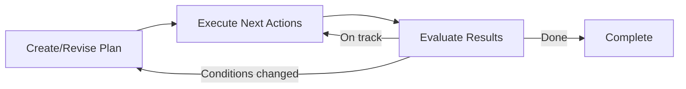

# Action Policies

Action policies are the decision-making core of Colony agents. They determine what actions an agent takes at each step (including how it interacts with other agents), how it plans to achieve its goals, and how it adapts to new information at runtime (*replanning*). Agents can use custom action policies by implementing the `ActionPolicy` interface. Colony's main implementations are `CacheAwareActionPolicy` and `CodeGenerationActionPolicy`, which use Model-Predictive Control (MPC) for iterative planning and execution. Both action policies use a LLM-based planner that examines (*at every step*) the planning context (including goals, constraints, execution history, and relevant memory entries) and action descriptions (exported by the agent's `AgentCapabilities`) enabled at that step. The LLM planner selects the next action, and the dispatcher executes it where the results are automatically written to memory, thus closing the loop between planning, execution, and learning. Other `ActionPolicy` implementations can provide simpler and cheaper but more rigid plan graphs, prescribed workflows, state machines, or rule-based orchestration.

A "plan" in Colony is the LLM's current thinking plus execution history -- not a fixed sequence. The action policy can revise or abandon its plan at any point based on new information.


## The Action Policy Space

Action policies that dynamically adapt can be categorized along two dimensions (see diagram below):

1. **Planning Pipeline Structure**: How much structure and guidance is provided to the LLM in its planning process?
    - *None*: LLM decides the action plan with no scaffolding. This is the most flexible but also the most difficult for the LLM to get right.
    - *Optional*: **Planning capabilities** are provided but it is left up to the LLM to use them.
    - *Full*: The action policy follows a pre-programmed planning pipeline or sequence.
2. **Execution Mode**: How expressive is the plan execution flow produced by the LLM?
    - *Turing-complete*: LLM generates code that can express any logic, including loops and conditionals.
    - *Action Sequence*: LLM selects from a fixed set of actions with no internal control flow. Data flow is mediated by the agent memory or a policy-specific mechanism (e.g., `PolicyPythonREPL`).

!!! info "Planning Capabilities vs. Domain Capabilities"
    Planning capabilities (cache analysis, plan learning, plan coordination, plan evaluation, replanning) are orthogonal to domain capabilities (page analysis, code synthesis, hypothesis testing). Both can be exposed to the LLM as `@action_executor` methods, but planning capabilities are more likely to be used in structured planning pipelines while domain capabilities may be more useful for flexible code generation.


Moving right adds structure; moving up adds expressiveness. The same capabilities work across all positions in this space.

<div style="margin:1.5rem 0;">

<style>
.ap-svg text { font-family: 'Inter', system-ui, -apple-system, sans-serif; }
.ap-svg .r-codegen { fill: #f5f3ff; stroke: #8b5cf6; }
.ap-svg .r-json    { fill: #eff6ff; stroke: #3b82f6; }
.ap-svg .r-cell    { fill: #fafafa; stroke: #d4d4d4; }
.ap-svg .r-cell-hi { fill: #ecfdf5; stroke: #10b981; }
.ap-svg .t-title   { fill: #1e1b4b; }
.ap-svg .t-body    { fill: #374151; }
.ap-svg .t-muted   { fill: #6b7280; }
.ap-svg .t-label   { fill: #7c3aed; }
.ap-svg .t-green   { fill: #064e3b; }
[data-md-color-scheme="slate"] .ap-svg .r-codegen { fill: #1e1338; stroke: #7c3aed; }
[data-md-color-scheme="slate"] .ap-svg .r-json    { fill: #0c1929; stroke: #2563eb; }
[data-md-color-scheme="slate"] .ap-svg .r-cell    { fill: #1a1a1a; stroke: #525252; }
[data-md-color-scheme="slate"] .ap-svg .r-cell-hi { fill: #052e16; stroke: #059669; }
[data-md-color-scheme="slate"] .ap-svg .t-title   { fill: #c4b5fd; }
[data-md-color-scheme="slate"] .ap-svg .t-body    { fill: #d1d5db; }
[data-md-color-scheme="slate"] .ap-svg .t-muted   { fill: #9ca3af; }
[data-md-color-scheme="slate"] .ap-svg .t-label   { fill: #a78bfa; }
[data-md-color-scheme="slate"] .ap-svg .t-green   { fill: #6ee7b7; }
</style>

<svg class="ap-svg" viewBox="0 0 760 400" xmlns="http://www.w3.org/2000/svg">
  <!-- Axis labels -->
  <text class="t-muted" x="380" y="18" text-anchor="middle" font-size="11" font-weight="600">Structure / Guidance provided to LLM ───────►</text>
  <text class="t-muted" x="15" y="200" text-anchor="middle" font-size="11" font-weight="600" transform="rotate(-90,15,200)">Execution Mode ▲</text>
  <text class="t-muted" x="25" y="200" text-anchor="middle" font-size="11" font-weight="600" transform="rotate(-90,25,200)">(Turing Completeness)</text>

  <!-- Column headers -->
  <text class="t-muted" x="155" y="42" text-anchor="middle" font-size="10">None</text>
  <text class="t-muted" x="390" y="42" text-anchor="middle" font-size="10">Optional</text>
  <text class="t-muted" x="625" y="42" text-anchor="middle" font-size="10">Full</text>

  <!-- Row labels -->
  <text class="t-label" x="45" y="120" text-anchor="middle" font-size="10" font-weight="600" transform="rotate(-90,45,120)">Code Gen</text>
  <text class="t-muted" x="55" y="120" text-anchor="middle" font-size="9" transform="rotate(-90,55,120)">(Python)</text>
  <text class="t-label" x="45" y="260" text-anchor="middle" font-size="10" font-weight="600" transform="rotate(-90,45,260)">JSON</text>
  <text class="t-muted" x="55" y="255" text-anchor="middle" font-size="9" transform="rotate(-90,55,255)">action selection</text>

  <!-- Top row: Code Generation -->
  <rect class="r-cell" x="65" y="55" width="230" height="110" rx="6" stroke-width="1.2"/>
  <text class="t-title" x="180" y="80" text-anchor="middle" font-size="11" font-weight="600">CodeGen Minimal</text>
  <text class="t-muted" x="180" y="96" text-anchor="middle" font-size="9">LLM writes Python</text>
  <text class="t-muted" x="180" y="110" text-anchor="middle" font-size="9">Domain actions only</text>

  <rect class="r-cell-hi" x="300" y="55" width="230" height="110" rx="6" stroke-width="1.2"/>
  <text class="t-green" x="415" y="80" text-anchor="middle" font-size="11" font-weight="600">CodeGen + Planning</text>
  <text class="t-green" x="415" y="96" text-anchor="middle" font-size="9">Programmatic APIs via</text>
  <text class="t-green" x="415" y="110" text-anchor="middle" font-size="9">browse("programmatic")</text>
  <text class="t-green" x="415" y="126" text-anchor="middle" font-size="9">Planning + Execution modes</text>

  <rect class="r-codegen" x="535" y="55" width="210" height="110" rx="6" stroke-width="1.2"/>
  <text class="t-title" x="640" y="80" text-anchor="middle" font-size="11" font-weight="600">CodeGen + Full</text>
  <text class="t-muted" x="640" y="96" text-anchor="middle" font-size="9">Full planner callable</text>
  <text class="t-muted" x="640" y="110" text-anchor="middle" font-size="9">in generated code</text>

  <!-- Bottom row: JSON Action Selection -->
  <rect class="r-cell" x="65" y="195" width="230" height="110" rx="6" stroke-width="1.2"/>
  <text class="t-title" x="180" y="220" text-anchor="middle" font-size="11" font-weight="600">MinimalActionPolicy</text>
  <text class="t-muted" x="180" y="236" text-anchor="middle" font-size="9">LLM picks actions</text>
  <text class="t-muted" x="180" y="250" text-anchor="middle" font-size="9">No planning infrastructure</text>

  <rect class="r-cell-hi" x="300" y="195" width="230" height="110" rx="6" stroke-width="1.2"/>
  <text class="t-green" x="415" y="220" text-anchor="middle" font-size="11" font-weight="600">Minimal + Planning</text>
  <text class="t-green" x="415" y="236" text-anchor="middle" font-size="9">@action_executor wrappers</text>
  <text class="t-green" x="415" y="250" text-anchor="middle" font-size="9">LLM uses if it wants</text>

  <rect class="r-json" x="535" y="195" width="210" height="110" rx="6" stroke-width="1.2"/>
  <text class="t-title" x="640" y="220" text-anchor="middle" font-size="11" font-weight="600">CacheAwarePolicy</text>
  <text class="t-muted" x="640" y="236" text-anchor="middle" font-size="9">Pre-programmed pipeline</text>
  <text class="t-muted" x="640" y="250" text-anchor="middle" font-size="9">learning → cache → strategy</text>

  <!-- Caption -->
  <text class="t-muted" x="380" y="345" text-anchor="middle" font-size="11" font-style="italic">Same planning capabilities work across all positions.</text>
  <text class="t-muted" x="380" y="362" text-anchor="middle" font-size="11" font-style="italic">Green cells = planning capabilities available to the LLM.</text>
  <text class="t-muted" x="380" y="379" text-anchor="middle" font-size="11" font-style="italic">Structure / Guidance provided to LLM takes the form of granularity of planning abstractions or primitives:</text>
  <text class="t-muted" x="380" y="396" text-anchor="middle" font-size="11" font-style="italic">None=LLM decides everything, Optional=available but not forced, Full=pre-programmed sequence.</text>
</svg>

</div>

**Bottom-left**: `MinimalActionPolicy` — LLM picks from `@action_executor` **domain actions**. No planning infrastructure.

**Bottom-middle**: `MinimalActionPolicy` + planning capabilities registered on the agent. The LLM sees `analyze_cache`, `get_learned_patterns`, `check_plan_conflicts` as available actions and MAY use them (its choice).

**Bottom-right**: `CacheAwareActionPolicy` — full *pre-programmed, rigid, hard-coded pipeline* or sequence: learning → cache → strategy → replan. LLM doesn't decide when to analyze cache; the planner always does it before prompting.

**Top-left**: `CodeGenerationActionPolicy` with no planning capabilities. LLM writes Python that *parameterizes* and calls **domain actions** only.

**Top-middle**: `CodeGenerationActionPolicy` with planning capabilities. LLM writes Python that can call `self.agent.get_capability_by_type(CacheAnalysisCapability).analyze_cache_requirements(...)` — the full programmatic API, not just `@action_executor` wrappers via `browse("programmatic")`. Supports **planning mode** and **execution mode** for context window optimization.

**Top-right**: `CodeGenerationActionPolicy` with full planning pipeline available. LLM can call the entire planner programmatically OR bypass it and call individual components.


### Dual-Interface Pattern

Each planning capability exposes both a programmatic API (for planners and code generation) and simplified `@action_executor` wrappers (for JSON-selecting policies):

<div style="margin:1.5rem 0;">

<svg class="ap-svg" viewBox="0 0 640 280" xmlns="http://www.w3.org/2000/svg">
  <!-- Main container -->
  <rect class="r-codegen" x="20" y="20" width="600" height="240" rx="8" stroke-width="1.5"/>
  <text class="t-title" x="320" y="48" text-anchor="middle" font-size="13" font-weight="600">AgentCapability (e.g., CacheAnalysisCapability)</text>

  <!-- Programmatic API box -->
  <rect class="r-cell" x="40" y="65" width="250" height="100" rx="6" stroke-width="1"/>
  <text class="t-title" x="175" y="85" text-anchor="middle" font-size="11" font-weight="600">Programmatic API</text>
  <text class="t-muted" x="175" y="102" text-anchor="middle" font-size="9">(complex params, system objects)</text>
  <text class="t-body" x="55" y="124" font-size="10">analyze_cache_requirements(</text>
  <text class="t-muted" x="65" y="138" font-size="9">  PlanningContext, DiGraph</text>
  <text class="t-body" x="55" y="152" font-size="10">) → CacheContext</text>

  <!-- LLM API box -->
  <rect class="r-cell-hi" x="350" y="65" width="250" height="100" rx="6" stroke-width="1"/>
  <text class="t-green" x="465" y="85" text-anchor="middle" font-size="11" font-weight="600">@action_executor API</text>
  <text class="t-green" x="465" y="102" text-anchor="middle" font-size="9">(simple params, LLM-producible)</text>
  <text class="t-body" x="365" y="124" font-size="10">analyze_cache(</text>
  <text class="t-muted" x="375" y="138" font-size="9">  page_ids: list[str]</text>
  <text class="t-body" x="365" y="152" font-size="10">) → dict</text>

  <!-- Shared logic arrow -->
  <line x1="290" y1="130" x2="350" y2="130" stroke="#7c3aed" stroke-width="1.5" stroke-dasharray="4,3"/>
  <text class="t-label" x="320" y="120" text-anchor="middle" font-size="8">shared</text>
  <text class="t-label" x="320" y="128" text-anchor="middle" font-size="8">logic</text>

  <!-- Callers -->
  <text class="t-muted" x="175" y="190" text-anchor="middle" font-size="9" font-weight="600">Called by:</text>
  <text class="t-body" x="175" y="206" text-anchor="middle" font-size="9">CacheAwareActionPlanner</text>
  <text class="t-body" x="175" y="220" text-anchor="middle" font-size="9">CodeGenerationActionPolicy</text>
  <text class="t-muted" x="175" y="234" text-anchor="middle" font-size="8">(direct method call or generated code)</text>

  <text class="t-muted" x="465" y="190" text-anchor="middle" font-size="9" font-weight="600">Called by:</text>
  <text class="t-body" x="465" y="206" text-anchor="middle" font-size="9">MinimalActionPolicy</text>
  <text class="t-muted" x="465" y="220" text-anchor="middle" font-size="8">(via JSON action selection)</text>
</svg>

</div>
Each planning component is an `AgentCapability` with `@action_executor` methods for the LLM. But it ALSO exposes a **programmatic API** (plain async methods without `@action_executor`) that `CacheAwareActionPlanner` and `CodeGenerationActionPolicy` call directly.

The `@action_executor` methods are thin wrappers that:
1. Accept simple, LLM-producible parameters (strings, lists, dicts)
2. Call the programmatic API internally
3. Return structured results the LLM can use

The programmatic API methods are NOT `@action_executor` — they accept complex objects (`PlanningContext`, `CacheContext`, `list[Action]`) that the LLM can't produce. They exist for `CacheAwareActionPlanner` which already has these objects.

**The `@action_executor` methods are simplified wrappers that accept LLM-friendly types and call the programmatic API internally**. The `@action_executor` methods are **simplified entry points** for policies that use JSON action selection (like `MinimalActionPolicy`). `CodeGenerationActionPolicy` doesn't need them — it calls the programmatic API directly in generated code.


## `ActionPolicy` Base Class

`polymathera.colony.agents.base.ActionPolicy` defines the contract:

```python
class ActionPolicy(ABC):
    async def execute_iteration(
        self, state: ActionPolicyExecutionState
    ) -> ActionPolicyIterationResult:
        """Execute one iteration of the policy loop."""
        ...

    async def serialize_suspension_state(
        self, state: AgentSuspensionState
    ) -> AgentSuspensionState:
        """Serialize policy state for suspension."""
        ...

    async def deserialize_suspension_state(
        self, state: AgentSuspensionState
    ) -> None:
        """Restore policy state from suspension."""
        ...
```

The policy manages which `AgentCapability` instances are active via `use_agent_capabilities()` and `disable_agent_capabilities()`. Active capabilities provide action executors that the policy can invoke.

The execution state passed to each iteration:

```python
class ActionPolicyExecutionState(BaseModel):
    current_plan: ActionPlan | None = None
    iteration_history: list[ActionPolicyIterationResult] = []
    iteration_num: int = 0
    custom: dict[str, Any] = {}  # Arbitrary state for the policy
```

Each iteration returns:

```python
class ActionPolicyIterationResult(BaseModel):
    policy_completed: bool = False
    success: bool
    error_context: ErrorContext | None = None
    requires_termination: bool = False
    blocked_reason: str | None = None
    idle: bool = False            # Policy requests IDLE state
    action_executed: Action | None = None
    result: ActionResult | None = None
```


### `ActionPolicy` I/O Contract

The policy operates on structured input and produces structured output:

**Input** (`ActionPolicyInput`):

- `goals`: What the agent is trying to achieve
- `constraints`: Boundaries on behavior
- `initial_context`: Starting context for the task
- `action_descriptions`: Available actions from active capabilities

**Output** (`ActionPolicyOutput`):

- `success`: Whether the policy achieved its goals
- `final_result`: The produced result
- `exported_results`: Results to share with other agents
- `learned_patterns`: Patterns discovered during execution

The I/O contract is declared via `ActionPolicyIO`:

```python
class MyPolicy(CacheAwareActionPolicy):
    io = ActionPolicyIO(
        inputs={"query": str, "max_results": int},
        outputs={"page_ids": list[str], "analysis": dict},
    )
```

## Planning Framework

### Planning Capabilities

Planning capabilities are cognitive capabilities that augment an agent's reasoning about its own planning process. They support three consumption modes:

| Mode | Consumer | Interface |
|------|----------|-----------|
| Pre-programmed | `CacheAwareActionPlanner` | Programmatic API (complex params) |
| LLM-selected | `MinimalActionPolicy` | `@action_executor` (simple params) |
| Code-generated | `CodeGenerationActionPolicy` | Programmatic API via generated code |

#### Available Planning Capabilities

| Capability | Purpose | Key `@action_executor` methods |
|------------|---------|-------------------------------|
| `CacheAnalysisCapability` | Working set analysis, page priorities, cache-optimal batching | `analyze_cache`, `get_cache_optimal_batches`, `get_page_dependencies` |
| `PlanLearningCapability` | Learn from execution history, surface applicable patterns | `get_learned_patterns`, `get_execution_history`, `record_outcome` |
| `PlanCoordinationCapability` | Multi-agent conflict detection and resolution | `check_plan_conflicts`, `get_sibling_plans`, `propose_plan`, `resolve_contention` |
| `PlanEvaluationCapability` | Cost-benefit-risk analysis for plans | `evaluate_plan` |
| `ReplanningCapability` | Decide when to revise the current plan | `should_replan` |

#### Automatic Registration

`CacheAwareActionPlanner` automatically registers missing planning capabilities on `initialize()`. Using `CacheAwareActionPolicy` automatically gives the agent access to all planning capabilities — both through the planner's pre-programmed pipeline and through `@action_executor` methods.


### Replanning

Replanning is triggered by:

- **Plan exhaustion**: All actions in the current plan have been executed
- **Failure**: An action fails or produces unexpected results
- **New information**: Events from other agents or blackboard changes invalidate assumptions
- **Resource changes**: VCM page availability changes

Replanning strategies:

- **Revision**: Modify the existing plan to account for new information
- **Backtracking**: Undo recent actions and try a different approach
- **Escalation**: Request help from a supervisor agent
- **Re-creation**: Discard the plan entirely and create a new one

!!! warning "Cache-conscious revision"
    When revising plans, the policy preserves cache locality when possible. Abandoning a plan may mean abandoning cached pages, so the cost of re-planning is weighed against the cost of cache misses.


### Hierarchical Planning

Plans can be hierarchical -- higher-level plans use high-level actions that encapsulate lower-level plans:

1. A parent agent creates a high-level plan with composite actions
2. When executing a composite action, a sub-plan is generated JIT
3. The sub-plan may itself contain composite actions, creating arbitrary depth
4. The policy maintains its position in the plan tree for context

This allows natural decomposition of complex tasks without requiring the LLM to plan everything up front.

### Blueprint Pattern

!!! bug "Reference the full blueprint pattern in the example gallery"

Policies are configured via `ActionPolicyBlueprint`, created through the `bind()` class method:

```python
blueprint = CacheAwareActionPolicy.bind(
    planning_strategy="mpc",
    max_iterations=50,
)
```

Blueprints are validated for serializability at creation time. The `agent` reference is injected at instantiation time, not bound in the blueprint.


### Planning Mode vs Execution Mode

To conserve the LLM's context window, `CodeGenerationActionPolicy` operates in two modes:

- **Planning mode**: Only planning capabilities appear in the prompt (cache analysis, learned patterns, coordination, evaluation, replanning). The LLM decides strategy and resource allocation.
- **Execution mode**: Only domain capabilities appear in the prompt (analysis, synthesis, page operations). The LLM performs the actual work.

Mode transitions:

1. **Initial state**: Planning mode.
2. **First domain action dispatched**: Automatically switches to execution mode.
3. **`should_replan` returns `should_replan=True`**: Switches back to planning mode.
4. **Explicit**: Generated code calls `switch_mode("planning")` or `switch_mode("execution")`.

Planning capabilities are tagged with `"planning"` via `get_capability_tags()`. The `ActionDispatcher.get_action_descriptions()` method accepts `include_tags` and `exclude_tags` parameters, used by the policy to filter based on the current mode.

This optimization is important because showing all capabilities simultaneously wastes tokens — planning actions are irrelevant during execution and vice versa. The mode system ensures the LLM always sees the most relevant action vocabulary for its current task.


## `MinimalActionPolicy`

`MinimalActionPolicy` is the simplest possible policy: gather available actions, show them to the LLM, dispatch whatever it selects. No planning infrastructure, no event processing, no pre-programmed enrichment.

```python
from polymathera.colony.agents.patterns.actions import (
    MinimalActionPolicy,
    create_minimal_action_policy,
)

policy = await create_minimal_action_policy(agent, max_iterations=20)
```

The LLM sees all `@action_executor` methods from the agent's capabilities and selects one per iteration. If planning capabilities are registered on the agent, their actions appear too — but the LLM is not forced to use them.

This is the **baseline** for evaluating what structure and guidance add to planning quality.


## `CacheAwareActionPolicy`

The primary policy implementation, extending `EventDrivenActionPolicy`:

```python
class CacheAwareActionPolicy(EventDrivenActionPolicy):
    """Action policy with multi-step planning.

    - Creates plans using configurable strategies (MPC, top-down, bottom-up)
    - Executes plans incrementally via Agent.run_step
    - Handles replanning when needed
    - Coordinates with child agents event-driven (no polling)
    """
```

Key features:

- **Configurable planning strategies**: MPC (default), top-down decomposition, bottom-up aggregation
- **Event-driven coordination**: No polling for child agent results; events trigger re-evaluation
- **Cache context in plans**: Every plan includes working set information, access patterns, page graph summary, prefetch hints, and shareable vs. exclusive page designations
- **Sub-plan generation**: JIT sub-plan creation when executing composite actions, with arbitrary depth and maintained position in the plan tree

!!! bug "Explain cache-awareness in detail"
    Explain how the `CacheAwareActionPlanner` works


### Two-Phase Action Selection

Action selection follows a two-phase process to manage the potentially large action space (many `AgentCapability` instances, each with multiple actions):

!!! bug "This description is outdated"
    First phase select "action groups" (an action group is the set of all `@action_executor` methods on a given `AgentCapability`), then the second phase selects and parameterizes a specific action within that group. This two-phase process is intended to reduce the size of the action selection prompt.


#### Phase 1: Action Selection
The LLM receives descriptions of all available actions (from active capabilities) and chooses which action to take. Actions are typed via `ActionType` -- planning, reasoning, tool usage, communication, memory management, orchestration, and output.

#### Phase 2: Parameterization
Once an action type is selected, the LLM receives the specific action's JSON schema and fills in parameters. This separation prevents the LLM from being overwhelmed by the full parameter space of all actions simultaneously.

Actions are defined on capabilities via the `@action_executor` decorator, which auto-infers input/output schemas from type hints:

```python
from polymathera.colony.agents.patterns.actions.policies import action_executor

class QueryCapability(AgentCapability):
    @action_executor(reads=["page_graph"], writes=["query_results"])
    async def route_query(
        self,
        query: str,
        max_results: int = 10,
    ) -> list[str]:
        """Route query to find relevant pages."""
        ...

    @action_executor(exclude_from_planning=True)
    async def update_index(self, page_id: str) -> None:
        """Not exposed to LLM planner -- invoked programmatically only."""
        ...
```

`@action_executor` parameters:

- `action_key`: Identifier for the action type (defaults to method name)
- `input_schema` / `output_schema`: Override auto-inferred Pydantic schemas
- `reads` / `writes`: Scope variable dependencies for dataflow tracking
- `exclude_from_planning`: Hide from LLM planner (for programmatic-only actions)
- `planning_summary`: Custom description for the LLM planner
- `tags`: Domain/modality tags for filtering (e.g., `frozenset({"memory", "expensive"})`)

### Model-Predictive Control

`CacheAwareActionPolicy` (in `polymathera.colony.agents.patterns.actions.policies`) uses Model-Predictive Control (MPC) for plan execution:



1. **Plan**: The LLM creates or revises a plan based on current context
2. **Execute**: Execute only the next few actions (not the full plan)
3. **Evaluate**: Check results against expectations
4. **Adapt**: If conditions changed, revise the plan; otherwise continue

This accounts for the nonstationary nature of multi-agent environments -- other agents may change shared state, new information may invalidate assumptions, and resource availability fluctuates.


### Dataflow `Refs` and The `PolicyPythonREPL`

!!! bug "Explain Refs and the PolicyPythonREPL in detail"
    Explain how action results are stored in the REPL and how action parameters can reference previous results, planning context, capability state, or blackboard entries via typed `Ref` objects. This enables dataflow between actions without manual state threading or storing large amounts of intermediate data in agent memory or context window. Also explain how the `PolicyPythonREPL` allows the LLM to execute arbitrary Python code for complex reasoning or dynamic action generation, with access to the same context and `Refs`.


Action parameters generated by the `CacheAwareActionPolicy` can reference results from previous actions, planning context, capability state, or blackboard entries via typed `Ref` objects. This enables dataflow between actions without manual state threading:

```python
class Ref(BaseModel):
    """Reference to a value in scope for dataflow between actions.

    References follow a path syntax:
        $variable           - Scope variable from current/parent scope
        $results.action_id  - Previous action's result
        $global.CapName     - Agent capability
        $shared.key         - Blackboard entry
    """
```


## `CodeGenerationActionPolicy`

`CodeGenerationActionPolicy` is an alternative to `CacheAwareActionPolicy` that replaces JSON action selection with **Python code generation**. Instead of the LLM selecting from a list of action types and filling parameter dicts, it generates executable Python that composes capability methods with real control flow.

### Why Code Generation?

The JSON action selection approach has a structural limitation: the LLM produces flat `{"action_type": "...", "parameters": {...}}` dicts. When an action needs the output of a prior action, the LLM must encode data flow as `$ref` expressions — an unnatural and error-prone interface. Complex parameters (nested Pydantic models, system-generated objects) are even harder.

Code generation eliminates these problems:

```python
# Instead of:
{"action_type": "analyze_pages", "parameters": {"page_ids": ["p1"]}}
{"action_type": "synthesize", "parameters": {"result_id": "$results.step_1.output.result_id"}}

# The LLM writes:
result = await run("analyze_pages", page_ids=["p1"])
if result.success:
    synthesis = await run("synthesize", result_id=result.output["result_id"])
```

Empirical evidence (CodeAct, ICML 2024) shows 20% higher success rates with code-based actions.

### How It Works

`CodeGenerationActionPolicy` extends `EventDrivenActionPolicy`. Its `plan_step()`:

1. Builds a prompt with execution history, capability summaries, and goals
2. Calls the LLM to generate Python code
3. Returns an `EXECUTE_CODE` action containing the generated code
4. The existing `ActionDispatcher` executes it via `PolicyPythonREPL`

If the generated code fails, the error is fed back to the LLM on the next iteration for correction (iterative refinement).

### Enriched Namespace

Generated code has access to:

| Name | Type | Description |
|------|------|-------------|
| `run(action_key, **params)` | async function | Dispatch a capability action through the action dispatcher |
| `browse(query=None)` | async function | Progressive capability discovery |
| `bb` | `EnhancedBlackboard` | Agent's primary blackboard |
| `results` | `dict` | Prior action results by key |
| `pages` | `list[str]` | Current working set page IDs |
| `goals` | `list[str]` | Agent's current goals |
| `log(msg)` | function | Structured logging |
| `signal_complete()` | function | Signal that all goals are achieved |

### Progressive Capability Discovery

The `browse()` function provides hierarchical discovery:

```python
# Top level: list all capability groups
groups = await browse()
# {"analysis": {"description": "...", "actions": ["analyze_pages", ...], "count": 5}, ...}

# Group level: list actions with signatures
actions = await browse("analysis")
# {"analyze_pages": "Analyze pages for findings.\n  Parameters: page_ids: list[str], ...", ...}

# Action level: full docstring and source
detail = await browse("analysis.analyze_pages")
# "analyze_pages(self, page_ids: list[str], ...) -> AnalysisResult\n\nFull docstring..."
```

### Usage

```python
from polymathera.colony.agents.patterns.actions import (
    CodeGenerationActionPolicy,
    create_code_generation_action_policy,
)

# Via factory (recommended)
policy = await create_code_generation_action_policy(
    agent=agent,
    max_retries=2,
    code_timeout=30.0,
)

# Via blueprint (for agent configuration)
blueprint = CodeGenerationActionPolicy.bind(
    max_retries=2,
    code_timeout=30.0,
)
```

### Transaction Semantics

On code execution failure:
1. The REPL namespace is restored to its pre-execution state (partial variable mutations are rolled back)
2. The error message and failed code are stored for iterative refinement
3. On the next `plan_step()`, the LLM receives the error and generates corrected code

### When to Use

| Scenario | Recommended Policy |
|----------|-------------------|
| Simple sequential actions | `CacheAwareActionPolicy` |
| Complex data flow between actions | `CodeGenerationActionPolicy` |
| Actions with complex parameter types | `CodeGenerationActionPolicy` |
| Multi-step conditional logic | `CodeGenerationActionPolicy` |
| Well-defined fixed workflows | `CacheAwareActionPolicy` |
| Exploratory analysis with branching | `CodeGenerationActionPolicy` |
| Evaluation baseline | `MinimalActionPolicy` |
