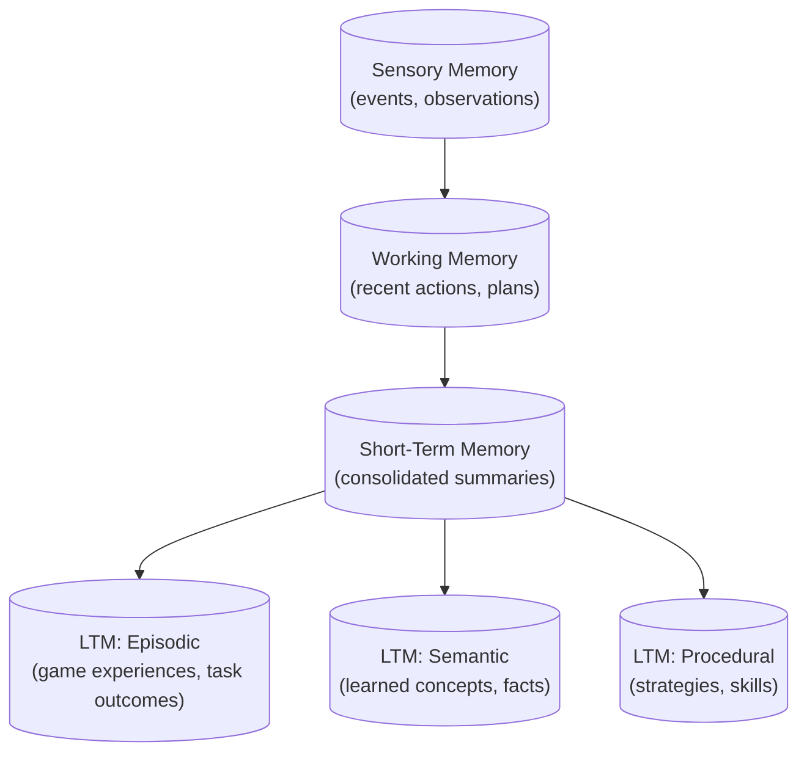

# Agent Memory System

Colony's agent memory system implements a cognitive memory architecture where agents reason *about* their memory, not just *with* it. All memory state lives in blackboards, memory levels form a dataflow graph, and the LLM planner has full introspection into the memory layout.

## Unified Storage Principle

!!! bug "This principle needs to be elucidated"
    The blackboard is not the essential part. The essential part is that there is no hidden state in the agent. All state is observable and queryable by the LLM planner. The blackboard is an implementation detail, but the key idea is the *observability* and *introspectability* of memory, not the specific storage mechanism.


**All agent state must be stored in blackboards.** No out-of-band state in instance variables. This single rule enables:

- State changes as observable events via blackboard notifications
- Memory as a bidirectional observer pattern (agents observe memories; memories observe agent behavior)
- Transparent persistence, replication, and recovery
- Cross-agent memory sharing through shared blackboard scopes

## Default Memory Hierarchy

!!! tip "Colony's default memory hierarchy is a starting point, not a constraint"
    Colony provides a default memory hierarchy (working memory, short-term memory, episodic/semantic/procedural long-term memory) implemented as `MemoryCapability` instances. However, Colony users have full freedom to assemble a memory hierarchy with arbitrary topology (the specific scopes, their relationships, and their maintenance policies) and can customize it to fit the needs of different applications and domains.

Memory is organized as a dataflow graph where nodes are memory scopes and edges are subscriptions. Each level is managed by a `MemoryCapability` instance from `polymathera.colony.agents.patterns.memory`.



| Level | Scope | TTL | Purpose |
|-------|-------|-----|---------|
| Sensory | `agent:{id}:sensory` | Seconds | Raw events and observations |
| Working | `agent:{id}:working` | ~1 hour | Recent actions, current plan, immediate context |
| Short-Term | `agent:{id}:stm` | ~1 day | Consolidated summaries from working memory |
| LTM Episodic | `agent:{id}:ltm:episodic` | Persistent | Past experiences, task outcomes, game results |
| LTM Semantic | `agent:{id}:ltm:semantic` | Persistent | Learned concepts, domain knowledge |
| LTM Procedural | `agent:{id}:ltm:procedural` | Persistent | Strategies, skills, procedural knowledge |

## `MemoryCapability`

`polymathera.colony.agents.patterns.memory.MemoryCapability` manages a single memory scope. It handles:

- **Ingestion**: Pull data from subscribed scopes, transform via `ingestion_policy.transformer`
- **Storage**: Write entries to its **output scope** with tags and metadata
- **Retrieval**: Query via `recall()` with semantic, logical, or hybrid queries
- **Maintenance**: Background decay, pruning, deduplication, reindexing

```python
from polymathera.colony.agents.patterns.memory import (
    MemoryCapability, MemorySubscription, MemoryProducerConfig,
)

stm = MemoryCapability(
    agent=agent,
    scope_id=MemoryScope.agent_stm(agent_id),
    ingestion_policy=MemoryIngestPolicy(
        subscriptions=[
            MemorySubscription(source_scope_id=MemoryScope.agent_working(agent_id)),
        ],
        transformer=SummarizingTransformer(agent=agent, prompt="..."),
    ),
    ttl_seconds=86400,
    max_entries=500,
)
```

### Architecture: Pull Model

Each capability only manages its own scope. There is no "push" logic:

1. `CapabilityB` subscribes to `CapabilityA`'s scope
2. `CapabilityB`'s ingestion transformer consolidates incoming data
3. `CapabilityA`'s maintenance policies clean up old entries independently

## Memory as Observer Pattern

!!! tip "Memory observes agent behavior"
    The agent does not explicitly write to memory after each action. The memory system captures it automatically via hooks.

Memory formation uses hook-based producers (`MemoryProducerConfig` in `polymathera.colony.agents.patterns.memory.types`). A producer attaches a hook to a `@hookable` method and extracts storable data *from the call arguments and return value* when that method executes:

```python
MemoryProducerConfig(
    pointcut=Pointcut.pattern("ActionDispatcher.dispatch"),
    extractor=extract_action_from_dispatch,  # (ctx, result) -> (data, tags, metadata)
    ttl_seconds=3600,
)
```

## Query System

`MemoryQuery` (in `polymathera.colony.agents.patterns.memory.types`) supports three query modes:

### Semantic Search
Vector similarity via ChromaDB embeddings:
```python
MemoryQuery(query="What authentication approach was used?")
```

### Logical Filtering
Structured filtering with `TagFilter` (AND/OR/NOT combinators):
```python
MemoryQuery(tag_filter=TagFilter(
    all_of={"action", "success"},
    none_of={"action_type:infer"},
))
```

### Hybrid Queries
Combine semantic search with logical filtering -- results are filtered first, then ranked by similarity:
```python
MemoryQuery(
    query="security analysis results",
    tag_filter=TagFilter(any_of={"action_type:infer", "action_type:plan"}),
    max_results=10,
)
```

Additional query controls include `time_range`, `key_pattern`, `max_age_seconds`, `min_relevance`, and `include_expired`.

## Memory Lenses

A `MemoryLens` is a read-only view over memory with custom filtering and ranking, defined in `polymathera.colony.agents.patterns.memory.types`. Lenses do not copy data -- they are configured query interfaces for different contexts:

```python
@dataclass
class MemoryLens:
    name: str
    description: str
    scopes: list[str]          # Which memory scopes to query
    tags_include: set[str]     # Only include entries with these tags
    tags_exclude: set[str]     # Exclude entries with these tags
    time_range: float | None   # Relative time range (seconds before now)
    max_results: int = 10
```

Built-in lenses:

- **`PLANNING_LENS`**: Recent actions and goals from working/STM (last hour, max 10 results)
- **`REFLECTION_LENS`**: Past experiences from STM/LTM episodic (action results, game experiences)
- **`SKILL_LENS`**: Procedural knowledge from LTM procedural (max 5 results)

## Memory Introspection

The LLM planner can inspect the memory system at runtime through structured types:

- **`MemoryMap`**: Complete layout of all memory scopes, their configurations, entry counts, and dataflow edges
- **`MemoryScopeInfo`**: Per-scope details including capacity, TTL, subscription relationships, and pending ingestion counts
- **`MemoryStatistics`**: Health and usage statistics across all scopes

```python
@dataclass
class MemoryMap:
    agent_id: str
    scopes: dict[str, MemoryScopeInfo]              # All scopes by scope_id
    dataflow_edges: list[tuple[str, str]]            # (source, target) subscriptions
    total_entries: int = 0
    total_pending_ingestion: int = 0

@dataclass
class MemoryScopeInfo:
    scope_id: str                           # e.g., "agent:abc123:stm"
    scope_type: str                         # "working", "stm", "ltm:episodic", etc.
    purpose: str                            # What this scope stores and why
    ttl_seconds: float | None = None
    max_entries: int | None = None
    entry_count: int = 0
    pending_ingestion: int = 0
    subscribed_to: list[str] = []           # Source scopes this level pulls from
    available_tags: set[str] = set()        # Tags present in entries
```

This introspection is what enables agents to reason *about* their memory -- the LLM can examine what it knows, what it has forgotten, and what is pending consolidation.

!!! important "Agents reason about memory"
    Memory is not a passive store. The LLM planner can query available tags via `list_tags`, inspect the memory map, and construct targeted `MemoryQuery` objects. It can decide to consolidate, forget, or search based on its current goals. Memory is a first-class cognitive resource navigable by the `ActionPolicy`.

## Memory Scopes by Ownership

| Scope Level | Lifetime | Example |
|-------------|----------|---------|
| Agent private | Agent lifetime | Working memory, personal STM |
| Capability-scoped | Capability lifetime | Game protocol state |
| Task-scoped | Task duration | Shared analysis context |
| Collective | Team lifetime | Team-wide knowledge base |
| Global system | Application lifetime | System-wide facts, managed by `MemoryManagementAgent` |

## Maintenance Policies

`MaintenanceConfig` controls background memory maintenance:

```python
@dataclass
class MaintenanceConfig:
    decay_rate: float = 0.01       # 1% per minute relevance decay
    prune_threshold: float = 0.1   # Remove if relevance < 10%
    dedup_threshold: float = 0.95  # Merge if similarity > 95%
    reindex_interval: float = 300  # Reindex embeddings every 5 min
    track_access: bool = True      # Track access counts/timestamps
```

Example:

```python
stm = MemoryCapability(
    agent=agent,
    scope_id=MemoryScope.agent_stm(agent_id),
    maintenance=MaintenanceConfig(
        decay_rate=0.01,
        prune_threshold=0.1,
        dedup_threshold=0.95,
    ),
)
```

These are **subconscious cognitive processes** -- they run in the background without LLM involvement, keeping each memory level healthy.
