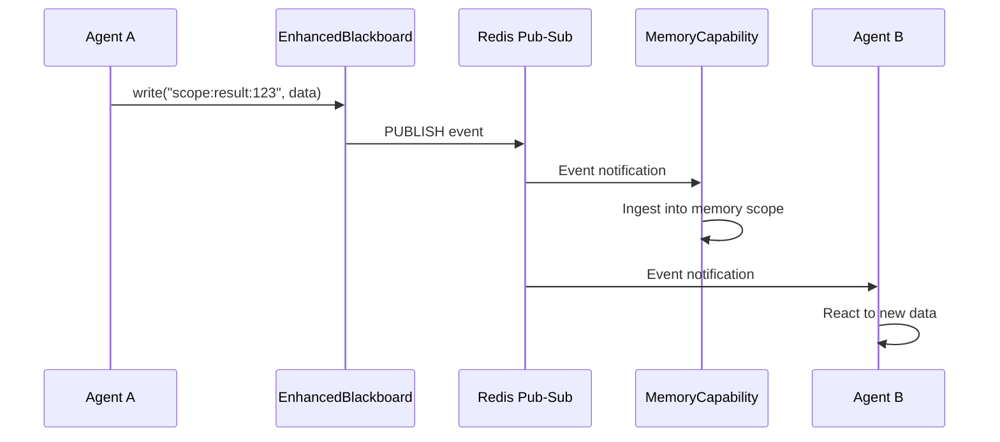

# Blackboard

The `EnhancedBlackboard` is the single source of truth for all agent state in Colony. It provides a shared, observable, transactional key-value store backed by Redis, with event-driven notifications and policy-based customization.

## Core Philosophy

The blackboard design follows five principles:

1. **Composability over inheritance**: Behaviors are composed from pluggable policies, not inherited from base classes
2. **Policy-based design**: Access control, eviction, and validation are pluggable policies using duck-typed protocols
3. **Observable by default**: Every write produces an event; subscribers react to state changes
4. **Transactional integrity**: Optimistic concurrency control prevents lost updates
5. **Strongly typed**: Entries carry metadata, tags, and versioning information

## EnhancedBlackboard

Defined in `polymathera.colony.agents.blackboard.blackboard`:

```python
class EnhancedBlackboard:
    """Production-grade blackboard.

    Features:
    - Pluggable backends (memory, distributed, Redis)
    - Event-driven notifications via Redis pub-sub
    - Policy-based customization (access, eviction, validation)
    - Transactions with optimistic locking
    - Rich metadata (TTL, tags, versioning)
    - Efficient backend-specific queries
    """

    def __init__(
        self,
        app_name: str,
        scope: BlackboardScope = BlackboardScope.LOCAL,
        scope_id: str = "default",
        # Policy customization points
        access_policy: AccessPolicy | None = None,
        eviction_policy: EvictionPolicy | None = None,
        validation_policy: ValidationPolicy | None = None,
        # Backend selection
        backend: BlackboardBackend | None = None,
        backend_type: str | None = None,  # "memory", "distributed", "redis"
        # Event system
        enable_events: bool = True,
        max_event_queue_size: int = 1000,
        # Resource limits
        max_entries: int | None = None,
    ): ...
```

### Scopes

Blackboard instances are scoped via `BlackboardScope`:

```python
class BlackboardScope(str, Enum):
    LOCAL = "local"       # Agent-local (in-memory, not shared)
    SHARED = "shared"     # Shared among specific agents
    GLOBAL = "global"     # Shared among all agents in app
    PERSISTENT = "persistent"  # Persisted to VCM/disk
```

- **Agent-private scope**: Only the owning agent can read/write
- **Shared scope**: Accessible to all agents in the application
- **Task scope**: Scoped to a specific task or coordination group

The `scope_id` parameter determines the namespace for all keys in that blackboard instance.

### Operations

| Operation | Description |
|-----------|-------------|
| `write(key, value, ...)` | Write entry with optional tags, metadata, TTL |
| `read(key)` | Read single entry |
| `query(pattern)` | Query entries by key glob pattern |
| `delete(key)` | Remove an entry |
| `subscribe(filter)` | Subscribe to events matching a filter |
| `transaction()` | Start an optimistic transaction |

```python
board = EnhancedBlackboard(
    app_name="my-app",
    scope=BlackboardScope.SHARED,
    scope_id="team-1",
    access_policy=MyAccessPolicy(),
    validation_policy=SchemaValidator(MySchema),
)
await board.initialize()

# Write with metadata and TTL
await board.write(
    "analysis_results",
    my_results,
    created_by="agent-123",
    tags={"analysis", "final"},
    ttl_seconds=3600,
)

# Read
value = await board.read("analysis_results")

# Read full entry with metadata
entry = await board.read_entry("analysis_results")
print(entry.version, entry.tags, entry.updated_at)

# Query by namespace pattern and tags
entries = await board.query(
    namespace="agent:*:results",
    tags={"analysis"},
    limit=50,
)

# Batch operations
values = await board.read_batch(["key1", "key2", "key3"])
await board.write_batch(
    {"key1": val1, "key2": val2},
    created_by="agent-123",
    tags={"batch"},
)

# Ambient transaction -- read/write/delete transparently route
# through transaction buffers while the context is active
async with board.transaction() as txn:
    counter = await board.read("counter") or 0   # routed through txn
    await board.write("counter", counter + 1)     # buffered until commit
    # commit happens automatically on __aexit__
```

## Event System

Every blackboard write produces a `BlackboardEvent` distributed via Redis pub-sub. Events carry:

- **Event type**: Write, delete, expire, update
- **Key**: The affected blackboard key
- **Value**: The new value (for write/update events)
- **Metadata**: Tags, timestamp, version, created_by

Subscribers register via `EventFilter` which supports key patterns and event type filtering. This enables reactive architectures -- capabilities and memory levels respond to state changes without polling.

```python
@dataclass
class BlackboardEvent:
    event_type: str              # "write", "delete", "clear"
    key: str | None              # None for clear events
    value: Any | None            # None for delete/clear events
    event_id: str                # Auto-generated unique ID
    version: int = 0
    old_value: Any | None = None # Previous value (for updates)
    timestamp: float             # Auto-set to time.time()
    agent_id: str | None = None
    tags: set[str]               # For querying
    metadata: dict[str, Any]     # Extensible
```

Subscribing to events:

```python
# Callback-based subscription
async def on_result_updated(event: BlackboardEvent):
    print(f"Result updated by {event.agent_id}: {event.key}")

board.subscribe(on_result_updated, filter=KeyPatternFilter("*:results:*"))

# Async iterator -- long-running background monitoring
async for event in board.stream_events(
    filter=KeyPatternFilter("scope:*:analysis:*"),
    until=lambda: self._stopped,
):
    await process(event)

# Queue-based -- feed events into an asyncio.Queue for plan_step
event_queue = board.stream_events_to_queue(
    pattern="agent:*:result:*",
    event_types={"write"},
)
```



## Optimistic Concurrency Control

The blackboard uses optimistic concurrency control (OCC) for transactions. Each entry has a version number. When a transaction commits:

1. The transaction reads entries and records their versions
2. Modifications are prepared locally
3. At commit time, versions are checked against current state
4. If any version has changed (another writer intervened), the transaction is retried

```python
async with board.transaction() as txn:
    # Reads record version tokens for optimistic check at commit
    entry = await txn.read("shared_counter")
    current = entry.value if entry else 0

    # Writes are buffered locally
    await txn.write("shared_counter", BlackboardEntry(
        key="shared_counter", value=current + 1, version=(entry.version + 1) if entry else 0,
        created_by="agent-123", updated_at=time.time(), created_at=entry.created_at if entry else time.time(),
    ))
    # On __aexit__: versions are checked via compare-and-swap.
    # If another writer modified "shared_counter" after our read,
    # ConcurrentModificationError is raised and the transaction must be retried.
```

!!! warning "Write transaction pattern"
    When using `async for state in state_manager.write_transaction()`, never `return` or `break` from inside the loop after modifying state. Python async generators skip post-yield cleanup code (the `compare_and_swap`) when the caller exits early. Use a result variable, let the loop body complete naturally, and return after the loop.

## Storage Backends

The blackboard supports pluggable storage backends:

| Backend | Use Case |
|---------|----------|
| **InMemory** | Development, testing, single-process scenarios |
| **Redis** | Production distributed deployment |
| **VCM-backed** | Page-mapped data that should be discoverable via VCM |

Backend selection is configured via cluster config and can be overridden per-blackboard instance.

## Blackboard as Memory Foundation

The memory system is built entirely on top of the blackboard:

- Each memory level (working, STM, LTM) is a blackboard scope
- Memory queries translate to blackboard key pattern matching + tag filtering
- Memory events are blackboard events
- Memory subscriptions are blackboard event subscriptions with transformation

This means the blackboard is not just a coordination mechanism -- it is the foundation of the entire memory architecture.

## BlackboardEntry

Every value stored in the blackboard is wrapped in a `BlackboardEntry` with rich metadata:

```python
class BlackboardEntry(BaseModel):
    key: str
    value: Any = None
    version: int = 0                       # Incremented on each write
    created_at: float                      # Unix timestamp
    updated_at: float                      # Unix timestamp
    created_by: str | None = None          # Agent ID
    updated_by: str | None = None          # Agent ID
    ttl_seconds: float | None = None       # Time-to-live
    tags: set[str] = set()                 # For querying
    metadata: dict[str, Any] = {}          # Extensible
```

## Key Patterns and Namespacing

Blackboard keys follow a hierarchical namespace convention:

```
{scope_id}:{data_type}:{identifier}
```

Examples:
- `agent:abc123:working:record:action+success:a1b2c3d4` -- A working memory record
- `game:hypothesis-42:state:current` -- Current state of a hypothesis game
- `task:analysis-7:result:summary` -- Task result summary

The `BlackboardPublishable` protocol and legacy `get_blackboard_key()` method on data models provide automatic key generation.

## KeyPatternFilter and EventFilter

`KeyPatternFilter` (in `polymathera.colony.agents.blackboard.types`) supports glob-style pattern matching for querying entries. `EventFilter` extends this with event type filtering for subscriptions.

```python
class EventFilter(ABC):
    @abstractmethod
    def matches(self, event: BlackboardEvent) -> bool: ...

# Filter by key glob pattern
@dataclass
class KeyPatternFilter(EventFilter):
    pattern: str  # e.g., "agent:*:results"
    def matches(self, event: BlackboardEvent) -> bool:
        return event.key and fnmatch.fnmatch(event.key, self.pattern)

# Filter by event type
@dataclass
class EventTypeFilter(EventFilter):
    event_types: set[str]  # e.g., {"write", "delete"}
    def matches(self, event: BlackboardEvent) -> bool:
        return event.event_type in self.event_types

# Filter by agent ID
@dataclass
class AgentFilter(EventFilter):
    agent_ids: set[str]
    def matches(self, event: BlackboardEvent) -> bool:
        return event.agent_id in self.agent_ids

# Combine key pattern + event type
@dataclass
class CombinationFilter(EventFilter):
    pattern: str
    event_types: set[str]
    def matches(self, event: BlackboardEvent) -> bool:
        return (event.key and fnmatch.fnmatch(event.key, self.pattern)
                and event.event_type in self.event_types)
```

These filters define memory scope boundaries -- a memory level is specified by a list of one or more `KeyPatternFilter` instances that define its scope within the blackboard.

## Policy Protocols

Policies use Python protocols (duck typing), not abstract base classes:

- **Access policy**: Controls read/write permissions per key/scope
- **Eviction policy**: Determines which entries to evict under memory pressure
- **Validation policy**: Validates entries before write (schema, constraints)

```python
class AccessPolicy(ABC):
    @abstractmethod
    async def can_read(self, agent_id: str, key: str, scope_id: str) -> bool: ...
    @abstractmethod
    async def can_write(self, agent_id: str, key: str, value: Any, scope_id: str) -> bool: ...
    @abstractmethod
    async def can_delete(self, agent_id: str, key: str, scope_id: str) -> bool: ...

class EvictionPolicy(ABC):
    @abstractmethod
    async def get_eviction_candidates(
        self, entries: list[BlackboardEntry], num_to_evict: int
    ) -> list[str]: ...

class ValidationPolicy(ABC):
    @abstractmethod
    async def validate(self, key: str, value: Any, metadata: dict[str, Any]) -> None: ...
```

Built-in implementations:

```python
# Access: allow everything (default)
NoOpAccessPolicy()

# Eviction: least recently used (default)
LRUEvictionPolicy()  # sorts by updated_at ascending

# Eviction: least frequently used (requires access_count in metadata)
LFUEvictionPolicy()

# Validation: enforce type constraints per key pattern
TypeValidationPolicy({"config.*": dict, "count.*": int})

# Validation: no-op (default)
NoOpValidationPolicy()
```

This enables flexible composition -- multiple policies without inheritance hierarchies, easy testing with simple mock objects, and runtime swapping of behavior.

## VCM Integration

When a blackboard scope is VCM-mapped via `mmap_application_scope()`, writes to that scope are automatically picked up by the `BlackboardContextPageSource` running inside the VCM. The data eventually appears in a VCM page and becomes discoverable by other agents via `QueryAttentionCapability`.

This bridges the two halves of the Extended VCM: the blackboard provides read-write coordination state, and the VCM makes that state available as context pages for deep reasoning.
