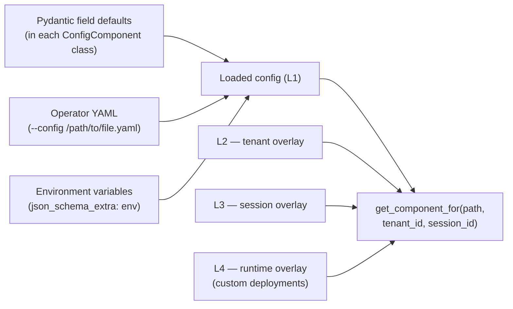

# Configuration System

Colony's configuration system is one centralized, typed, layered store, defined
by Pydantic ``ConfigComponent`` classes. Every operator-tunable value Colony
exposes — LLM topology, agent system, sandbox images, custom deployments,
observability, capability secrets — flows through it. Extensions register
new components from outside the public colony source tree without modifying
it. Operators override values at deploy time via a single ``--config``
YAML; tenants and sessions layer their own overrides on top at runtime.



## What the system gives you

| Need | Surface |
|---|---|
| Discover what's tunable | `cm.get_schema(format="yaml")` — the JSON schema of every registered component. |
| Read a typed value | `cm.get_component("agent_system")` returns a typed `AgentSystemConfig`. |
| Override at deploy time | One YAML file, passed via `colony-env up --config <path>`. |
| Override per environment | Field-level `POLYMATHERA_<PATH>_<FIELD>` env-var binding. |
| Override per tenant / session at runtime | `cm.update_overlay(path, updates, scope=OverlayScope.tenant(tid))`. |
| Push runtime values from a custom deployment | `await ctx.write_runtime_overlay(path, updates)` after `provision()`. |
| Add a new tunable from an external package | `@register_polymathera_config(path="my_ext.thing")` on a `ConfigComponent` subclass; declare in `[tool.poetry.plugins."polymathera.config_components"]`. |

## Resolution chain

For every field of every registered ``ConfigComponent``, the precedence (lowest
→ highest) is:

1. **Pydantic field default** declared on the component class.
2. **Operator YAML** at ``--config``, loaded by ``ConfigurationManager`` once
   per startup.
3. **Environment variable** declared on the field via
   ``json_schema_extra={"env": "FOO_BAR"}``. Plus the catch-all
   ``POLYMATHERA_<dotted_path>_<field>`` always works.
4. **Tier overlays** (L2 tenant / L3 session / L4 runtime) layer on top at
   *read* time when the caller asks for a scoped view.

There is no fallback location search. ``--config`` is the only file path. The
resolution is deterministic — no ambiguity about which file produced a value.

## A typed component, end to end

A ``ConfigComponent`` is a Pydantic model with a registered path and per-field
metadata. Defaults live in the class; env bindings live in
``json_schema_extra``; tier metadata is added via the ``tier_metadata`` helper
so the loader and overlay store know who is allowed to write what.

```python
from pydantic import Field
from polymathera.colony.distributed.config import (
    ConfigComponent, Mutability, Tier,
    register_polymathera_config, tier_metadata,
)

@register_polymathera_config(path="capabilities.web_search")
class WebSearchConfig(ConfigComponent):
    api_key: str = Field(
        default="",
        json_schema_extra={
            "env": "TAVILY_API_KEY", "optional": True,
            **tier_metadata(tier=Tier.L1_OPERATOR, mutability=Mutability.RELOADABLE),
        },
    )
```

Operators set it three equivalent ways:

=== "YAML"

    ```yaml
    capabilities:
      web_search:
        api_key: sk-tvly-xxxx
    ```

=== "Field-bound env var"

    ```bash
    export TAVILY_API_KEY=sk-tvly-xxxx
    ```

=== "Catch-all env var"

    ```bash
    export POLYMATHERA_CAPABILITIES_WEB_SEARCH_API_KEY=sk-tvly-xxxx
    ```

Capabilities read it via a sync helper, not by re-reading env vars themselves:

```python
from polymathera.colony.agents.configs import get_web_search_config

class WebSearchCapability(WebSearchAdapter):
    def __init__(self, *, api_key: str | None = None, ...):
        self._api_key = api_key or get_web_search_config().api_key
```

The helper degrades to defaults when the global manager has not initialized
yet (e.g. inside unit tests that build a capability directly). All capability
secrets that previously read ``os.environ`` directly use this pattern now —
``WebSearchCapability``, ``GitHubCapability``, ``ChromaMemoryBackend``, the
two cluster tracing call sites, the web-UI backend.

## Tier-aware overlays

L2/L3/L4 overlays let you change values *after* deploy without touching the
operator YAML. Each layer has a meaning:

| Tier | Scope key | Persistence | Use case |
|---|---|---|---|
| `L1_OPERATOR` | global | YAML / env vars | Cluster topology, default LLM, capability secrets — anything the operator owns at deploy time. |
| `L2_TENANT` | `tenant_id` | StateManager (CAS) | Per-tenant quota raises, per-tenant API key overrides, per-tenant analysis selection. |
| `L3_SESSION` | `session_id` | StateManager (CAS) | Per-session timeouts, budgets, repo selection. |
| `L4_RUNTIME` | deployment name | StateManager (CAS) | Values produced by a custom deployment's `provision()` (e.g. an HPC stack returning its scheduler URL). |

A field's declared tier is the *highest* layer permitted to write it. A tenant
overlay cannot override a field marked `L1_OPERATOR`; a session cannot override
an `L2_TENANT` field. Writes that violate this raise `PermissionError` before
they touch the state.

```python
from polymathera.colony.distributed.config import OverlayScope

# Read the tenant-and-session-composed view of a component.
quotas = await cm.get_component_for(
    "tenant_quotas", tenant_id="acme", session_id="s-42",
)

# Write a tenant overlay.
await cm.update_overlay(
    "tenant_quotas",
    {"max_concurrent_agents": 200},
    scope=OverlayScope.tenant("acme"),
)
```

L1 is in-process. L2/L3/L4 share one ``ConfigOverlayState`` document
persisted via the existing colony ``StateManager`` (the same primitive VCM and
the convergence runtime use). Cross-replica consistency rides on the
StateManager's CAS — no etcd, no separate config-update protocol.

## Pluggable LLM providers

Adding a new remote LLM backend follows the same registration pattern,
through a dedicated registry in ``cluster/remote_registry.py``. Built-ins
(Anthropic, OpenRouter) register themselves at module-import time and are
lazy-loaded on first lookup so CPU-only environments without the optional
``vllm`` extra never pay for unused module loads.

```python
from polymathera.colony.cluster.remote_registry import register_remote_llm_provider
from polymathera.colony.cluster.remote_deployment import RemoteLLMDeployment

@register_remote_llm_provider("my_provider")
class MyProviderDeployment(RemoteLLMDeployment):
    async def _initialize_client(self) -> None: ...
    async def _call_api(self, messages, **kw): ...
```

Operator YAML:

```yaml
cluster:
  remote_deployments:
    - model_name: "my-org/my-model"
      provider: "my_provider"
      api_key_env_var: "MY_API_KEY"
```

## Shipping config from an external package

Extensions like ``polymathera-cps`` register their components without
patching public colony files. Two entry points connect them:

```toml
# In your package's pyproject.toml
[tool.poetry.plugins."polymathera.config_components"]
my_extension = "polymathera.cps.config:register_components"
```

```python
# polymathera/cps/config.py
def register_components() -> None:
    """Side-effect: importing these modules triggers their
    @register_polymathera_config / @register_remote_llm_provider decorators."""
    from . import analysis_types     # noqa: F401
    from . import remote_providers   # noqa: F401
```

``ConfigurationManager.initialize()`` walks the
``polymathera.config_components`` group at startup, calls each registered
function once, and isolates failures (one broken extension is logged and
skipped — it does not block the rest).

## Use cases

### 1. Swap the default LLM for a local OpenRouter model

```yaml
# my-config.yaml
cluster:
  remote_deployments:
    - model_name: "deepseek/deepseek-v3.2"
      provider: "openrouter"
      api_key_env_var: "OPENROUTER_API_KEY"
      num_replicas: 2
```

```bash
colony-env up --config my-config.yaml
```

### 2. Raise a tenant's quota at runtime — no restart

```python
async def raise_quota(cm, tenant_id: str, new_max: int):
    await cm.update_overlay(
        "tenant_quotas",
        {"max_concurrent_agents": new_max},
        scope=OverlayScope.tenant(tenant_id),
    )
```

The next call to ``cm.get_component_for("tenant_quotas",
tenant_id=tenant_id)`` from any replica observes the new ceiling.

### 3. Override a capability secret per environment without editing YAML

```bash
# CI environment
export TAVILY_API_KEY=ci-test-key

# Staging
export POLYMATHERA_CAPABILITIES_WEB_SEARCH_API_KEY=staging-key
```

Both paths land on the same Pydantic field. The first uses the field's
declared `env` binding (`TAVILY_API_KEY`); the second uses the
catch-all (`POLYMATHERA_<PATH>_<FIELD>`). Use the declared one when you want
a stable name; use the catch-all when reaching into a third-party
``ConfigComponent`` whose author didn't pre-declare a name you like.

### 4. Disable tracing globally without code changes

Tracing reads from `ObservabilityConfig`. Every tracing call site (agent
base, both cluster facilities) resolves through `get_observability_config()`,
so flipping one field reaches every consumer:

```bash
export TRACING_ENABLED=false
```

## File layout

```
colony/configs/
├── README.md          # operator-facing overview + registered-component table
└── example.yaml       # documented template — copy + customize

colony/src/polymathera/colony/distributed/config/
├── manager.py         # ConfigurationManager — load, set_config_path, update_*
├── configs.py         # ConfigComponent base, registry, env-var application
├── extensions.py      # discover_config_components (entry-point walker)
├── overlays.py        # ConfigOverlayState, OverlayScope, OverlayStore
└── tiers.py           # Tier / Mutability / Persistence enums + tier_metadata
```

## See also

- [`colony/configs/README.md`](https://github.com/polymathera/colony/tree/main/configs/README.md) — full table of registered components and field-by-field reference.
- [`colony/configs/example.yaml`](https://github.com/polymathera/colony/tree/main/configs/example.yaml) — annotated template ready to copy and edit.
- [colony-env guide](../guides/colony-env.md) — how `colony-env up --config <file>` plumbs the YAML into the cluster.
- [Sandboxed Shell capability](sandboxed-shell-capability.md) — `SandboxImagesConfig` is its operator surface.
- [User Plugin capability](user-plugin-capability.md) — `PluginsConfig` is its operator surface.
