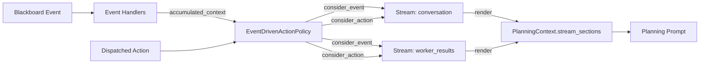

# Consciousness Streams

A **consciousness stream** is a filtered, ordered record of one slice of an agent's experience -- the events it receives and the actions it takes -- rendered into the LLM planning prompt. An agent's action policy can maintain as many streams as it needs, and each stream decides independently what to capture and how to present it.

Streams are defined in `polymathera.colony.agents.patterns.planning.streams` and are consumed by `EventDrivenActionPolicy` and its subclasses (including `CodeGenerationActionPolicy`).

## Why Streams Instead of a Single Event History?

A conversational session agent's experience is fundamentally a chat transcript: user messages interleaved with the agent's own replies, rendered so the LLM can reason about and continue the conversation. An analysis coordinator's experience is not a transcript at all -- it is a collection of worker-result events, synthesis actions, game moves, each requiring its own presentation. A monitoring agent might stream telemetry events but never actions.

Baking any one of these shapes into the framework privileges it over the others. Chat agents would get a `ConversationFormatter`; analysis agents would get an `EventHistoryFormatter`; every new agent type would push on the framework until the core policy code accumulated agent-specific hacks. The same problem shows up at the write side: if the policy has a single `event_history`, then adding agent replies to it means the policy has to scan the action dispatcher's call trace for a specific action key (`respond_to_user`) -- which is exactly the kind of domain-specific leak that the framework should not contain.

Consciousness streams invert the relationship. The policy does not decide what to record or how to present it. It just feeds every event and every action call to all registered streams. Each stream is a small, composable object that answers three questions:

1. **Which events does this stream care about?** (event filter)
2. **Which action calls does this stream care about?** (action filter)
3. **How should the recorded entries be rendered into a prompt section?** (formatter)

## Anatomy of a Stream

A `ConsciousnessStream` is fully defined by its three pluggable pieces plus a rolling window:

```python
class ConsciousnessStream:
    def __init__(
        self,
        name: str,
        formatter: ConsciousnessStreamFormatter,
        event_filter:  Callable[[dict[str, Any]], bool] | None = None,
        action_filter: Callable[[dict[str, Any]], bool] | None = None,
        max_entries: int = 20,
    ):
        ...

    def consider_event(self, contexts: dict[str, Any]) -> None: ...
    def consider_action(self, call: dict[str, Any]) -> None: ...
    def render(self) -> str: ...
```

The action policy calls `consider_event` after each round of event-handler broadcast and `consider_action` after each dispatched action, passing the raw data. The stream consults its filters to decide whether to append an entry; old entries are dropped once `max_entries` is exceeded. At prompt-build time, the policy asks each stream to `render` itself and drops the resulting markdown section directly into the planning prompt.

### Filters

A filter is any picklable callable with a specific signature. Stock implementations:

| Filter | Signature | Purpose |
|--------|-----------|---------|
| `EventContextKeyFilter(*keys)` | `(contexts: dict) -> bool` | Accept events whose accumulated context contains any of the given `context_key` values. |
| `ActionKeySubstringFilter(*substrings)` | `(call: dict) -> bool` | Accept action calls whose `action_key` contains any of the given substrings. |
| `SuccessfulActionFilter(inner)` | `(call: dict) -> bool` | Wraps another action filter and additionally requires `call["success"]` to be truthy. |

Custom filters are ordinary callables -- classes, top-level functions, or lambdas, as long as they are picklable for transport through Ray. `AnyOf(...)` and `AllOf(...)` style composition is just stacked `and`/`or` over the underlying callables.

!!! tip "Design note: why classes, not closures"
    The stock filters are classes with `__init__` arguments rather than closures so that an entire stream blueprint can be serialized via cloudpickle and shipped across Ray boundaries without capturing surrounding scope. If you write a custom filter, prefer a top-level class or function for the same reason.

### Formatters

A `ConsciousnessStreamFormatter` is an abstract class whose `format(entries)` method renders the recorded entries into a markdown section. Each captured entry is a plain dict:

```python
# Event entry
{"kind": "event", "timestamp": ..., "contexts": {<context_key>: <context_dict>}}

# Action entry
{"kind": "action", "timestamp": ..., "call": {"action_key": ..., "output_preview": ..., "success": ..., ...}}
```

Two stock formatters ship with the framework:

- **`ConversationFormatter`** -- renders a chat thread. Event entries with a configured `user_context_key` become `**User**: <message>`; action entries become `**You (Agent)**: <output>`. Suitable for session agents.
- **`JSONStreamFormatter`** -- renders a flat bullet list with the event or action key and a truncated value. A reasonable default when no domain-specific formatter is needed.

Domain agents should subclass `ConsciousnessStreamFormatter` to render streams in whatever form makes sense for their task. Formatters are constructed via `ConsciousnessStreamFormatter.bind(**kwargs)`, which returns a `Blueprint` that travels through agent configuration and is resolved locally when the agent materializes.

## How Streams Wire Into the Planning Prompt

Streams live on the `EventDrivenActionPolicy`. The flow is:

1. **Configure**: The agent's `action_policy_blueprints` dict supplies a `consciousness_streams` entry -- a list of `ConsciousnessStream` blueprints.
2. **Resolve**: `Agent._initialize_action_policy` walks the blueprints, calls `local_instance()` on each, and passes the resulting list to `create_default_action_policy`.
3. **Capture**:
    - After event handlers run inside `EventDrivenActionPolicy.plan_step`, the policy calls `stream.consider_event(accumulated_context)` for every stream.
    - After code execution inside `CodeGenerationActionPolicy.execute_iteration`, the policy iterates its `_run_call_trace` and calls `stream.consider_action(call)` for every stream.
4. **Render**: `PlanningContextBuilder.get_planning_context` calls `stream.render()` on each stream and stores the resulting markdown sections in `PlanningContext.stream_sections`.
5. **Format**: `format_planning_context_for_codegen` inserts every section into the prompt verbatim, between the goals/constraints block and the available-actions block.

No part of the policy or the prompt formatter knows about chat threads, worker results, or any other domain-specific concept. That knowledge lives entirely in the stream objects supplied by the agent.



## Example 1 -- Session Agent (Conversation Stream)

A session agent's entire experience is the user chat thread plus its own replies. One stream suffices: capture the `user_chat_message` event (emitted by `SessionOrchestratorCapability.handle_user_message`) and successful calls to the `respond_to_user` action, render both as a `**User** / **You (Agent)**` transcript.

```python
from polymathera.colony.agents.patterns.planning.streams import (
    ConsciousnessStream,
    ConversationFormatter,
    EventContextKeyFilter,
    ActionKeySubstringFilter,
    SuccessfulActionFilter,
)

bp = SessionAgent.bind(
    metadata=agent_metadata,
    capability_blueprints=[...],
    action_policy_blueprints={
        "consciousness_streams": [
            ConsciousnessStream.bind(
                name="conversation",
                formatter=ConversationFormatter.bind(),
                event_filter=EventContextKeyFilter("user_chat_message"),
                action_filter=SuccessfulActionFilter(
                    ActionKeySubstringFilter("respond_to_user")
                ),
            ),
        ],
    },
)
```

The resulting planning prompt contains a section like:

```markdown
## Conversation

**User**: Can you run an impact analysis on the auth module?
**You (Agent)**: I'll spawn an ImpactAnalysisCoordinator for the auth module...
**User**: Focus on session token handling specifically.
```

The session agent's own replies are captured automatically by the same stream, because `respond_to_user` is a dispatched action and the stream's action filter accepts it. The policy never has to scan its own call trace for a specific action key.

## Example 2 -- Analysis Coordinator (Two Streams)

An analysis coordinator watches worker result events and also performs synthesis actions. It wants the LLM planner to see worker results as a compact list and synthesis actions as a summarized history, cleanly separated in the prompt. Two streams:

```python
from polymathera.colony.agents.patterns.planning.streams import (
    ConsciousnessStream,
    JSONStreamFormatter,
    EventContextKeyFilter,
    ActionKeySubstringFilter,
    SuccessfulActionFilter,
)

streams = [
    ConsciousnessStream.bind(
        name="worker_results",
        formatter=JSONStreamFormatter.bind(section_title="## Worker Results"),
        event_filter=EventContextKeyFilter("worker_result", "worker_failed"),
        action_filter=None,  # no actions in this stream
        max_entries=50,
    ),
    ConsciousnessStream.bind(
        name="synthesis",
        formatter=JSONStreamFormatter.bind(section_title="## Synthesis Progress"),
        event_filter=None,  # no events in this stream
        action_filter=SuccessfulActionFilter(
            ActionKeySubstringFilter("synthesize", "finalize")
        ),
        max_entries=20,
    ),
]

bp = AnalysisCoordinator.bind(
    metadata=coordinator_metadata,
    capability_blueprints=[...],
    action_policy_blueprints={"consciousness_streams": streams},
)
```

The prompt now contains two independent sections in the order the streams were declared -- `## Worker Results` filled by events, `## Synthesis Progress` filled by successful synthesis actions -- without any domain-specific code in the policy.

## Example 3 -- Custom Formatter (Game State Transitions)

A game-playing agent wants to render each recorded move as a state transition with the move number, the move itself, and its evaluation. Subclass `ConsciousnessStreamFormatter`:

```python
from polymathera.colony.agents.patterns.planning.streams import (
    ConsciousnessStream,
    ConsciousnessStreamFormatter,
    EventContextKeyFilter,
)

class GameMoveFormatter(ConsciousnessStreamFormatter):
    def __init__(self, section_title: str = "## Game Moves"):
        self._section_title = section_title

    def format(self, entries):
        if not entries:
            return ""
        lines = [self._section_title, ""]
        for i, entry in enumerate(entries, start=1):
            if entry["kind"] != "event":
                continue
            ctx = entry["contexts"].get("game_move", {})
            move = ctx.get("move", "?")
            eval_ = ctx.get("evaluation", "?")
            lines.append(f"{i}. {move} (eval: {eval_})")
        return "\n".join(lines)

stream = ConsciousnessStream.bind(
    name="game_moves",
    formatter=GameMoveFormatter.bind(),
    event_filter=EventContextKeyFilter("game_move"),
    max_entries=30,
)
```

Any agent can ship its own formatters alongside its capabilities. The framework treats them as opaque blueprints; only the agent knows what a "game move" means.

## Serialization and Transport

Streams are configured via `Blueprint` objects because agent configuration crosses Ray actor boundaries. The rules:

- **`ConsciousnessStream.bind(**kwargs)`** -- returns a `Blueprint[ConsciousnessStream]`. Kwargs are validated via cloudpickle at bind time.
- **`ConsciousnessStreamFormatter.bind(**kwargs)`** -- same, for formatters. A formatter blueprint passed as the `formatter` kwarg of a stream is resolved by `ConsciousnessStream.__init__` automatically.
- **Filters** are plain callables, not blueprints. They must be picklable (top-level classes or functions).

On the remote node, `Agent._initialize_action_policy` resolves each blueprint in `action_policy_blueprints` -- including every element of list-valued entries like `consciousness_streams` -- before handing the fully materialized list to the policy constructor.

!!! info "Why separate from `action_policy_config`"
    `action_policy_config` lives on `AgentMetadata` and is JSON-serialized into Redis for durability. Blueprints are cloudpickle-only. Keeping them in a separate `action_policy_blueprints` field (with `exclude=True` on the Pydantic model) avoids JSON-serialization errors while letting blueprints still travel through `AgentBlueprint` via cloudpickle.

## Design Principles

1. **No domain knowledge in the policy.** `EventDrivenActionPolicy` and `CodeGenerationActionPolicy` do not know what a chat message, a worker result, or a game move is. They only feed events and actions to whatever streams are attached.
2. **Each stream owns its presentation.** The formatter is part of the stream, not a framework-level concept. Two agents that both consume `user_chat_message` events can render them completely differently.
3. **Filters decide membership; formatters decide shape.** These two concerns are independent -- the same `ConversationFormatter` can consume different filters on different agents; the same `EventContextKeyFilter` can feed different formatters.
4. **Streams are declarative.** An agent configures its streams at `bind()` time. The prompt shape is a consequence of the declared streams, not of imperative code sprinkled through the policy.
5. **Add a stream, never patch the policy.** When a new agent type needs a new view of its experience, the answer is always a new stream (or a new formatter), never a new branch in the policy or the prompt formatter.

## Further Reading

- Module: `polymathera.colony.agents.patterns.planning.streams`
- Used by: `polymathera.colony.agents.patterns.actions.policies.EventDrivenActionPolicy`, `polymathera.colony.agents.patterns.actions.code_generation.CodeGenerationActionPolicy`
- Rendered by: `polymathera.colony.agents.patterns.planning.context.PlanningContextBuilder`
- Prompt integration: `polymathera.colony.agents.patterns.actions.code_generation.format_planning_context_for_codegen`
