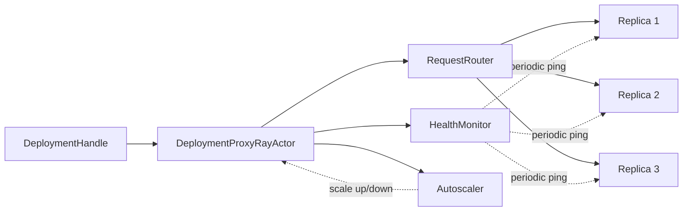
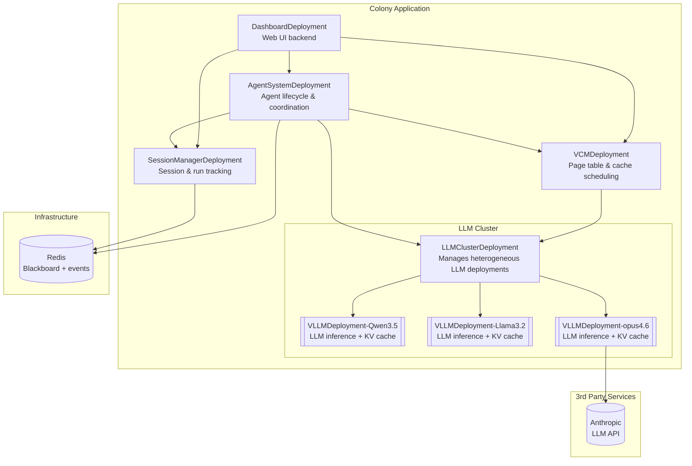

# Distributed Architecture

Colony is natively distributed. Agents are regular Python objects, not Ray actors, with their lifecycle managed by `AgentManager` replicas. The framework provides its own lightweight serving layer built on Ray Core that manages deployment, routing, autoscaling, and fault tolerance.

!!! tip "Why distributed?"

    The workloads Colony targets require more memory and compute than a single machine can provide. A distributed architecture allows Colony to scale horizontally across a GPU cluster, keeping the entire context live and accessible without retrieval. It also enables flexible routing strategies that optimize for cache locality, latency, or tenant isolation.


!!! tip "Agents are *not* Ray actors"
    `AgentManager` replicas (e.g., LLM instances) are Ray actors that manage the lifecycle of `Agent` instances, which are regular Python objects. This allows the same `AgentManager` to manage multiple agents on the same Ray actor, enabling more efficient resource utilization and flexible scheduling. Agents can be spawned, suspended, resumed, migrated, or evicted to free up resources.


## Why Not Ray Serve?

Colony requires lower latency and more flexible routing than Ray Serve provides. The framework's serving layer communicates via pure Ray actor calls (Python object passing).

!!! tip "Why not Ray Serve?"
    Ray Serve is designed for high-throughput, stateless HTTP APIs. Colony's workloads are *stateful*, and require complex routing based on VCM page locality and agent affinity. By stateful we mean that routing of one request may depend on the routing of previous requests. Building a custom serving layer on Ray Core allows Colony to implement these features without the constraints of Serve's routing model.

!!! tip "Syntactic sugar for Ray actors"
    The `@deployment` decorator and `DeploymentHandle` proxy provide syntactic sugar for defining and calling Ray actors without directly interacting with the Ray API using `ray.get` or `ray.remote`.


## Serving Framework

The serving framework lives in `polymathera.colony.distributed.ray_utils.serving` and provides:

### `@deployment` Decorator

Marks a class as a deployable service with lifecycle management, health checking, and autoscaling:

```python
from polymathera.colony.distributed.ray_utils import serving

@serving.deployment(
    name="my_service",
    autoscaling_config=AutoscalingConfig(
        min_replicas=1,
        max_replicas=10,
        target_queue_length=5,
    ),
    ray_actor_options={"num_cpus": 2, "num_gpus": 1},
)
class MyService:
    @serving.endpoint
    async def process(self, data: dict) -> Result:
        ...
```

Only `@endpoint`-decorated methods can be called remotely via deployment handles. This provides a clear API boundary.

!!! tip "`polymathera.colony.serving.Applications`"
    The `Application` class manages a collection of deployments. When you call `deploy()`, it starts all deployments and their replicas, ensuring that lifecycle hooks are called in the correct order. Deployments can discover each other through `serving.get_deployment()` after deployment.


### Lifecycle Hooks

| Decorator | When | Purpose |
|-----------|------|---------|
| `@initialize_deployment` | After replica creation | Async setup (connect to Redis, load models) |
| `@on_app_ready` | After all deployments start | Safe for cross-deployment discovery |
| `@cleanup_deployment` | Before replica destruction | Resource cleanup |
| `@periodic_health_check(interval_s)` | On interval | Background health monitoring |

### `DeploymentHandle`

Client-side proxy returned by `serving.get_deployment()`. Method calls on the handle are transparently routed to a replica. The called method name must match an `@endpoint` method on the deployment class:

```python
# Get handle to a deployment
service = serving.get_deployment(app_name, MyService)

# Calls are routed to an appropriate replica
result = await service.process(data=my_data)
```

## Request Routing

!!! bug "Explain routing in detail"
    Explain how the `DeploymentProxyRayActor` routes requests to replicas based on `RoutingHints` that it extracts, how health monitoring and autoscaling work, and how custom routers can be implemented for tenant-aware sharding or capability-based routing.


Colony's routing is context-aware by design. Every request carries optional `RoutingHints` that inform the router:

```python
@dataclass
class RoutingHints:
    router_class: Type[RequestRouter] | None   # Which router to use
    context_page_ids: list[str] | None         # Required VCM pages
    tenant_id: str | None                      # Multi-tenancy
    requirements: LLMClientRequirements | None # Model requirements
    metadata: dict[str, Any]                   # Generic metadata
```

### Built-in Routers

!!! bug "Explain the request journey in detail"
    Explain how a request travels from the `DeploymentHandle` to the `DeploymentProxyRayActor`, how the proxy extracts `RoutingHints`, selects a router, and routes to a replica. Also explain how health monitoring and autoscaling interact with routing decisions.


| Router | Strategy | Use Case |
|--------|----------|----------|
| `LeastLoadedRouter` | Route to replica with shortest queue | Default, general-purpose |
| `RoundRobinRouter` | Cyclic selection | Stateless workloads |
| `ContextAwareRouter` | Score replicas by page locality | LLM inference with VCM pages |
| `PageAffinityRouter` | Only route to replicas with ALL required pages | Latency-critical inference |

The `ContextAwareRouter` is the most important for Colony's workload. It scores each replica:

```python
# ContextAwareRouter scoring formula
score = (PAGE_HIT_WEIGHT * (pages_loaded / total_pages)       # 100.0 × hit ratio
       - LOAD_WEIGHT     * (current_load / max_load)          # 10.0 × load factor
       + CAPACITY_WEIGHT * (available_capacity / total_capacity))  # 5.0 × capacity
```

The `PageAffinityRouter` is stricter -- it refuses to route to a replica that lacks required pages, used when a cache miss would make execution impractical.

For agent placement, `SoftPageAffinityRouter` scores replicas by how many of the agent's bound pages are already loaded:

```python
class SoftPageAffinityRouter(RequestRouter):
    """Route agent spawning to replicas with best page affinity.

    - Hard affinity: Only consider replicas with ALL bound pages
    - Soft affinity: Select replica with maximum bound pages loaded
    """

    async def route_request(self, request, replicas) -> DeploymentReplicaInfo:
        bound_pages = request.routing_hints.metadata.get("bound_pages", [])
        soft_affinity = request.routing_hints.metadata.get("soft_affinity", False)
        page_locations = await self._get_page_locations(vcm_handle, bound_pages)
        ranked_replicas = await self._rank_replicas_by_affinity(
            replicas, bound_pages, page_locations
        )
        ...
```

`AgentAffinityRouter` routes lifecycle calls (suspend, stop, get_state) to the replica that owns the agent.

### Custom Routers

Implement the `RequestRouter` protocol:

```python
class RequestRouter(ABC):
    @abstractmethod
    async def route_request(
        self, request: DeploymentRequest,
        replicas: list[DeploymentReplicaInfo],
    ) -> DeploymentReplicaInfo:
        ...
```

Custom routers can implement tenant-aware sharding, capability-based routing, or any domain-specific strategy.

## Proxy Architecture

Each deployment has a `DeploymentProxyRayActor` that serves as its single entry point:



The proxy handles:

- **Request routing**: Selects the appropriate router based on `RoutingHints` and dispatches
- **Health monitoring**: Periodic `__ping__()` calls to replicas; unhealthy replicas excluded from routing
- **Autoscaling**: Monitors queue length and in-flight requests; scales replicas within configured bounds
- **Lifecycle management**: Calls initialization/cleanup hooks on replica creation/destruction

## Colony System Deployments

The Colony cluster is composed of these core deployments:



| Deployment | Role | Accessed Via |
|-----------|------|-------------|
| `SessionManagerDeployment` | Tracks sessions, runs, token usage | `get_session_manager(app_name)` |
| `AgentSystemDeployment` | Creates, manages, coordinates agents | `get_agent_system(app_name)` |
| `VCMDeployment` | Page table, fault handling, cache scheduling | `get_vcm(app_name)` |
| `VLLMDeployment` | LLM inference with KV cache management | `get_vllm_deployment(app_name)` |
| `LLMClusterDeployment` | Manages heterogeneous LLM deployments | `get_llm_cluster(app_name)` |

### Deployment Configuration

```python
@dataclass
class PolymatheraClusterConfig:
    app_name: str
    llm_cluster_config: ClusterConfig
    vcm_config: VCMConfig = field(default_factory=VCMConfig)
    agent_system_config: AgentSystemConfig = field(default_factory=AgentSystemConfig)
    cleanup_on_init: bool = False

    def add_deployments_to_app(self, app: serving.Application, top_level: bool) -> None:
        """Add all Polymathera components to the application."""
        self.llm_cluster_config.add_deployments_to_app(app, top_level=False)
        self.vcm_config.add_deployments_to_app(app, top_level=False)
        self.agent_system_config.add_deployments_to_app(app, top_level=False)
```

LLM deployment configuration supports heterogeneous models:

```python
class LLMDeploymentConfig(BaseModel):
    model_name: str                                   # HuggingFace model name or path
    quantization: str | None = None
    tensor_parallel_size: int = 1
    gpu_memory_utilization: float = 0.9
    max_model_len: int | None = None
    capabilities: set[str] = {"structured_output"}
    lora_adapters: list[LoRAAdapterConfig] | None = None
    num_replicas: int = 2
    default_router_class: str = "ContextAwareRouter"
    max_agents_per_replica: int = 100
```

### Deployment Flow

1. `PolymatheraCluster(config).deploy()` is the top-level entry point
2. `ClusterConfig.add_deployments_to_app()` registers vLLM + remote LLM deployments
3. `VCMConfig` adds the VCM deployment
4. `AgentSystemConfig` adds agent system + session manager
5. The `Application` starts all deployments, calls `@initialize_deployment` hooks, then `@on_app_ready` hooks

### Spawning Agents

!!! bug "Explain the blueprint pattern in detail"
    Explain how the `spawn_agents()` function takes a list of blueprints that define agent configurations (capability blueprints, action policy blueprints, initial pages, etc.) and spawns them on the cluster.


```python
from polymathera.colony.system import spawn_agents

agent_ids = await spawn_agents(
    blueprints=[blueprint1, blueprint2],
    requirements=LLMClientRequirements(min_context_window=128_000),
    soft_affinity=True,       # Best-effort page locality
    suspend_agents=False,     # Don't suspend existing agents to make room
    app_name="my-app",
)
```

## Autoscaling

The autoscaler monitors queue depth and adjusts replica count:

```python
AutoscalingConfig(
    min_replicas=1,
    max_replicas=10,
    target_queue_length=5,      # Scale up when queue exceeds this
    upscale_cooldown_s=10.0,    # Minimum time between scale-ups
    downscale_cooldown_s=30.0,  # Minimum time between scale-downs
)
```

- **Scale up** when `total_queue_length > target × num_replicas`
- **Scale down** with longer cooldown to avoid oscillation
- **Min/max bounds** prevent under- or over-provisioning

## Fault Tolerance

### Health Monitoring

- Replicas receive periodic `__ping__()` calls (default: every 10 seconds)
- After N consecutive failures (default: 3), a replica is marked unhealthy and excluded from routing
- Unhealthy replicas can recover automatically if they start responding again

### Replica Recovery

- Ray actors with `max_restarts` restart automatically on crash
- New replicas receive `@initialize_deployment` hooks
- Failed requests return full tracebacks to the caller; the replica continues processing

### Error Propagation

Errors are captured with full type information and remote tracebacks:

```python
class DeploymentResponse(BaseModel):
    status: DeploymentResponseStatus  # SUCCESS | ERROR
    result: Any                       # Result if successful
    error: str | None                 # Error message
    error_type: str | None            # Exception class name
    traceback: str | None             # Remote traceback
```

## Multi-Tenancy

!!! bug "Explain multi-tenancy in detail"
    Explain how `RoutingHints.tenant_id` enables tenant-aware routing, how VCM tracks pages per tenant, and how deployments can implement tenant isolation or sharding strategies. Also explain how resource usage and costs can be tracked per tenant in the session manager.

Colony supports multi-tenancy through `RoutingHints.tenant_id`:

- Routers can implement tenant-aware sharding (route tenant A to replicas 1-3, tenant B to replicas 4-6)
- VCM tracks pages per tenant via `VirtualPageTableState.tenant_pages`
- Blackboard scopes can be tenant-isolated
- Different tenants can use different model configurations

## Service Discovery

Deployments discover each other using `serving.get_deployment` (which uses Ray's actor naming under the hood):

```python
# Within any deployment (safe after @on_app_ready)
vcm = serving.get_deployment(serving.get_my_app_name(), VCMDeployment)
session_mgr = serving.get_deployment(serving.get_my_app_name(), SessionManagerDeployment)
```

Deployment handles are cached after first lookup. Environment variables (`POLYMATHERA_APP_NAME`, `POLYMATHERA_DEPLOYMENT_NAME`, `POLYMATHERA_REPLICA_ID`) are propagated to all replicas for self-identification.

## LLM Cluster Management

!!! bug "Explain how fields of `LLMClientRequirements` map to LLM types"

Colony manages a heterogeneous cluster of LLM deployments (one or more deployments of self-hosted vLLM possibly with different models, remote API models) with unified routing and memory management:

- Each model type gets its own `VLLMDeployment` with independent scaling
- `LLMClientRequirements` in routing hints match requests to compatible models (context window, capabilities)
- VCM coordinates KV cache state across all LLM replicas
- Page loading and eviction decisions are cluster-wide, not per-replica

This is a key differentiator: Colony treats the LLM cluster as a unified resource with cluster-level memory management, not as isolated inference endpoints.

