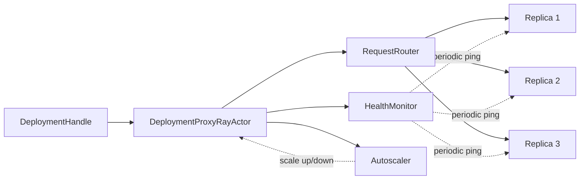
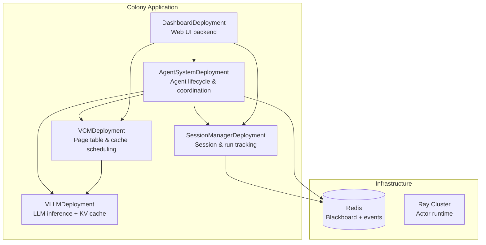

# Distributed Architecture

Colony is natively distributed. Agents are long-lived Ray actors, not task-scoped threads or in-process coroutines. The framework provides its own lightweight serving layer built on Ray Core that manages deployment, routing, autoscaling, and fault tolerance without HTTP serialization overhead.

## Why Not Ray Serve?

Colony requires lower latency and more flexible routing than Ray Serve provides. The framework's serving layer communicates via pure Ray actor calls (Python object passing) rather than HTTP+JSON serialization. This eliminates serialization overhead for the high-frequency inter-deployment communication that multi-agent systems demand -- agent-to-VCM, agent-to-blackboard, planner-to-scheduler calls happen thousands of times per session.

## Serving Framework

The serving framework lives in `polymathera.colony.distributed.ray_utils.serving` and provides:

### @deployment Decorator

Marks a class as a deployable service with lifecycle management, health checking, and autoscaling:

```python
from polymathera.colony.distributed.ray_utils import serving

@serving.deployment(
    name="my_service",
    autoscaling_config=AutoscalingConfig(
        min_replicas=1,
        max_replicas=10,
        target_queue_length=5,
    ),
    ray_actor_options={"num_cpus": 2, "num_gpus": 1},
)
class MyService:
    @serving.endpoint
    async def process(self, data: dict) -> Result:
        ...
```

Only `@endpoint`-decorated methods can be called remotely via deployment handles. This provides a clear API boundary.

### Lifecycle Hooks

| Decorator | When | Purpose |
|-----------|------|---------|
| `@initialize_deployment` | After replica creation | Async setup (connect to Redis, load models) |
| `@on_app_ready` | After all deployments start | Safe for cross-deployment discovery |
| `@cleanup_deployment` | Before replica destruction | Resource cleanup |
| `@periodic_health_check(interval_s)` | On interval | Background health monitoring |

### DeploymentHandle

Client-side proxy returned by `serving.get_deployment()`. Method calls on the handle are transparently routed to a replica:

```python
# Get handle to a deployment
service = serving.get_deployment(app_name, MyService)

# Calls are routed to an appropriate replica
result = await service.process(data=my_data)
```

## Request Routing

Colony's routing is context-aware by design. Every request carries optional `RoutingHints` that inform the router:

```python
@dataclass
class RoutingHints:
    router_class: Type[RequestRouter] | None   # Which router to use
    context_page_ids: list[str] | None         # Required VCM pages
    tenant_id: str | None                      # Multi-tenancy
    requirements: LLMClientRequirements | None # Model requirements
    metadata: dict[str, Any]                   # Generic metadata
```

### Built-in Routers

| Router | Strategy | Use Case |
|--------|----------|----------|
| `LeastLoadedRouter` | Route to replica with shortest queue | Default, general-purpose |
| `RoundRobinRouter` | Cyclic selection | Stateless workloads |
| `ContextAwareRouter` | Score replicas by page locality | LLM inference with VCM pages |
| `PageAffinityRouter` | Only route to replicas with ALL required pages | Latency-critical inference |

The `ContextAwareRouter` is the most important for Colony's workload. It scores each replica by how many of the requested VCM pages are already in its KV cache, preferring replicas where cache hits are likely. The `PageAffinityRouter` is stricter -- it refuses to route to a replica that lacks required pages, used when a cache miss would make execution impractical.

### Custom Routers

Implement the `RequestRouter` protocol:

```python
class RequestRouter(ABC):
    @abstractmethod
    async def route_request(
        self, request: DeploymentRequest,
        replicas: list[DeploymentReplicaInfo],
    ) -> DeploymentReplicaInfo:
        ...
```

Custom routers can implement tenant-aware sharding, capability-based routing, or any domain-specific strategy.

## Proxy Architecture

Each deployment has a `DeploymentProxyRayActor` that serves as its single entry point:



The proxy handles:

- **Request routing**: Selects the appropriate router based on `RoutingHints` and dispatches
- **Health monitoring**: Periodic `__ping__()` calls to replicas; unhealthy replicas excluded from routing
- **Autoscaling**: Monitors queue length and in-flight requests; scales replicas within configured bounds
- **Lifecycle management**: Calls initialization/cleanup hooks on replica creation/destruction

## Colony System Deployments

The Colony cluster is composed of these core deployments:



| Deployment | Role | Accessed Via |
|-----------|------|-------------|
| `SessionManagerDeployment` | Tracks sessions, runs, token usage | `get_session_manager(app_name)` |
| `AgentSystemDeployment` | Creates, manages, coordinates agents | `get_agent_system(app_name)` |
| `VCMDeployment` | Page table, fault handling, cache scheduling | `get_vcm(app_name)` |
| `VLLMDeployment` | LLM inference with KV cache management | `get_vllm_deployment(app_name)` |

### Deployment Flow

1. `PolymatheraCluster(config).deploy()` is the top-level entry point
2. `ClusterConfig.add_deployments_to_app()` registers vLLM + remote LLM deployments
3. `VCMConfig` adds the VCM deployment
4. `AgentSystemConfig` adds agent system + session manager
5. The `Application` starts all deployments, calls `@initialize_deployment` hooks, then `@on_app_ready` hooks

## Autoscaling

The autoscaler monitors queue depth and adjusts replica count:

```python
AutoscalingConfig(
    min_replicas=1,
    max_replicas=10,
    target_queue_length=5,      # Scale up when queue exceeds this
    upscale_cooldown_s=10.0,    # Minimum time between scale-ups
    downscale_cooldown_s=30.0,  # Minimum time between scale-downs
)
```

- **Scale up** when `total_queue_length > target × num_replicas`
- **Scale down** with longer cooldown to avoid oscillation
- **Min/max bounds** prevent under- or over-provisioning

## Fault Tolerance

### Health Monitoring

- Replicas receive periodic `__ping__()` calls (default: every 10 seconds)
- After N consecutive failures (default: 3), a replica is marked unhealthy and excluded from routing
- Unhealthy replicas can recover automatically if they start responding again

### Replica Recovery

- Ray actors with `max_restarts` restart automatically on crash
- New replicas receive `@initialize_deployment` hooks
- Failed requests return full tracebacks to the caller; the replica continues processing

### Error Propagation

Errors are captured with full type information and remote tracebacks:

```python
class DeploymentResponse(BaseModel):
    status: DeploymentResponseStatus  # SUCCESS | ERROR
    result: Any                       # Result if successful
    error: str | None                 # Error message
    error_type: str | None            # Exception class name
    traceback: str | None             # Remote traceback
```

## Multi-Tenancy

Colony supports multi-tenancy through `RoutingHints.tenant_id`:

- Routers can implement tenant-aware sharding (route tenant A to replicas 1-3, tenant B to replicas 4-6)
- VCM tracks pages per tenant via `VirtualPageTableState.tenant_pages`
- Blackboard scopes can be tenant-isolated
- Different tenants can use different model configurations

## Service Discovery

Deployments discover each other through Ray's actor naming:

```python
# Within any deployment (safe after @on_app_ready)
vcm = serving.get_deployment(serving.get_my_app_name(), VCMDeployment)
session_mgr = serving.get_deployment(serving.get_my_app_name(), SessionManagerDeployment)
```

Deployment handles are cached after first lookup. Environment variables (`POLYMATHERA_APP_NAME`, `POLYMATHERA_DEPLOYMENT_NAME`, `POLYMATHERA_REPLICA_ID`) are propagated to all replicas for self-identification.

## LLM Cluster Management

Colony manages a heterogeneous cluster of LLM deployments:

- Each model type gets its own `VLLMDeployment` with independent scaling
- `LLMClientRequirements` in routing hints match requests to compatible models (context window, capabilities)
- VCM coordinates KV cache state across all LLM replicas
- Page loading and eviction decisions are cluster-wide, not per-replica

This is a key differentiator: Colony treats the LLM cluster as a unified resource with cluster-level memory management, not as isolated inference endpoints.
