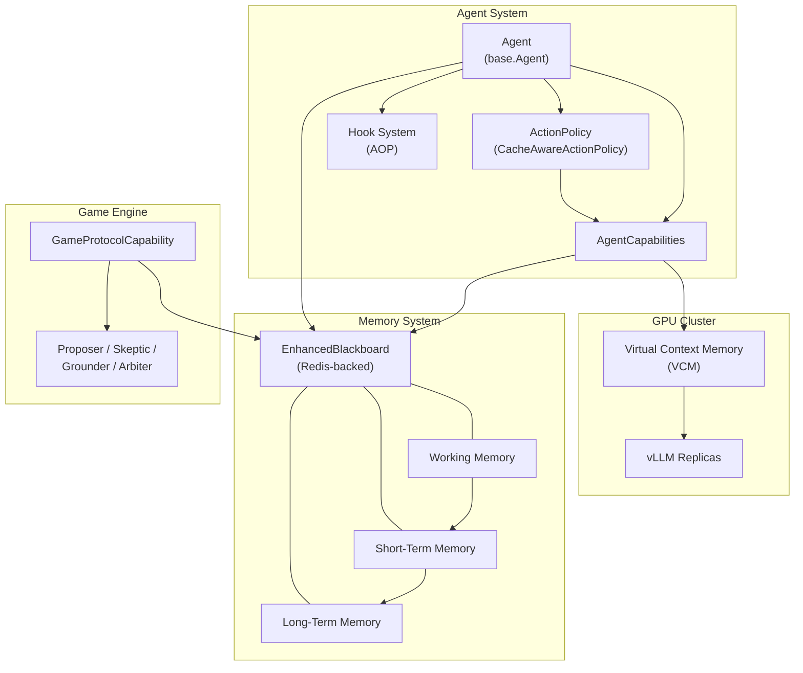

# Architecture Overview

Colony is a cache-aware multi-agent framework for reasoning over extremely long context (billion-token scale) without RAG. Instead of retrieving fragments, Colony keeps the entire context "live" through paged distributed KV caching across a GPU cluster, allowing agents to perform deep, iterative reasoning over the full input.

## Core Design Principles

1. **Explicit context over implicit context.** LLMs struggle with knowledge buried in training data. Deep reasoning requires explicating implicit context into explicit, in-context material.

2. **The LLM is the planner, not the framework.** Agent control flow and all decisions are driven by a reasoning LLM given sufficient context, not hardcoded logic. The framework provides context, asks "what next?", executes, and feeds back results.

3. **Policy-based design.** Every cognitive process is a pluggable policy with well-defined interfaces and default implementations. Policies compose hierarchically.

4. **All state on the blackboard.** No out-of-band state in instance variables. State changes become observable events via blackboard notifications, enabling the memory-as-observer pattern.

5. **Cache-awareness is emergent.** Cache efficiency is not a property of individual primitives but an emergent property of the LLM planner composing primitives with awareness of the current cache state.

## System Architecture

## Subsystems

### [Virtual Context Memory](virtual-context-memory.md)

The VCM manages context pages like an OS manages virtual memory -- with page tables, page faults, and cache-aware scheduling. It operates at the cluster level (across GPU nodes), unlike vLLM which is node-level. Extended VCM combines immutable read-only input pages with read-write blackboard output.

### [Agent System](agent-system.md)

Agents are autonomous computational entities with lifecycle states, capabilities, and action policies. The framework supports VCM-bound agents (loaded/unloaded with pages), unbound agents, service agents, and supervisor agents. `AgentCapability` provides the extension point -- each capability is an AOP aspect, and the `ActionPolicy` acts as the aspect weaver.

### [Memory System](memory-system.md)

A unified memory architecture where all state lives in blackboards. Memory is organized hierarchically -- sensory, working, short-term, and long-term (episodic, semantic, procedural) -- with each level implemented as a `MemoryCapability` managing a blackboard scope. Agents reason *about* their memory, not just *with* it.

### [Action Policies](action-policies.md)

The decision-making core. The LLM selects actions through a two-phase process (choose action, then parameterize), executes partial plans in a Model-Predictive Control loop, and revises as conditions change. `CacheAwareActionPolicy` is the primary implementation, coordinating planning, execution, and replanning.

### [Blackboard](blackboard.md)

`EnhancedBlackboard` is the single source of truth for all agent state. Redis-backed, event-driven, with optimistic concurrency control. Policy-based design (access, eviction, validation) without inheritance hierarchies.

### [Hook System](hook-system.md)

Aspect-oriented programming for cross-cutting concerns. The `@hookable` decorator marks interception points; `Before`, `After`, and `Around` hooks attach via `Pointcut` expressions. Used for token tracking, rate limiting, checkpointing, and memory capture without polluting core logic.

### [Game Engine](game-engine.md)

A framework for structured multi-agent deliberation. Four game types -- hypothesis, bidding/contract, negotiation, consensus -- with defined roles and an Agent Communication Language. Games serve as correctness mechanisms: hypothesis games combat hallucination, contract nets combat laziness, objective guards combat goal drift.

## Key Classes

| Class | Module | Role |
|-------|--------|------|
| `Agent` | `polymathera.colony.agents.base` | Base agent with lifecycle, capabilities, blackboard access |
| `ActionPolicy` | `polymathera.colony.agents.base` | Abstract base for action selection and planning |
| `CacheAwareActionPolicy` | `polymathera.colony.agents.patterns.actions.policies` | Primary policy: MPC-style planning with cache awareness |
| `AgentCapability` | `polymathera.colony.agents.base` | Extension point for agent functionality (AOP aspect) |
| `EnhancedBlackboard` | `polymathera.colony.agents.blackboard` | Redis-backed shared state with events and OCC |
| `MemoryCapability` | `polymathera.colony.agents.patterns.memory` | Manages one memory scope with ingestion, retrieval, maintenance |
| `GameProtocolCapability` | `polymathera.colony.agents.patterns.games` | Structured multi-agent deliberation protocol |
| `AgentHookRegistry` | `polymathera.colony.agents.patterns.hooks` | Per-agent hook registration and dispatch |
