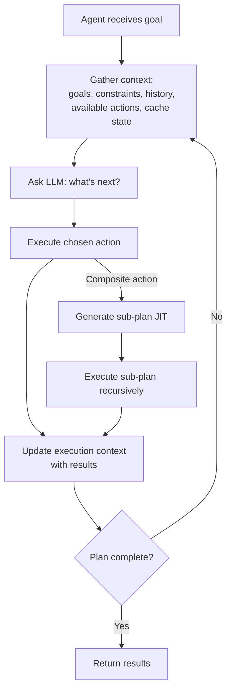
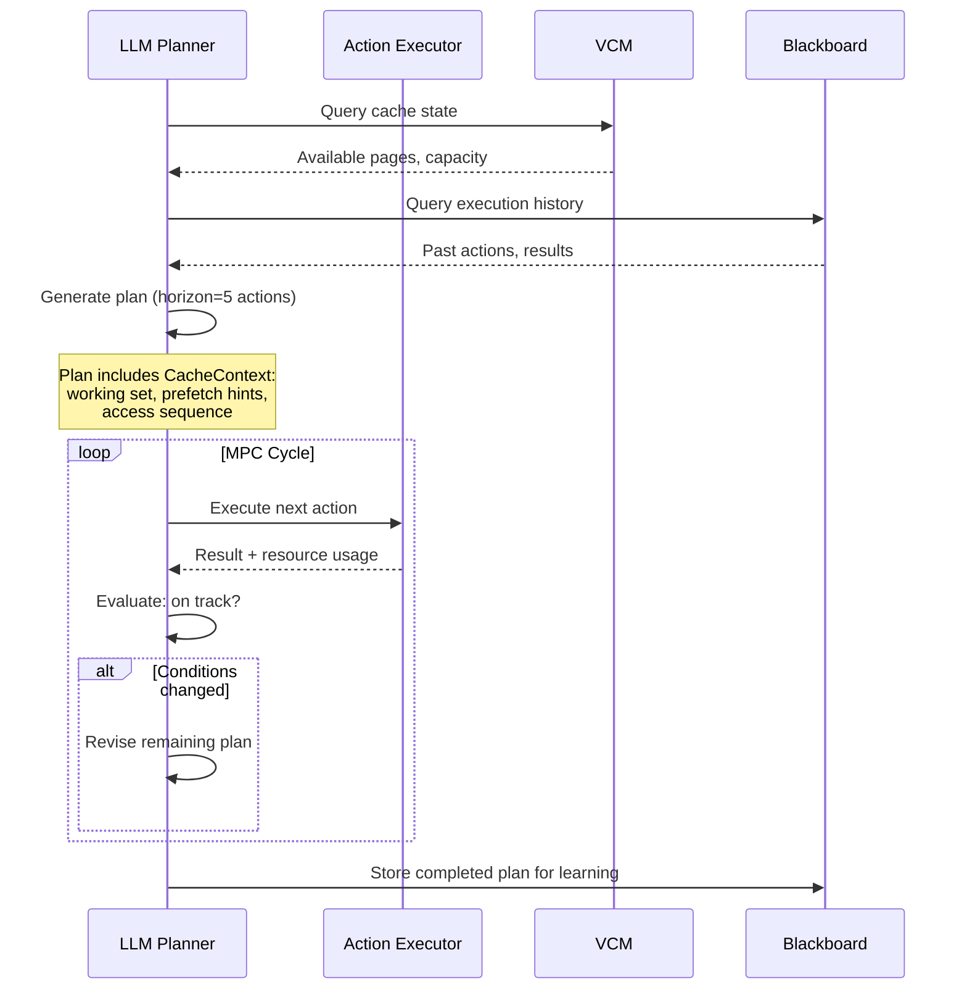
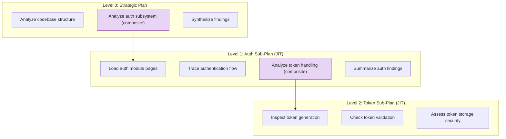

# Planning Architecture

Colony's planning system follows a single principle: **the LLM is the planner, not the framework**. There are no rigid plan graphs, state machines, or rule-based orchestration engines. The framework provides context and available actions; the LLM decides what to do; the framework executes and feeds back results.

## Why LLM-Centric Planning?

Traditional agent frameworks constrain planning through explicit structures: DAGs of tasks, state machines with fixed transitions, or Standard Operating Procedures that prescribe step sequences. These work for well-defined workflows but fail for Colony's target domain -- deep reasoning over extremely long context -- where:

- The optimal plan depends on what the LLM discovers during execution
- The task structure is not known in advance
- Cache state, page availability, and other agents' actions change the optimal strategy mid-execution
- The reasoning process may require arbitrary depth of sub-planning

Colony's approach: a **plan** is the LLM's current thinking plus execution history -- not a fixed sequence of steps. The LLM can revise, extend, or abandon its plan at any point based on new information.

## Plan and Action Models

### Action

An `Action` represents a single decision made by the LLM planner:

```python
class Action(BaseModel):
    action_id: str
    action_type: ActionType        # ANALYZE, PLAN_CREATE, TOOL_USE, etc.
    parameters: dict[str, Any]     # Action-specific parameters
    reasoning: str                 # LLM's reasoning for this action
    status: ActionStatus           # PENDING, RUNNING, COMPLETED, FAILED
    result: ActionResult | None    # Execution result
    sub_plan: ActionPlan | None    # For composite actions
    parent_action_id: str | None   # Hierarchical reference
```

Actions can be **atomic** (executed directly by an `@action_executor`) or **composite** (containing a sub-plan that is generated JIT when the action is executed). This enables hierarchical planning without requiring the LLM to plan everything upfront.

### ActionPlan

An `ActionPlan` is a container for the LLM's current strategy:

```python
class ActionPlan(BaseModel):
    plan_id: str
    goal: str                        # What this plan aims to achieve
    actions: list[Action]            # Ordered actions at this level
    current_action_index: int        # Execution cursor
    abstraction_level: int           # 0=top-level, 1=sub-plan, ...
    revision_history: list[str]      # Version tracking
    cache_context: CacheContext       # Working set, access patterns, prefetch
    execution_context: dict[str, Any] # Accumulated results and state
```

The plan maintains a full `execution_context` -- all completed actions, their results, and accumulated findings. This context is passed to the LLM when replanning, so the planner can generate informed continuations.

## The Reasoning Loop

The core execution cycle is straightforward:



At each iteration:

1. The framework gathers current context: goals, constraints, execution history, available actions from active capabilities, and cache state
2. The LLM reasons about what to do next (or creates/revises a plan)
3. The framework executes the chosen action via the appropriate `@action_executor`
4. Results feed back into context for the next iteration

This is not a chatbot loop. The LLM receives structured input (`ActionPolicyInput`) with typed descriptions of every available action, and produces structured output (action type + parameters). The two-phase action selection (choose action type, then parameterize) prevents the LLM from being overwhelmed by the full parameter space.

## Model-Predictive Control

`CacheAwareActionPolicy` uses a **Model-Predictive Control (MPC)** approach rather than plan-then-execute:

1. **Create plan**: LLM generates a plan with a finite horizon (not trying to plan the entire task)
2. **Execute partially**: Execute the next few actions
3. **Observe**: Check results against expectations, observe cache state changes
4. **Revise**: If conditions changed, revise the remaining plan; if on track, continue



MPC is essential for cache-aware planning because:

- **Cache state is nonstationary**: Other agents load and evict pages, invalidating assumptions
- **Page graph evolves**: New relationships are discovered during execution, changing optimal access patterns
- **Working set drifts**: The reasoning process may discover that different pages are more relevant than initially predicted

## Hierarchical Planning

Plans can be hierarchical through composite actions:

1. A parent agent creates a high-level plan with composite actions (e.g., "Analyze authentication subsystem")
2. When executing a composite action, a sub-plan is generated JIT by the LLM
3. The sub-plan may itself contain composite actions, creating arbitrary depth
4. The policy maintains its position in the plan tree for context



This allows natural decomposition: the LLM plans at the right level of abstraction for its current context, and defers detailed planning until it has the context to plan well.

## Replanning

Replanning is triggered by several conditions:

| Trigger | Strategy | Example |
|---------|----------|---------|
| **Plan exhaustion** | `ADD_ACTIONS` -- extend with new actions | All planned actions executed, but goal not yet satisfied |
| **Action failure** | `REVISE` or `BACKTRACK` | An action produces unexpected results |
| **New information** | `REVISE` -- adjust remaining actions | Blackboard events from other agents invalidate assumptions |
| **Resource changes** | `REVISE` with new cache context | VCM page availability changes |
| **Periodic** | `REVISE` | Configurable re-evaluation interval |

The replanning mechanism preserves the full execution history. When `revise_plan()` is called, the planner sees all completed actions and their results, and generates a continuation that builds on what has already been accomplished.

### Plan Exhaustion

When all actions in the current plan have been executed, this does not automatically mean the agent should stop. Plan exhaustion triggers replanning via the existing MPC mechanism:

1. The planner receives the full execution context (all completed actions + results)
2. The planner decides: is the goal satisfied, or does more work need to be done?
3. If more work: new actions are appended to the existing plan (preserving history)
4. If goal satisfied: the agent completes (or transitions to IDLE in continuous mode)

A configurable `max_replan_cycles` prevents infinite replanning loops.

## Cache-Aware Planning Context

Every plan includes a `CacheContext` that the LLM planner reasons about:

```python
class CacheContext(BaseModel):
    working_set: list[str]                    # Pages this plan needs
    working_set_priority: dict[str, float]    # page_id -> importance (0-1)
    estimated_access_pattern: dict[str, int]  # page_id -> expected access count
    access_sequence: list[str]                # Expected order of access
    page_graph_summary: dict[str, Any]        # Cluster info, relationships
    min_cache_size: int                       # Minimum for viable execution
    ideal_cache_size: int                     # For optimal performance
    shareable_pages: list[str]                # Safe for concurrent access
    exclusive_pages: list[str]                # Must not be evicted
    prefetch_pages: list[str]                 # Load before execution begins
    prefetch_priority: dict[str, float]       # Prefetch ordering
```

The planner uses this to:

- **Order actions** to maximize cache locality (group accesses to the same pages)
- **Declare prefetch needs** so the VCM can load pages before they are needed
- **Size the plan** to fit available cache capacity
- **Preserve cache locality** when revising plans mid-execution

## Checkpointing

Long-running actions support checkpointing for fault tolerance:

- The checkpoint policy saves state after expensive actions (page analysis, synthesis, agent spawning)
- State includes the full plan with execution context, current action index, and accumulated results
- On failure, the agent can resume from the last checkpoint rather than starting over
- Checkpoint frequency is configurable per action type

## What This Means in Practice

A concrete example of planning in action:

1. Agent receives goal: "Understand the dependency injection patterns in this codebase"
2. LLM creates initial plan: scan package structure, identify DI frameworks, trace injection points
3. First action discovers the codebase uses a custom DI system (not a standard framework)
4. LLM revises plan: shift from framework-specific analysis to tracing the custom DI implementation
5. During tracing, the agent discovers the custom DI interacts with an ORM in unexpected ways
6. LLM generates a sub-plan to analyze the ORM interaction, spawning child agents for the ORM modules
7. Child agents report findings; the parent synthesizes across the full dependency chain
8. Plan exhaustion triggers replanning; the LLM determines the goal is satisfied and completes

At no point did the framework prescribe the plan structure. The LLM adapted its strategy as it learned about the codebase. The MPC approach ensured that each planning decision was based on the most current information.
