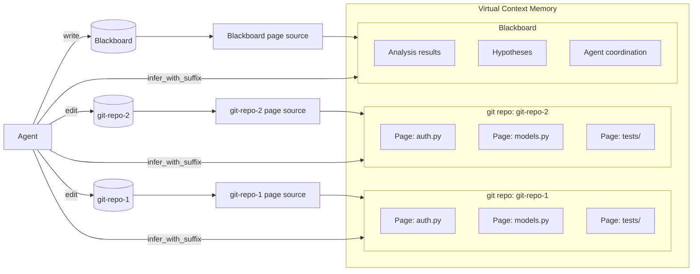

# Virtual Context Memory (VCM)


The Virtual Context Memory system manages potentially unlimited context like an operating system manages virtual memory. Context pages are swapped in and out of GPU KV cache, with page tables tracking residency, page faults signaling demand, and cache-aware scheduling maximizing reuse across agents.

!!! tip "VCM is A Cluster-Level *Virtual Context Manager*, Not A Node-Level Cache Manager or Request Router"
    Node-level serving libraries (e.g., vLLM) manage node-local KV cache capacity so that requests sharing prompt prefixes can benefit from cached context to varying degrees. Cluster-level serving libraries (e.g., Ray Serve) may route requests to nodes according to where relevant context is cached. Similarly to Ray Serve, Colony's VCM routes inference requests across the entire GPU cluster depending on node-level cache state. But unlike Ray Serve, the VCM allows agents to address a **virtual context space** much larger than the combined KV cache capacity of all nodes. VCM also allows agents to coordinate their dynamic working set (page placement and eviction decisions) to minimize cache misses across all agents.


## The Virtual Memory Analogy

Traditional LLM serving treats context as a flat, per-request resource or . Colony treats it as a shared, paged resource managed at the cluster level:

| OS Concept | VCM Equivalent |
|------------|----------------|
| Virtual page | `VirtualContextPage` -- a chunk of tokenized context |
| Physical frame | KV cache slot on a specific GPU replica |
| Page table | `VirtualPageTableState` -- maps pages to replicas |
| Page fault | Agent requests a page not resident on any available replica |
| Working set | Set of pages an agent needs for its current task |
| Cache-aware scheduling | Route agents to replicas that already have their pages cached |


## Context Page Sources

Any data source can be mapped to separate regions of the virtual context space by implementing the `ContextPageSource` interface. Colony includes implementations for file-based and git-based sources and the blackboard, but custom sources can be implemented for databases, APIs, or any structured data. This abstraction decouples the VCM from specific data domains and allows flexible mapping of application-level records to context pages.



For example, Colony's `FileGrouperContextPageSource` maps files in a git repository to pages, grouping related files together (e.g., a module and its tests). Agents can edit the git repository directly in the file system, and the context page source will detect the changes and the corresponding VCM pages will be invalidated (i.e., marked as stale) and updated. The `BlackboardContextPageSource` maps blackboard entries to pages, allowing agents to read/write shared state as part of their reasoning process.


!!! bug "Automatic Change Detection is Unimplemented"
    Implement.


#### Layout Optimization and Spatial Locality

Layout optimization -- both static (at session start) and dynamic (during execution) -- arranges raw data into pages to maximize *spatial locality*. Related content is co-located so that agents reading one piece likely find related pieces already cached.

!!! info "Spatial Locality"
    In OS virtual memory, spatial locality means that if a program accesses a memory address, it is likely to access nearby addresses soon. This is why memory is managed in pages -- to take advantage of this locality and minimize costly page faults. For example, if a large matrix is more frequently traversed in a row-wise manner, storing the matrix in row-major order increases spatial locality.
    Similarly, in the context of LLMs, spatial locality means that *context within the same page is self-contained that a LLM can reason effectively without needing to access other pages*. For example, a page containing a single source file with its unit tests has high spatial locality for code analysis tasks. A page containing random lines from different files has low spatial locality and would lead to more page faults.


## `VirtualContextPage`

`VirtualContextPage` is a generic abstraction -- it is not tied to git repositories or any specific domain. A page represents a contiguous chunk of tokenized content with metadata:

- **Content**: The tokenized text that will occupy KV cache
- **Metadata**: Source information, relationships, size estimates
- **Group membership**: Optional `group_id` and `sequence_number`
- **Affinity hints**: Which agents are likely to need this page

Pages are produced by pluggable `PageSource` implementations. The framework ships with file-based and git-based sources, but any data source can produce pages.

```python
class VirtualContextPage(BaseModel):
    page_id: ContextPageId              # Unique identifier
    tokens: list[int]                   # The actual token sequence
    text: str | None = None             # Source text (for remote LLM deployments)
    size: int                           # Number of tokens (>= len(tokens))
    metadata: dict[str, Any] = {}       # Arbitrary metadata (source file, keywords, etc.)

    scope_id: str                       # Scope identifier (e.g., repo ID, blackboard scope)
    group_id: str                       # Page group for spatial locality

    # Storage
    storage_uri: str | None = None      # Where raw data is stored (S3, DB, etc.)

    # Multi-tenancy
    tenant_id: str = "default"          # Data owner for isolation
    created_by: str | None = None       # Creator (agent_id, session_id, etc.)
    isolation_level: str = "shared"     # "shared" or "isolated"
    allowed_tenant_ids: set[str]        # Tenant IDs with access
    sensitivity_level: str = "internal" # "public", "internal", "confidential", "restricted"

    # Copy-on-write
    branch_id: BranchId = "main"
    parent_page_id: ContextPageId | None = None
    is_overlay: bool = False
```

### `ContextPageSource`

Pages are produced by `ContextPageSource` implementations (in `polymathera.colony.vcm.sources.context_page_source`). Each source maps application-level records (files, blackboard entries, etc.) to VCM pages:

```python
class ContextPageSource(ABC):
    """Maps application-level records to VCM pages."""

    def __init__(self, scope_id: str, group_id: str, tenant_id: str, mmap_config: MmapConfig): ...

    @abstractmethod
    async def initialize(self) -> None: ...

    @abstractmethod
    async def get_page_id_for_record(self, record_id: str) -> ContextPageId | None: ...

    @abstractmethod
    async def get_record_ids_for_page(self, page_id: ContextPageId) -> list[str]: ...

    @abstractmethod
    async def get_all_mapped_records(self) -> dict[str, ContextPageId]: ...

    @abstractmethod
    async def get_all_mapped_pages(self) -> dict[ContextPageId, list[str]]: ...
```

Custom page sources are registered via `ContextPageSourceFactory`:

```python
@ContextPageSourceFactory.register_new_source_type("my_source")
class MyContextPageSource(ContextPageSource):
    async def initialize(self) -> None: ...
    async def get_page_id_for_record(self, record_id: str) -> ContextPageId | None: ...
    ...

# Later, create via factory
source = ContextPageSourceFactory.create(
    source_type="my_source",
    scope_id="my-scope", group_id="my-group",
    tenant_id="default", mmap_config=mmap_config,
)
```

## Page Groups

Pages can be organized into groups for atomic loading:

- **Advisory groups**: The scheduler tries to co-locate group members but may split them under pressure.
- **Mandatory groups**: All pages in the group must be loaded together or not at all.

Groups are useful for related files (e.g., a module and its tests), multi-part documents, or any content where partial loading would be misleading.

## Agent-Page Affinity

Agents declare affinity to specific pages or page groups:

- **Soft affinity**: Best-effort scheduling. The agent is routed to a replica that has its preferred pages cached, but may be placed elsewhere if no such replica is available.
- **Hard affinity**: Mandatory. The agent cannot run unless its required pages are resident. If no replica has them, the system must load them before the agent can proceed.

Affinity drives the `AgentAffinityRouter` and `SoftPageAffinityRouter` (in `polymathera.colony.agents.routing`), which select replicas for agent placement based on current cache state.

## Page Fault Semantics

Unlike OS page faults, a VCM page fault does not block execution immediately. Instead:

1. The fault is recorded, increasing the priority of loading that page.
2. The scheduler considers the fault when the next replica slot becomes available.
3. The agent may continue with degraded context or wait, depending on affinity type.

This lazy-loading approach avoids the performance cliff of synchronous faults while still ensuring high-priority pages are loaded promptly.

## Cache-Aware Scheduling

The VCM scheduler makes placement decisions based on:

- **Current cache residency**: Which pages are on which replicas
- **Agent working sets**: Which pages each agent needs
- **Access patterns**: Historical and predicted access sequences
- **Page graph**: Attention relationships between pages (which pages are commonly accessed together)

!!! info "Amortized cost"
    Initial routing cost is $O(N_P^2)$ for $N_P$ pages as the page attention graph is constructed. As the graph stabilizes over rounds of agent execution, amortized cost drops to $O(N_P \log N_P)$.

## Page Graph

The page graph is a dynamically-updated attention graph over context pages. Edges represent discovered relationships -- if an agent analyzing page A generates queries that lead to page B, an edge is added between them.

The page graph serves multiple purposes:

- **Prefetching**: When an agent loads page A, pages connected to A in the graph are candidates for speculative prefetching.
- **Layout optimization**: Strongly connected pages are placed on the same replica when possible.
- **Query routing**: When an agent generates a cross-page query, the page graph helps identify which pages are likely relevant.

## Copy-on-Write Sessions

Each session gets its own view of VCM pages following a copy-on-write model. Changes made in one session (e.g., annotations, analysis results written to blackboard-backed pages) do not affect other sessions until explicitly merged. This enables concurrent analysis sessions over the same corpus without interference.

## Deployment

VCM managers are deployed as Ray Serve deployments for fault tolerance and autoscaling. The `VCMConfig` is added to the application during cluster setup via `PolymatheraClusterConfig.add_deployments_to_app()`. Access is through the deployment handle returned by `get_vcm()` from `polymathera.colony.system`:

```python
from polymathera.colony.system import get_vcm

vcm_handle = get_vcm(app_name)
# All VCM operations go through the deployment handle
await vcm_handle.load_page(page_id=page.page_id, replica_id=target_replica)
await vcm_handle.evict_page(page_id=page.page_id, replica_id=target_replica)
page_table = await vcm_handle.get_page_table_state()
```
