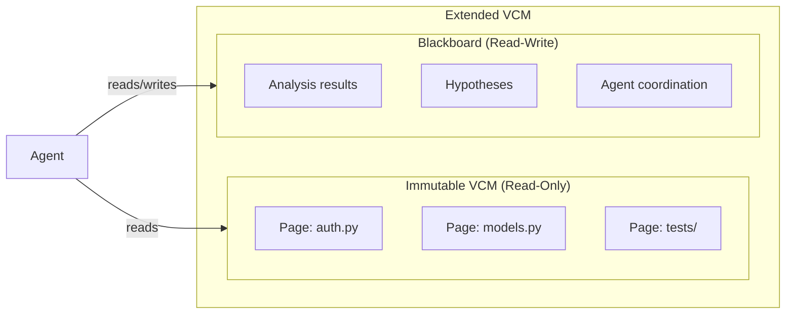

# Virtual Context Memory (VCM)

The Virtual Context Memory system manages LLM context like an operating system manages virtual memory. Context pages are swapped in and out of GPU KV cache, with page tables tracking residency, page faults signaling demand, and cache-aware scheduling maximizing reuse across agents.

## The Virtual Memory Analogy

Traditional LLM serving treats context as a flat, per-request resource. Colony treats it as a shared, paged resource managed at the cluster level:

| OS Concept | VCM Equivalent |
|------------|----------------|
| Virtual page | `VirtualContextPage` -- a chunk of tokenized context |
| Physical frame | KV cache slot on a specific GPU replica |
| Page table | `VirtualPageTableState` -- maps pages to replicas |
| Page fault | Agent requests a page not resident on any available replica |
| Working set | Set of pages an agent needs for its current task |
| Cache-aware scheduling | Route agents to replicas that already have their pages cached |

!!! note "Cluster-level, not node-level"
    vLLM manages KV cache within a single node. VCM operates **across the entire GPU cluster**, coordinating page placement and agent routing to minimize cache misses across all replicas.

## Extended VCM (eVCM)

The Extended VCM combines two complementary memory regions:

- **Immutable VCM**: Read-only input data (source code, documents, datasets) organized into pages. Once loaded, content does not change during a session.
- **Blackboard**: Read-write shared output. Analysis results, hypotheses, plans, and coordination state. Backed by Redis, accessible to all agents.

Layout optimization -- both static (at session start) and dynamic (during execution) -- arranges raw data into pages to maximize spatial locality. Related content is co-located so that agents reading one piece likely find related pieces already cached.

## VirtualContextPage

`VirtualContextPage` is a generic abstraction -- it is not tied to git repositories or any specific domain. A page represents a contiguous chunk of tokenized content with metadata:

- **Content**: The tokenized text that will occupy KV cache
- **Metadata**: Source information, relationships, size estimates
- **Group membership**: Optional `group_id` and `sequence_number`
- **Affinity hints**: Which agents are likely to need this page

Pages are produced by pluggable `PageSource` implementations. The framework ships with file-based and git-based sources, but any data source can produce pages.

## Page Groups

Pages can be organized into groups for atomic loading:

- **Advisory groups**: The scheduler tries to co-locate group members but may split them under pressure.
- **Mandatory groups**: All pages in the group must be loaded together or not at all.

Groups are useful for related files (e.g., a module and its tests), multi-part documents, or any content where partial loading would be misleading.

## Agent-Page Affinity

Agents declare affinity to specific pages or page groups:

- **Soft affinity**: Best-effort scheduling. The agent is routed to a replica that has its preferred pages cached, but may be placed elsewhere if no such replica is available.
- **Hard affinity**: Mandatory. The agent cannot run unless its required pages are resident. If no replica has them, the system must load them before the agent can proceed.

Affinity drives the `AgentAffinityRouter` and `SoftPageAffinityRouter` (in `polymathera.colony.agents.routing`), which select replicas for agent placement based on current cache state.

## Page Fault Semantics

Unlike OS page faults, a VCM page fault does not block execution immediately. Instead:

1. The fault is recorded, increasing the priority of loading that page.
2. The scheduler considers the fault when the next replica slot becomes available.
3. The agent may continue with degraded context or wait, depending on affinity type.

This lazy-loading approach avoids the performance cliff of synchronous faults while still ensuring high-priority pages are loaded promptly.

## Cache-Aware Scheduling

The VCM scheduler makes placement decisions based on:

- **Current cache residency**: Which pages are on which replicas
- **Agent working sets**: Which pages each agent needs
- **Access patterns**: Historical and predicted access sequences
- **Page graph**: Attention relationships between pages (which pages are commonly accessed together)

!!! info "Amortized cost"
    Initial routing cost is O(N_P^2) for N_P pages as the page attention graph is constructed. As the graph stabilizes over rounds of agent execution, amortized cost drops to O(N_P log N_P).

## Page Graph

The page graph is a dynamically-updated attention graph over context pages. Edges represent discovered relationships -- if an agent analyzing page A generates queries that lead to page B, an edge is added between them.

The page graph serves multiple purposes:

- **Prefetching**: When an agent loads page A, pages connected to A in the graph are candidates for speculative prefetching.
- **Layout optimization**: Strongly connected pages are placed on the same replica when possible.
- **Query routing**: When an agent generates a cross-page query, the page graph helps identify which pages are likely relevant.

## Copy-on-Write Sessions

Each session gets its own view of VCM pages following a copy-on-write model. Changes made in one session (e.g., annotations, analysis results written to blackboard-backed pages) do not affect other sessions until explicitly merged. This enables concurrent analysis sessions over the same corpus without interference.

## Deployment

VCM managers are deployed as Ray Serve deployments for fault tolerance and autoscaling. The `VCMConfig` is added to the application during cluster setup via `PolymatheraClusterConfig.add_deployments_to_app()`. Access is through the deployment handle returned by `get_vcm()` from `polymathera.colony.system`.
