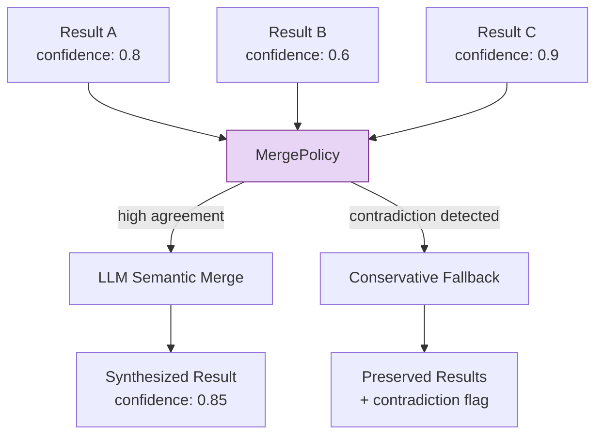
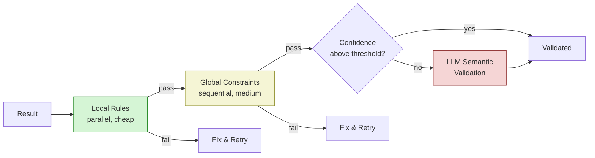
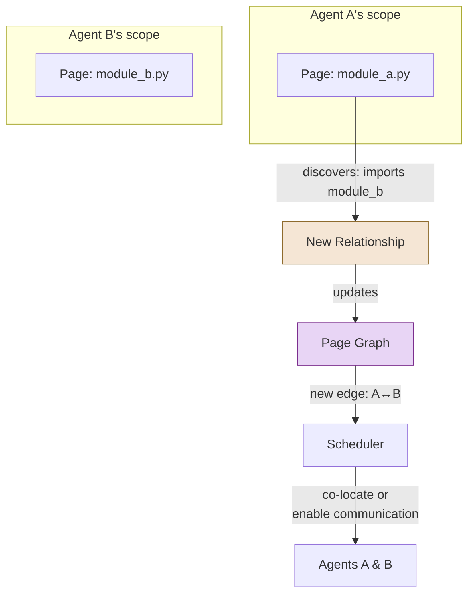

# Seven Core Abstraction Patterns

Colony's abstraction patterns were distilled from analysis of 30+ code analysis strategies, but they are not specific to code analysis. They generalize to any domain where agents work with **partial knowledge** and **discovered relationships** -- scientific research, intelligence analysis, medical diagnosis, forensic accounting, or any investigation that starts with incomplete information and iteratively deepens.

!!! tip "Central Insight"

    Distributed analysis is about managing **partial knowledge** and discovering **relationships**. The right unit of distributed analysis is not the answer -- it is the *partial, confidence-scored, context-aware finding that knows what it does not know*. Systems that treat agent outputs as final answers must either accept low quality or add expensive post-hoc validation. Systems built on `ScopeAwareResult` can route effort precisely where uncertainty is highest, discover relationships that no single agent could see, and converge on high-confidence results through targeted refinement.


!!! warning "These patterns are not optional add-ons"

    In `polymathera.colony`, the patterns described here are baked into the base abstractions. `ScopeAwareResult` is not a convenience wrapper -- it is the expected return type from analysis capabilities. `MergePolicy` is not a utility -- it is a required component of any multi-agent aggregation pipeline. If you find yourself producing bare strings from agent analysis, you are working against the framework's grain.

The patterns were discovered empirically by studying what worked across 30+ code analysis strategies. But their power comes from the fact that they are **domain-independent**. Partial knowledge, discovered relationships, uncertain inference, iterative refinement -- these are the universal challenges of any distributed reasoning system. Colony's bet is that getting these patterns right at the framework level frees domain-specific code to focus on what actually varies.


Every pattern below serves one of these four challenges: managing **partial knowledge**, discovering **relationships**, handling **uncertain inference**, and enabling **iterative refinement**.


## The Seven Patterns

### 1. `ScopeAwareResult`: Partial Knowledge as a First-Class Citizen

Most systems treat analysis results as final answers. Colony treats them as **partial knowledge** -- results that explicitly declare what they know, how confident they are, what they are missing, and what relationships they have discovered.

```python
class AnalysisScope(BaseModel):
    """Metadata about analysis result completeness and relationships."""

    is_complete: bool = False              # Whether analysis is complete
    missing_context: list[str] = []        # Specific context needed (function names, files)
    related_shards: list[str] = []         # Related page IDs to analyze together
    external_refs: list[str] = []          # External dependencies not in scope
    confidence: float = 0.7               # Confidence level (0.0 - 1.0)
    quality_score: float = 0.7            # Quality of analysis (0.0 - 1.0)
    reasoning: list[str] = []             # Justifications for scope assessment
    evidence: list[str] = []              # Evidence supporting conclusions
    assumptions: list[str] = []           # Assumptions made
    limitations: list[str] = []           # Known limitations

    def needs_more_context(self) -> bool:
        return not self.is_complete or len(self.missing_context) > 0


class ScopeAwareResult(BaseModel, Generic[T]):
    """Generic wrapper for analysis results with scope awareness."""

    content: T                             # The actual analysis result (generic)
    scope: AnalysisScope                   # Completeness, relationships, confidence
    result_id: str                         # Unique identifier
    producer_agent_id: str | None = None   # Which agent produced this
    refinement_count: int = 0              # How many times refined
    validated: bool = False                # Whether validated
    validation_results: list[dict] = []    # Validation history
```

This is not a wrapper around a string with a confidence score bolted on. The `missing_context` field is load-bearing: it drives subsequent **context discovery** (Pattern 3) and **refinement** (Pattern 7). The `relationships` field feeds the **page graph** (Pattern 6).

!!! info "Generalization"

    Any domain where initial analysis is uncertain and improves with more context benefits from this pattern. A medical diagnosis agent could produce a `ScopeAwareResult` listing differential diagnoses (`content`), likelihood (`confidence`), missing lab results (`missing_context`), and comorbidity connections (`relationships`).

### 2. `MergePolicy[T]`: Composing Uncertain Inferences

When multiple agents analyze overlapping or related domains, their results must be merged. Colony defines `MergePolicy[T]` as a generic, pluggable interface for combining partial results:

```python
class MergePolicy(ABC, Generic[T]):
    """Abstract base class for merge policies.

    Different strategies for different data types:
    - Semantic content → LLM-based merging (SemanticMergePolicy)
    - Numerical metrics → Statistical aggregation (StatisticalMergePolicy)
    - Graphs → Graph union/intersection (GraphMergePolicy)
    - Relationships → Deduplication (RelationshipMergePolicy)
    """

    @abstractmethod
    async def merge(
        self,
        results: list[ScopeAwareResult[T]],
        context: MergeContext
    ) -> ScopeAwareResult[T]:
        """Merge multiple results into one."""
        ...

    @abstractmethod
    async def validate(
        self,
        original: list[ScopeAwareResult[T]],
        merged: ScopeAwareResult[T]
    ) -> MergeValidationResult:
        """Validate that merge preserved important information."""
        ...


class MergeContext(BaseModel):
    """Context for merge decisions."""
    prefer_higher_confidence: bool = True
    prefer_newer: bool = False
    prefer_complete: bool = True
    max_merge_size: int | None = None
    timeout_seconds: float | None = None
    merge_reason: str | None = None
```

Colony ships two implementations that work in tandem:

- **LLM-based merge**: Uses an LLM to semantically combine results, resolve contradictions, and synthesize higher-level findings. This is the primary path.
- **Conservative fallback**: When the LLM merge produces low confidence or the results are too contradictory, falls back to a rule-based merge that preserves all findings without attempting synthesis. Information is retained rather than corrupted.



The key design decision: **merge is a policy, not a function**. Different domains, different confidence thresholds, and different cost budgets call for different merge strategies. The framework does not prescribe one.

### 3. Query-Driven Context Discovery

Agents do not passively wait for context to be assigned. They actively generate queries from their findings and route those queries to relevant pages in the virtual context.

The flow works like this:

1. An agent analyzes its assigned pages and produces a `ScopeAwareResult`
2. The agent's action policy examines the result's `missing_context` and `relationships` fields and decides to use `QueryAttentionCapability` to generate and route discovery queries to pages likely to contain answers (using the page graph)
3. Results come back, and the agent refines its analysis

This is the mechanism by which Colony agents perform **investigation** rather than **classification**. The agent does not just label its input -- it actively seeks out the information it needs to resolve uncertainty.

```python
class QueryAttentionCapability(AgentCapability):
    """Core primitives for query generation and routing."""

    @action_executor()
    async def generate_queries(
        self,
        findings: list[dict[str, Any]],
        context: dict[str, Any] | None = None,
        max_queries: int = 5,
    ) -> dict[str, Any]:
        """Generate queries from analysis findings."""
        ...

    @action_executor()
    async def route_query(
        self,
        query: PageQuery | dict[str, Any],
        available_pages: list[str] | None = None,
        max_results: int = 10,
        min_relevance: float = 0.5,
        boost_ws: bool = False,         # Boost pages in working set
        prefer_locality: str = "none",  # "none", "group", "cluster"
    ) -> dict[str, Any]:
        """Route query to find relevant pages (with cache-aware boosting)."""
        ...
```

!!! tip "Generalization"

    This pattern maps directly to scientific reasoning (form hypothesis, identify what evidence is missing, design experiment to find it), debugging (observe symptom, identify what context is missing, inspect relevant components), and investigative journalism (find lead, identify gaps, pursue sources).

### 4. Multi-Level Validation

Colony validates results at three levels, each catching different classes of error. The `MultiLevelValidator` composes multiple strategies:

```python
class AnalysisValidationPolicy(ABC, Generic[T]):
    """Abstract base for analysis validation policies."""

    @abstractmethod
    async def validate(
        self,
        result: ScopeAwareResult[T],
        context: ValidationContext
    ) -> ValidationResult: ...


class MultiLevelValidator(AnalysisValidationPolicy[T]):
    """Combines multiple validation strategies in sequence."""

    def __init__(self, validators: list[AnalysisValidationPolicy[T]]):
        self.validators = validators


class CrossShardConsistencyValidator(AnalysisValidationPolicy[T]):
    """Validates consistency across shard boundaries.
    Checks that cross-shard references don't contradict."""

    def __init__(self, result_reader: ResultReader[T], consistency_checker: ConsistencyChecker[T]):
        ...


class EvidenceBasedValidator(AnalysisValidationPolicy[T]):
    """Validates that claims are supported by evidence."""
    ...
```

Colony validates results at three levels:

| Level | Method | Catches | Cost |
|---|---|---|---|
| **Local rules** | Rule-based, runs in parallel | Structural errors, schema violations, obvious contradictions | Low |
| **Global constraints** | Sequential, cross-result | Cross-boundary inconsistencies, violated invariants | Medium |
| **LLM semantic** | LLM-based, on demand | Subtle logical errors, unstated assumption violations | High |

The levels are ordered by cost. Local rule validation is cheap and parallel -- it runs on every result. Global constraint checking is sequential because it needs cross-result context, but it is still rule-based. LLM semantic validation is expensive and invoked only when the cheaper levels pass but confidence remains below threshold.



### 5. ConfidenceTracker: Multi-Factor Scoring

Confidence in Colony is not a single number assigned by gut feeling. `ConfidenceTracker` computes confidence from multiple weighted factors with configurable penalties:

- **Evidence coverage**: What fraction of the relevant context was actually examined?
- **Cross-reference support**: How many independent sources corroborate the finding?
- **Missing context penalty**: Each unresolved `missing_context` entry reduces confidence
- **Contradiction penalty**: Conflicting evidence from different sources reduces confidence
- **Staleness decay**: Confidence decreases as the finding ages without re-validation

Weights are configurable per domain. A code analysis task might weight evidence coverage heavily. A research synthesis task might weight cross-reference support more.

The critical design property: **confidence is computed, not declared**. An agent cannot simply assert "I am 95% confident." The confidence emerges from measurable factors. This makes confidence scores comparable across agents and defensible in post-hoc analysis.

```python
class ConfidenceTracker:
    """Tracks and reasons about confidence across analysis results."""

    def calculate_aggregate_confidence(self, results: list[ScopeAwareResult]) -> float:
        """Weighted average based on scope completeness and quality.
        Complete results get more weight than incomplete ones."""
        total_weight = 0.0
        weighted_sum = 0.0
        for result in results:
            completeness_weight = 1.0 if result.scope.is_complete else 0.5
            quality_weight = result.scope.quality_score
            weight = completeness_weight * quality_weight
            weighted_sum += result.scope.confidence * weight
            total_weight += weight
        return weighted_sum / total_weight if total_weight > 0 else 0.0

    def should_continue_analysis(
        self,
        results: list[ScopeAwareResult],
        target_confidence: float = 0.8,
        min_high_confidence_ratio: float = 0.7,
    ) -> bool:
        """Decide if more analysis is needed."""
        metrics = self.calculate_metrics(results)
        if metrics.weighted_confidence < target_confidence:
            return True
        if metrics.high_confidence_count / metrics.total_count < min_high_confidence_ratio:
            return True
        if metrics.confidence_variance > 0.05:  # Inconsistent confidence
            return True
        return False
```

### 6. Relationship Discovery + Page Graph Updates

When agents analyze individual pages (or any bounded scope), they discover relationships that cross scope boundaries: function calls between modules, citations between papers, dependencies between components. These cross-boundary relationships dynamically update the **page graph** -- the attention graph that guides which pages are loaded together and which agents should communicate.

```python
class Relationship(BaseModel):
    """A typed, confidence-scored relationship between two entities."""

    source_id: str              # Source entity (page_id, symbol, etc.)
    target_id: str              # Target entity
    relationship_type: str      # "dependency", "alias", "dataflow", "similarity"
    bidirectional: bool = False
    confidence: float           # 0.0 - 1.0
    weight: float = 1.0         # Relationship strength
    evidence: list[str] = []    # Evidence supporting this relationship
    discovered_by: str | None = None  # Agent ID that discovered it


class PageGraphCapability(AgentCapability):
    """Traverses and updates the page relationship graph (NetworkX-backed)."""

    @action_executor()
    async def traverse(
        self, start_pages: list[str], strategy: str = "bfs",
        max_depth: int = 2, prefer_cached: bool = False,
    ) -> dict[str, Any]:
        """Traverse graph for prefetching or batching."""
        ...

    @action_executor()
    async def update_edge(
        self, source: str, target: str,
        weight_delta: float = 0.1, relationship_type: str = "query_resolution",
    ) -> dict[str, Any]:
        """Update edge weight based on discovered relationship."""
        ...

    @action_executor()
    async def get_clusters(
        self, algorithm: str = "connected", min_size: int = 2,
    ) -> dict[str, Any]:
        """Get page clusters for batch scheduling."""
        ...
```



The page graph starts as an approximation (based on file structure, explicit imports, or domain heuristics) and is refined as agents discover actual relationships. Over rounds of analysis, the graph converges on the true dependency structure of the domain. This is why Colony's amortized cost drops from O(N^2) to O(N log N) as the page graph stabilizes -- routing decisions become increasingly precise.

!!! info "Generalization"

    This pattern applies wherever you discover connections across boundaries: social network analysis (discovering relationships between communities), knowledge graph construction (discovering links between concepts), supply chain analysis (discovering dependencies between suppliers).

### 7. `RefinementPolicy[T]`: Iterative Improvement Under Uncertainty

The final pattern encodes a principle that distinguishes Colony from systems that try to get everything right on the first pass:

> **Low-confidence results trigger refinement instead of action.**

A `RefinementPolicy` defines when and how to improve a result:

```python
class RefinementPolicy(ABC, Generic[T]):
    """Defines how to improve results when new context arrives."""

    @abstractmethod
    async def should_refine(
        self,
        result: ScopeAwareResult[T],
        new_context: RefinementContext
    ) -> bool:
        """Decide if result should be refined with new context."""
        ...

    @abstractmethod
    async def refine(
        self,
        original: ScopeAwareResult[T],
        new_context: RefinementContext
    ) -> ScopeAwareResult[T]:
        """Refine result with new context."""
        ...


class RefinementContext(BaseModel):
    """Context for refinement operations."""
    new_evidence: dict[str, Any] = {}            # New evidence or context
    refinement_goal: str | None = None           # What aspect to refine
    constraints: dict[str, Any] = {}             # Time, size constraints
    requesting_agent_id: str | None = None
```

- **Trigger conditions**: Confidence below threshold, missing context resolvable, new evidence available
- **Refinement strategies**: Re-analyze with additional context, merge with related results, request peer review
- **Termination conditions**: Confidence above threshold, no more resolvable missing context, budget exhausted

This creates a natural feedback loop: analyze, assess confidence, discover what is missing, acquire context, re-analyze. The loop terminates when confidence is sufficient or resources are exhausted -- not when a fixed number of iterations have passed.

## Five Collaboration Mechanisms

The seven patterns are supported by five mechanisms for multi-agent collaboration:

1. **Hypothesis Auctions**: An agent publishes a hypothesis with a description of what evidence would strengthen or refute it. Other agents "bid" with relevant findings from their own analysis. The best bids are accepted, and the hypothesis is updated.

2. **Trajectory Alignment**: Agents broadcast their planned analysis trajectories (which pages they intend to examine, in what order). A coordinator reconciles trajectories to maximize cache reuse and minimize redundant work.

3. **Assertion Networks**: Agents produce assertions -- likely bounds or invariants plus supporting evidence. A `HintMergePolicy` narrows assertions when they are compatible and flags contradictions when they are not.

4. **Cross-Scope Queries**: Formalized version of Pattern 3 for multi-agent settings. An agent in one scope can issue a typed query to agents in other scopes, with the page graph routing queries to the most relevant respondents.

5. **Collective Refinement**: Multiple agents contribute context to refine a shared low-confidence result, coordinated by the RefinementPolicy to avoid redundant work.
