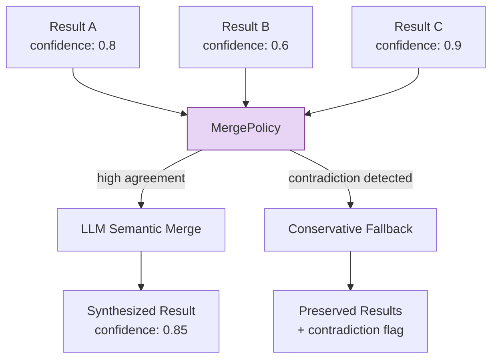
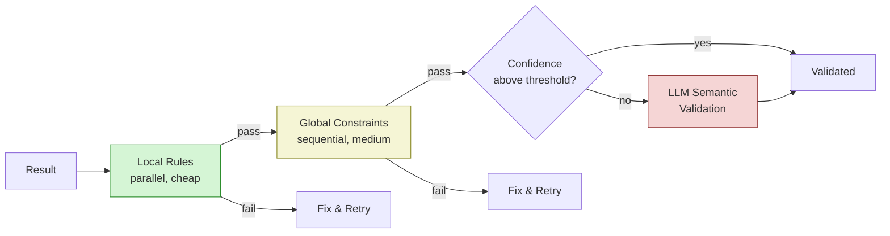
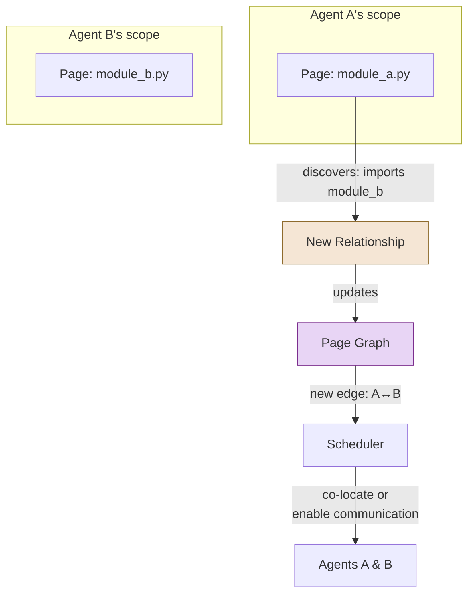

# Seven Core Abstraction Patterns

Colony's abstraction patterns were distilled from analysis of 30+ code analysis strategies, but they are not specific to code analysis. They generalize to any domain where agents work with **partial knowledge** and **discovered relationships** -- scientific research, intelligence analysis, medical diagnosis, forensic accounting, or any investigation that starts with incomplete information and iteratively deepens.

The central insight, stated directly:

> **Distributed analysis is about managing partial knowledge and discovering relationships.**

Every pattern below serves one of these two purposes.

## The Seven Patterns

### 1. ScopeAwareResult: Partial Knowledge as a First-Class Citizen

Most systems treat analysis results as final answers. Colony treats them as **partial knowledge** -- results that explicitly declare what they know, how confident they are, what they are missing, and what relationships they have discovered.

```python
class ScopeAwareResult(BaseModel):
    content: AnalysisContent          # What was found
    confidence: float                  # How certain (0.0 - 1.0)
    missing_context: list[str]        # What couldn't be resolved
    relationships: list[Relationship]  # Cross-boundary connections
    scope: AnalysisScope              # Where this result applies
```

This is not a wrapper around a string with a confidence score bolted on. The `missing_context` field is load-bearing: it drives subsequent context discovery (Pattern 3) and refinement (Pattern 7). The `relationships` field feeds the page graph (Pattern 6).

!!! info "Generalization"

    Any domain where initial analysis is uncertain and improves with more context benefits from this pattern. A medical diagnosis agent could produce a `ScopeAwareResult` listing differential diagnoses (content), likelihood (confidence), missing lab results (missing_context), and comorbidity connections (relationships).

### 2. MergePolicy[T]: Composing Uncertain Inferences

When multiple agents analyze overlapping domains, their results must be merged. Colony defines `MergePolicy[T]` as a generic, pluggable interface for combining partial results:

```python
class MergePolicy(Protocol[T]):
    async def merge(self, results: list[T], context: MergeContext) -> T:
        ...
```

Colony ships two implementations that work in tandem:

- **LLM-based merge**: Uses an LLM to semantically combine results, resolve contradictions, and synthesize higher-level findings. This is the primary path.
- **Conservative fallback**: When the LLM merge produces low confidence or the results are too contradictory, falls back to a rule-based merge that preserves all findings without attempting synthesis. Information is retained rather than corrupted.



The key design decision: **merge is a policy, not a function**. Different domains, different confidence thresholds, and different cost budgets call for different merge strategies. The framework does not prescribe one.

### 3. Query-Driven Context Discovery

Agents do not passively wait for context to be assigned. They actively generate queries from their findings and route those queries to relevant pages in the virtual context.

The flow works like this:

1. An agent analyzes its assigned pages and produces a `ScopeAwareResult`
2. The result's `missing_context` and `relationships` fields generate discovery queries
3. Queries are routed to pages likely to contain answers (using the page graph)
4. Results come back, and the agent refines its analysis

This is the mechanism by which Colony agents perform **investigation** rather than **classification**. The agent does not just label its input -- it actively seeks out the information it needs to resolve uncertainty.

!!! tip "Generalization"

    This pattern maps directly to scientific reasoning (form hypothesis, identify what evidence is missing, design experiment to find it), debugging (observe symptom, identify what context is missing, inspect relevant components), and investigative journalism (find lead, identify gaps, pursue sources).

### 4. Multi-Level Validation

Colony validates results at three levels, each catching different classes of error:

| Level | Method | Catches | Cost |
|---|---|---|---|
| **Local rules** | Rule-based, runs in parallel | Structural errors, schema violations, obvious contradictions | Low |
| **Global constraints** | Sequential, cross-result | Cross-boundary inconsistencies, violated invariants | Medium |
| **LLM semantic** | LLM-based, on demand | Subtle logical errors, unstated assumption violations | High |

The levels are ordered by cost. Local rule validation is cheap and parallel -- it runs on every result. Global constraint checking is sequential because it needs cross-result context, but it is still rule-based. LLM semantic validation is expensive and invoked only when the cheaper levels pass but confidence remains below threshold.



### 5. ConfidenceTracker: Multi-Factor Scoring

Confidence in Colony is not a single number assigned by gut feeling. `ConfidenceTracker` computes confidence from multiple weighted factors with configurable penalties:

- **Evidence coverage**: What fraction of the relevant context was actually examined?
- **Cross-reference support**: How many independent sources corroborate the finding?
- **Missing context penalty**: Each unresolved `missing_context` entry reduces confidence
- **Contradiction penalty**: Conflicting evidence from different sources reduces confidence
- **Staleness decay**: Confidence decreases as the finding ages without re-validation

Weights are configurable per domain. A code analysis task might weight evidence coverage heavily. A research synthesis task might weight cross-reference support more.

The critical design property: **confidence is computed, not declared**. An agent cannot simply assert "I am 95% confident." The confidence emerges from measurable factors. This makes confidence scores comparable across agents and defensible in post-hoc analysis.

### 6. Relationship Discovery + Page Graph Updates

When agents analyze individual pages (or any bounded scope), they discover relationships that cross scope boundaries: function calls between modules, citations between papers, dependencies between components. These cross-boundary relationships dynamically update the **page graph** -- the attention graph that guides which pages are loaded together and which agents should communicate.



The page graph starts as an approximation (based on file structure, explicit imports, or domain heuristics) and is refined as agents discover actual relationships. Over rounds of analysis, the graph converges on the true dependency structure of the domain. This is why Colony's amortized cost drops from O(N^2) to O(N log N) as the page graph stabilizes -- routing decisions become increasingly precise.

!!! info "Generalization"

    This pattern applies wherever you discover connections across boundaries: social network analysis (discovering relationships between communities), knowledge graph construction (discovering links between concepts), supply chain analysis (discovering dependencies between suppliers).

### 7. RefinementPolicy: Iterative Improvement Under Uncertainty

The final pattern encodes a principle that distinguishes Colony from systems that try to get everything right on the first pass:

> **Low-confidence results trigger refinement instead of action.**

A `RefinementPolicy` defines when and how to improve a result:

- **Trigger conditions**: Confidence below threshold, missing context resolvable, new evidence available
- **Refinement strategies**: Re-analyze with additional context, merge with related results, request peer review
- **Termination conditions**: Confidence above threshold, no more resolvable missing context, budget exhausted

This creates a natural feedback loop: analyze, assess confidence, discover what is missing, acquire context, re-analyze. The loop terminates when confidence is sufficient or resources are exhausted -- not when a fixed number of iterations have passed.

## Five Collaboration Mechanisms

The seven patterns are supported by five mechanisms for multi-agent collaboration:

1. **Hypothesis Auctions**: An agent publishes a hypothesis with a description of what evidence would strengthen or refute it. Other agents "bid" with relevant findings from their own analysis. The best bids are accepted, and the hypothesis is updated.

2. **Trajectory Alignment**: Agents broadcast their planned analysis trajectories (which pages they intend to examine, in what order). A coordinator reconciles trajectories to maximize cache reuse and minimize redundant work.

3. **Assertion Networks**: Agents produce assertions -- likely bounds or invariants plus supporting evidence. A `HintMergePolicy` narrows assertions when they are compatible and flags contradictions when they are not.

4. **Cross-Scope Queries**: Formalized version of Pattern 3 for multi-agent settings. An agent in one scope can issue a typed query to agents in other scopes, with the page graph routing queries to the most relevant respondents.

5. **Collective Refinement**: Multiple agents contribute context to refine a shared low-confidence result, coordinated by the RefinementPolicy to avoid redundant work.

## The Unifying Principle

These seven patterns and five mechanisms all serve the same thesis: **the right unit of distributed analysis is not the answer -- it is the partial, confidence-scored, context-aware finding that knows what it does not know.**

Systems that treat agent outputs as final answers must either accept low quality or add expensive post-hoc validation. Systems built on `ScopeAwareResult` can route effort precisely where uncertainty is highest, discover relationships that no single agent could see, and converge on high-confidence results through targeted refinement.

!!! warning "These patterns are not optional add-ons"

    In `polymathera.colony`, the patterns described here are baked into the base abstractions. `ScopeAwareResult` is not a convenience wrapper -- it is the expected return type from analysis capabilities. `MergePolicy` is not a utility -- it is a required component of any multi-agent aggregation pipeline. If you find yourself producing bare strings from agent analysis, you are working against the framework's grain.

The patterns were discovered empirically by studying what worked across 30+ code analysis strategies. But their power comes from the fact that they are domain-independent. Partial knowledge, discovered relationships, uncertain inference, iterative refinement -- these are the universal challenges of any distributed reasoning system. Colony's bet is that getting these patterns right at the framework level frees domain-specific code to focus on what actually varies.
