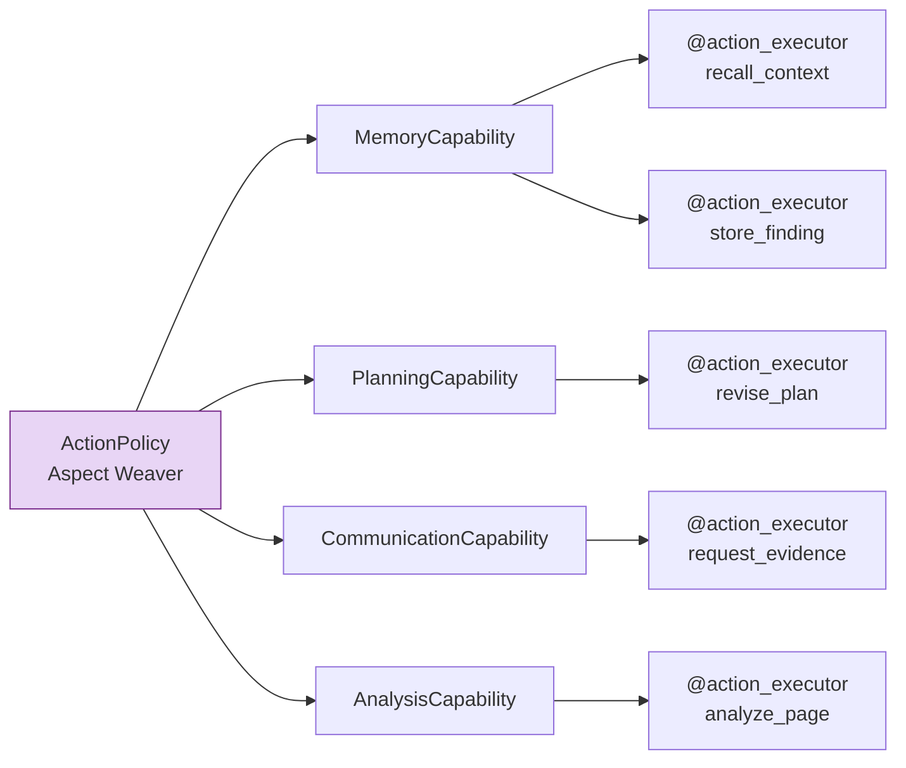
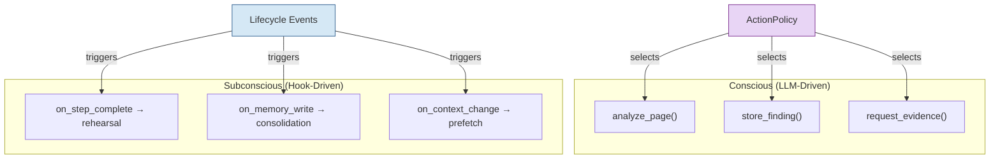

# AgentCapabilities as AOP Aspects

Most multi-agent frameworks model agent behavior through class inheritance. You subclass `Agent`, override methods, and hope the resulting hierarchy remains manageable. Colony takes a fundamentally different approach: agent behavior is composed from orthogonal capabilities that are woven together at runtime. This is aspect-oriented programming (AOP) applied to cognitive architecture.

## The Core Idea

In Colony, an `AgentCapability` is not a mixin. It is an **aspect** in the AOP sense -- a modular unit of cross-cutting concern that can be composed with other aspects without explicit knowledge of them. The `ActionPolicy` plays the role of the **aspect weaver**, deciding at each step which capabilities activate, in what order, and with what parameters.

```python
# Each capability declares what it can do
class MemoryConsolidationCapability(AgentCapability):
    @action_executor  # "conscious" -- LLM decides to invoke
    async def consolidate_memories(self, context: ActionContext) -> ActionResult:
        ...

    @hookable  # "subconscious" -- runs automatically via hooks
    async def on_step_complete(self, state: AgentState) -> None:
        # Background rehearsal, concept formation
        ...
```

The `ActionPolicy` receives the full set of action executors exported by all active capabilities and selects among them based on the current planning context. It does not need to know the implementation of any capability -- only the action descriptions and schemas.

## Emergent Behavior from Composition

Here is where the design pays off. Consider an agent with three capabilities: `MemoryCapability`, `PlanningCapability`, and `CommunicationCapability`. Each exports a handful of action executors. The ActionPolicy can interleave them in any order, creating behavior paths that no individual capability was designed to produce.



With 4 capabilities exporting 2--3 actions each, the ActionPolicy can produce dozens of distinct behavior sequences per step. With 8 capabilities, the combinatorial space is enormous. **You do not model these paths explicitly.** The LLM-based ActionPolicy navigates this space using the current context, goals, and execution history.

!!! info "Why this matters"

    Traditional frameworks require you to anticipate and code every meaningful agent behavior. Colony requires you to define capabilities with clean interfaces and let the ActionPolicy compose them. Adding a new capability to an agent immediately creates new emergent behaviors without modifying existing code.

## Conscious vs. Subconscious Processes

Colony draws an explicit line between two kinds of cognitive process within a capability:

**Conscious processes** are exported as `@action_executor` methods. The LLM-based ActionPolicy reasons about whether and when to invoke them. They appear in plans, show up in execution traces, and consume planning attention. These are the agent's deliberate choices.

**Subconscious processes** are internal to the capability and triggered by hooks -- `on_step_complete`, `on_memory_write`, `on_context_change`, and similar lifecycle events. The ActionPolicy never sees them. They run in the background: memory consolidation, rehearsal, concept formation, cache prefetching, confidence decay.



This separation matters because LLM attention is expensive. Subconscious processes handle maintenance tasks that should not consume planning tokens or distract the ActionPolicy from higher-level reasoning. A `MemoryCapability` can silently consolidate episodic memories into semantic summaries while the ActionPolicy focuses on the current analysis task.

## Memory as Observer + Observable

Colony's memory system implements a bidirectional observer pattern between agents and memories, mediated entirely through hooks.

**Memories observe agents.** When an agent executes an action, completes a step, or communicates with another agent, memory capabilities receive hook notifications and decide what to record. A `WorkingMemoryCapability` might capture raw observations. An `EpisodicMemoryCapability` might record higher-level episode boundaries.

**Agents observe memories.** When a memory is written, updated, or consolidated, the ActionPolicy can be notified via events. A new semantic memory about a discovered relationship might cause the ActionPolicy to revise its current plan.

```python
# Memory observes agent behavior
class EpisodicMemoryCapability(AgentCapability):
    @hookable
    async def on_action_complete(self, action: str, result: ActionResult):
        if self._is_episode_boundary(result):
            await self._store_episode(result)

# Agent observes memory changes
class AnalysisCapability(AgentCapability):
    @hookable
    async def on_memory_update(self, key: str, value: Any):
        if self._is_relevant_to_current_task(key):
            self._flag_for_replanning()
```

This is not a theoretical pattern. It is how Colony implements the principle that **all agent state lives in blackboards**. No hidden instance variables, no out-of-band state. Every state change is an observable event, which means every state change can trigger responsive behavior from any capability that cares about it.

## Contrast with Inheritance Hierarchies

Consider how other frameworks handle an agent that needs memory, planning, communication, and domain-specific analysis:

| Approach | Typical Pattern | Problem |
|---|---|---|
| **Single inheritance** | `AnalysisAgent(PlanningAgent(MemoryAgent(BaseAgent)))` | Fragile hierarchy, diamond problem, rigid ordering |
| **Mixins** | `class MyAgent(MemoryMixin, PlanningMixin, CommMixin, BaseAgent)` | Method resolution order issues, implicit coupling, no runtime composition |
| **Plugin registry** | Register tools/functions, agent calls them | Flat -- no cross-cutting concerns, no lifecycle hooks, no emergent composition |

Colony's approach:

```python
agent = Agent(
    capabilities=[
        MemoryCapability(config=...),
        PlanningCapability(config=...),
        CommunicationCapability(config=...),
        CodeAnalysisCapability(config=...),
    ],
    action_policy=CacheAwareActionPolicy(config=...),
)
```

Capabilities are composed at construction time. They do not know about each other. The ActionPolicy weaves them together at runtime. Adding or removing a capability changes the agent's behavioral repertoire without modifying any existing code.

## The Deeper Claim

Colony's position is that **general intelligence is emergent from the right composition of LLM-based reasoning agents**, and within a single agent, complex behavior is emergent from the right composition of capabilities. The capability-as-aspect model is not just an engineering convenience -- it is the architectural expression of this belief.

The ActionPolicy does not need to be programmed with all possible strategies. Given a rich enough set of capabilities and a capable enough LLM, it discovers effective strategies by reasoning about the available actions in context. Iterative deepening of finite-depth LLM reasoning, composed across capabilities, produces unbounded-depth reasoning.

!!! warning "This is a strong claim"

    We are asserting that emergent composition of simple, well-defined capabilities can produce sophisticated behavior that no individual capability was designed for. This works in practice because the LLM-based ActionPolicy is a general-purpose reasoner operating over structured action descriptions -- it is not limited to patterns seen during training.

## Practical Implications for Contributors

If you are building a new `AgentCapability` for Colony:

1. **Export clean action executors.** Each `@action_executor` should have a clear description, input schema, and output schema. The ActionPolicy will select among them based on these descriptions alone.

2. **Use hooks for maintenance.** Consolidation, decay, cache management, metric tracking -- these belong in hook handlers, not in action executors.

3. **Do not assume capability ordering.** Your capability may run before or after any other capability. Design for independence.

4. **Store all state in blackboards.** If state is not observable, it does not exist to the rest of the system. Hidden state breaks the observer pattern and makes debugging impossible.

5. **Trust the weaver.** The ActionPolicy will find good interleavings of your capability with others. Your job is to make each action executor do one thing well.
