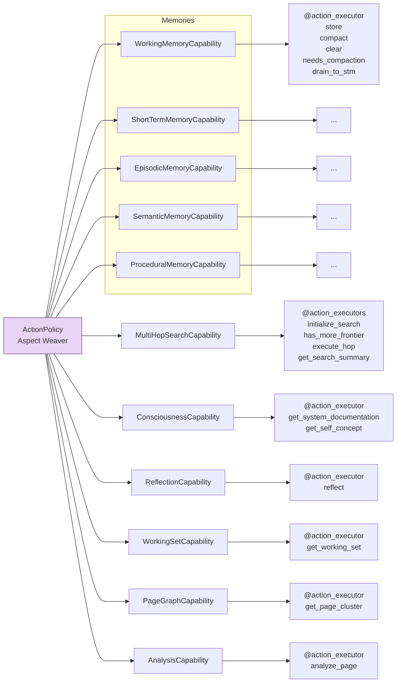
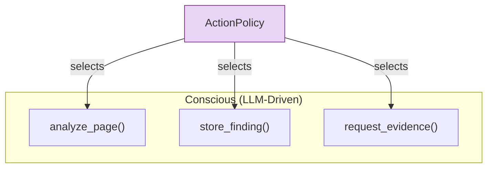
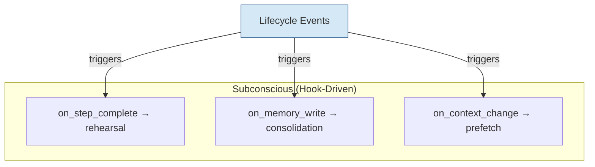

# `AgentCapabilities` as AOP Aspects

Most multi-agent frameworks intended for consumer applications typically model agent behavior using LLM-driven tool invocations, with user-defined plugins (e.g., Markdown files, Python scripts, etc.).

> Colony extends (and formalizes) this approach: *agent behavior is composed from orthogonal capabilities that are woven together at runtime*. This is **aspect-oriented programming** (AOP) applied to cognitive architecture.


## The Core Idea

In Colony, an `AgentCapability` is not a mixin. It is an **aspect** in the AOP sense -- a modular unit of cross-cutting concern that can be composed with other aspects without explicit knowledge of them. Each encapsulates a coherent set of **actions**, **events**, **services**, **hooks**, and **interaction protocols**. The `ActionPolicy` plays the role of the **aspect weaver**, deciding at each step which capabilities activate, in what order, and with what parameters. The result is emergent behavior from the combinatorial explosion of possible action interleavings, without explicitly modeling all possible paths in code.


Colony is a multi-agent programming model where `AgentCapabilities` are very *loosely coupled* and need not be aware of each other (which simplifies each `AgentCapability`), but can still interact with each by virtue of `MemoryCapabilities` which observe and aggregate the activities of all `AgentCapabilities` (including themselves) for the `ActionPolicy` to compose actions from various capabilities in intricate, interesting and unanticipated ways. This avoids complexity by *disentangling agent behavior* into separate "**aspects**" and delegating the "**weaving**" of all these "aspects" to the action policy aided by memory.


!!! info "Action Policy REPL"
    The `PolicyREPL` provides a dataflow medium among executed actions, allowing capabilities to interact and share information dynamically.


```python
# Each capability declares what it can do
@tracing(subscribe_key=lambda self: self.agent.agent_id)
class MemoryConsolidationCapability(AgentCapability):
    @action_executor  # "conscious" -- LLM decides to invoke
    async def consolidate_memories(self, context: ActionContext) -> ActionResult:
        ...

    @event_handler(pattern="{scope_id}:critique_request:*")
    async def handle_critique_request(
        self, event: BlackboardEvent, repl: PolicyREPL
    ) -> EventProcessingResult | None:
        # "subconscious" -- runs automatically via blackboard subscription
        ...

    @background  # "subconscious" -- runs periodically in the background
    async def run_maintenance(self) -> None:
        # Background memory consolidation
        ...

    @hook_handler(  # "subconscious" -- runs automatically via hooks
        pointcut=Pointcut.pattern("*.execute_iteration"),
        hook_type=HookType.AFTER,
    )
    async def on_step_complete(self, ctx: HookContext, result: Any) -> Any:
        # Background rehearsal, concept formation
        ...
```

The `ActionPolicy` receives the full set of action executors exported by all active capabilities and selects among them based on the current planning context. It does not need to know the implementation of any capability -- only the action descriptions (extracted from DocStrings) and input/output schemas (automatically inferred).

## Emergent Behavior from Composition

Here is where the design pays off. Consider an agent with a number of capabilities: `WorkingMemoryCapability`, `MultiHopSearchCapability`, `AnalysisCapability`, etc. Each exports a handful of action executors. *The `ActionPolicy` can interleave them in any order, creating behavior paths that no individual capability was designed to produce*.



With 10s of capabilities exporting 2--3 actions each, the `ActionPolicy` can produce dozens of distinct behavior sequences per step. The combinatorial space is enormous. **You do not model these paths explicitly.** The LLM-based `ActionPolicy` navigates this space using the current context, goals, and execution history.

!!! info "Why this matters"

    Colony allows you to define capabilities with clean interfaces and let the `ActionPolicy` compose them. *Adding a new capability to an agent immediately creates new emergent behaviors without modifying existing code*.


!!! info "What This Means in Practice"

    The "capabilities as aspects" philosophy produces concrete architectural decisions:
    1. **No hardcoded control flow.** The framework gives context, asks the LLM "what's next?", executes the chosen action, and feeds back results. <s>Plans are the LLM's current thinking plus history, not fixed sequences.</s>
    2. **Uniform agent abstraction.** There is no fundamental distinction between "top-level" agents and "sub-agents". They are all instances of the same `Agent` class with different capabilities and policies. This uniformity allows for recursive composition and emergent behavior without special cases.


## Complexity Growth

Colony's multi-agent abstractions *reduce* complexity growth as new features are added. When a new `AgentCapability` is added, existing capabilities continue to work. New primitives are **additive**. The LLM-based action policy handles the combinatorial complexity of composing capabilities, which is exactly the kind of problem LLMs are good at -- pattern-matching over a large space of possibilities given context about the current situation.

!!! info "Alternative To The Monolithic Agent"
    A monolithic agent with all capabilities hardcoded must handle every interaction between features explicitly. Adding feature $N+1$ (e.g., a new memory type) requires considering its interaction with all $N$ existing features (e.g., planning, reflection, analysis, etc.): $O(N)$ integration work. Colony's capability system decouples features and delegates composition to the action policy, reducing integration work to $O(1) - O(\log N)$ because each capability only needs to interact with the policy interface and the shared memory system and perhaps a few other capabilities.

!!! info "Complexity Reduction"

    In a monolithic design, adding a new feature (e.g., a new memory type) requires integrating it with every existing feature (planning, reflection, analysis, etc.) -- $O(N)$ integration work. In Colony's capability system, adding a new capability only requires integrating it with the `ActionPolicy` and the shared memory system -- $O(\log N)$ integration work, because each capability only interacts with these two components, not with every other capability.

!!! info "Minimal Ontological Commitment"
    Primitives are independently usable and composable into arbitrary algorithms. Specific strategies (clustering, batching, coordination) are implemented as pluggable `AgentCapabilities`, not hardcoded control flow.


## Conscious vs. Subconscious Processes

Colony draws an explicit line between two kinds of cognitive process within a capability:

**Conscious processes** are exported as `@action_executor` methods. The LLM-based `ActionPolicy` reasons about whether and when to invoke them. They appear in plans, show up in execution traces, and consume planning attention. These are the agent's deliberate choices.

**Subconscious processes** are internal to the capability and triggered by hooks -- `on_step_complete`, `on_memory_write`, `on_context_change`, and similar lifecycle events. The `ActionPolicy` never sees them directly, but they influence the agent's behavior indirectly. They run in the background: memory consolidation, rehearsal, concept formation, cache prefetching, confidence decay.





This separation matters because LLM attention is expensive. Subconscious processes handle maintenance tasks that should not consume planning tokens or distract the `ActionPolicy` from higher-level reasoning. A `MemoryCapability` can silently consolidate episodic memories into semantic summaries while the `ActionPolicy` focuses on the current analysis task.


!!! note "Not Just a Metaphor"
    Any Colony's `AgentCapability` exports `@action_executors` for **conscious cognitive processes** (deliberate actions interleaved with reasoning) and can run **subconscious cognitive processes** (consolidation, rehearsal, concept formation) in the background.

```python
@tracing(subscribe_key=lambda self: self.agent.agent_id)
class AnalysisCapability(AgentCapability):
    # Conscious: LLM planner chooses when to invoke
    @action_executor()
    async def analyze_module(self, page_ids: list[str]) -> dict:
        """Deep analysis of a code module — deliberate, LLM-driven."""
        ...

    # Subconscious: runs in the background via hooks
    @hook_handler(
        pointcut=Pointcut.pattern("ActionDispatcher.dispatch"),
        hook_type=HookType.AFTER,
    )
    async def capture_to_memory(self, ctx: HookContext, result: Any) -> Any:
        """Auto-captures action results to working memory."""
        ...
```


## Contrast with Inheritance Hierarchies

Consider how other frameworks handle an agent that needs memory, planning, communication, and domain-specific analysis:

| Approach | Typical Pattern | Problem |
|---|---|---|
| **Single inheritance** | `AnalysisAgent(PlanningAgent(MemoryAgent(BaseAgent)))` | Fragile hierarchy, diamond problem, rigid ordering |
| **Mixins** | `class MyAgent(MemoryMixin, PlanningMixin, CommMixin, BaseAgent)` | Method resolution order issues, implicit coupling, no runtime composition |
| **Plugin registry** | Register tools/functions, agent calls them | Flat -- no cross-cutting concerns, no lifecycle hooks, no emergent composition |

Colony's approach:

```python
agent = Agent(
    capabilities=[
        MemoryCapability(config=...),
        PlanningCapability(config=...),
        CommunicationCapability(config=...),
        CodeAnalysisCapability(config=...),
    ],
    action_policy=CacheAwareActionPolicy(config=...),
)
```

Capabilities are composed at construction time. They do not know about each other. The ActionPolicy weaves them together at runtime. Adding or removing a capability changes the agent's behavioral repertoire without modifying any existing code.

Capabilities operate in four modes via `scope_id`, enabling flexible communication patterns:

```python
# 1. Local mode — capability runs within its owning agent
memory = MemoryCapability(agent=self)  # scope_id defaults to agent.agent_id

# 2. Remote mode — parent monitors a child agent's progress
child_cap = ResultCapability(agent=parent, scope_id=child_agent_id)
result = await asyncio.wait_for(child_cap.get_result_future(), timeout=30.0)

# 3. Shared scope — all game participants see each other's events
game_cap = NegotiationGameProtocol(agent=self, scope_id=game_id)

# 4. Detached mode — external system interacts with agents via blackboard
external_cap = MyCapability(agent=None, scope_id=target_agent_id)
```

## The Deeper Claim

Colony's position is that **general intelligence is emergent from the right composition of LLM-based reasoning agents**, and within a single agent, complex behavior is emergent from the right composition of capabilities. The capability-as-aspect model is not just an engineering convenience -- it is the architectural expression of this belief.

The ActionPolicy does not need to be programmed with all possible strategies. Given a rich enough set of capabilities and a capable enough LLM, it discovers effective strategies by reasoning about the available actions in context. Iterative deepening of finite-depth LLM reasoning, composed across capabilities, produces unbounded-depth reasoning.

!!! warning "This is a strong claim"

    We are asserting that emergent composition of simple, well-defined capabilities can produce sophisticated behavior that no individual capability was designed for. This works in practice because the LLM-based ActionPolicy is a general-purpose reasoner operating over structured action descriptions -- it is not limited to patterns seen during training.

## Practical Implications for Contributors

If you are building a new `AgentCapability` for Colony:

1. **Export clean action executors.** Each `@action_executor` should have a clear description, input schema, and output schema. The ActionPolicy will select among them based on these descriptions alone.

2. **Use hooks for maintenance.** Consolidation, decay, cache management, metric tracking -- these belong in hook handlers, not in action executors.

3. **Do not assume capability ordering.** Your capability may run before or after any other capability. Design for independence.

4. **Store all state in blackboards.** If state is not observable, it does not exist to the rest of the system. Hidden state breaks the observer pattern and makes debugging impossible.

5. **Trust the weaver.** The ActionPolicy will find good interleavings of your capability with others. Your job is to make each action executor do one thing well.

Here is a concrete example from Colony's codebase showing a well-structured capability:

```python
class PageGraphCapability(AgentCapability):
    """Traverses and updates the page relationship graph.
    Graph is stored via PageStorage. Agnostic to relationship semantics —
    the ActionPolicy decides how to use edges."""

    def get_action_group_description(self) -> str:
        return (
            "Page Graph — graph-based traversal and relationship management over VCM pages. "
            "Provides cache-aware traversal (BFS/DFS respecting working set), clustering for "
            "batch scheduling, and centrality metrics for page prioritization."
        )

    @action_executor()
    async def traverse(
        self, start_pages: list[str], strategy: str = "bfs",
        max_depth: int = 2, prefer_cached: bool = False,
    ) -> dict[str, Any]:
        """Traverse graph from starting pages.
        prefer_cached: prioritize pages already in working set."""
        ...

    @action_executor()
    async def compute_centrality(
        self, page_ids: list[str] | None = None, metric: str = "degree",
    ) -> dict[str, Any]:
        """Compute centrality metrics for page importance ranking."""
        ...

    @action_executor()
    async def get_clusters(
        self, algorithm: str = "connected", min_size: int = 2,
    ) -> dict[str, Any]:
        """Get page clusters for batch scheduling."""
        ...

    @action_executor(exclude_from_planning=True)
    async def update_edge(
        self, source: str, target: str, weight_delta: float = 0.1,
    ) -> dict[str, Any]:
        """Update edge weight — called programmatically, not by the LLM planner."""
        ...
```

Note how `get_action_group_description()` provides the `ActionPolicy` with a high-level summary of what this capability does. Each `@action_executor` has a clear docstring that the LLM uses to decide when to invoke it. The `update_edge` action uses `exclude_from_planning=True` because it is called programmatically by other code, not selected by the LLM planner.


