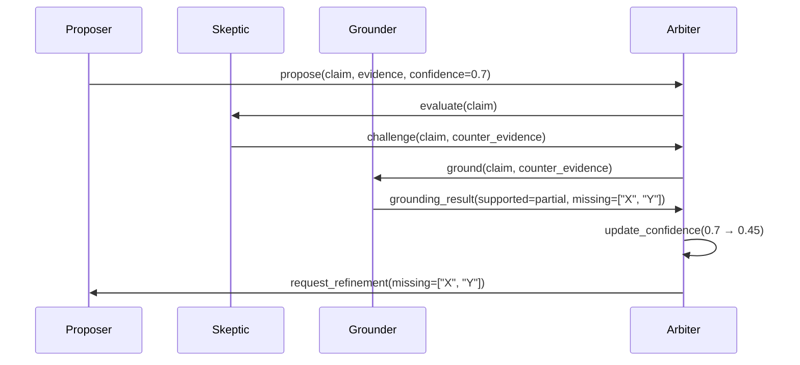
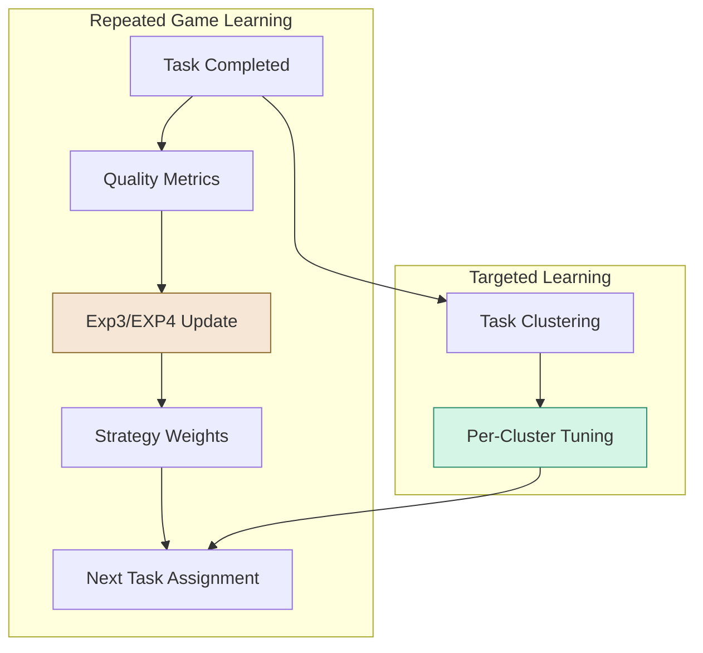
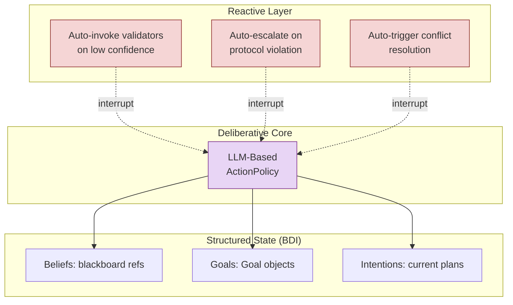

# Games as Error Correction Mechanisms


!!! bug "This page needs a rewrite"

    This page needs to be rewritten more concisely and clearly, with better examples and explanations.

!!! bug "Merge this with `docs/architecture/game-engine.md`"
    Or keep them separate, but minimize overlap and add cross-references.


!!! bug "Reframe this: Games as Learning Mechanisms"
    **Learning *is* a form of error correction**.
    The game-theoretic protocols in Colony are not just error correction mechanisms -- they also create rich learning signals that drive system improvement over time. For example, the outcomes of hypothesis games provide feedback on which agents produce more reliable claims, which in turn informs future task allocation and strategy selection. The contract net protocol creates a competitive environment where agents learn to bid effectively based on their capabilities and past performance. The objective guard provides a clear signal when goal drift occurs, allowing agents to learn how to maintain focus on objectives. In this way, the game engine is not just correcting errors in the moment -- it is generating the data needed for continuous learning and adaptation.


Colony is designed to execute long-running inference tasks over unbounded context. This is not a trivial engineering challenge -- it is a fundamental correctness challenge. LLMs are powerful but fallible reasoners. When you scale up to many agents and large context, the probability of failure modes (hallucination, laziness, goal drift) increases dramatically. Without mechanisms to detect and correct these failures, the system's outputs become unreliable.

The standard pitch for multi-agent systems is coordination: divide work, parallelize, aggregate. Colony uses multi-agent coordination for a different and more fundamental purpose: **error correction**. Game-theoretic protocols are not overhead -- they are the mechanism by which Colony combats specific, well-characterized LLM failure modes.


!!! info "Games as error correction mechanisms"
    Hypothesis games catch hallucination. Contract nets prevent laziness. Objective guards detect goal drift. These are not social simulations -- they are formal mechanisms with game-theoretic foundations (VCG incentives, no-regret learning, social choice aggregation).


## The Core Insight

LLMs fail in predictable ways. They hallucinate. They take shortcuts. They lose track of objectives. They misinterpret each other's outputs. These are not random errors -- they are systematic failure modes with known structure.

Colony's position is that each failure mode has a natural game-theoretic counter:

| LLM Failure Mode | Game-Theoretic Counter | Mechanism |
|---|---|---|
| **Hallucination** | Hypothesis games | Every claim requires evidence; scored by confidence; adversarial refutation |
| **Laziness** | Contract Net protocol | Reputation-based bid selection; agents compete for tasks |
| **Goal drift** | Objective guard agents | Independent agents check drafts against original goals |
| **Miscommunication** | Meta-agent vocabulary normalization | Detect mismatched assumptions; enforce shared terminology |

This is not metaphorical. Colony implements these as formal protocols with defined roles, legal moves, and payoff structures.

!!! tip "Any Agent Can Play Any Role"
    The roles in these protocols (Proposer, Skeptic, Grounder, Arbiter) are not hardcoded to specific agents. Any agent can play any role depending on the context. This flexibility allows the system to adaptively apply error correction where it is most needed. All an agent needs to to do is dynamically instantiate the relevant `GameProtocolCapability` (e.g., `HypothesisGameCapability`), start the game and it will create other agents to participate in the corresponding game. The agent's `ActionPolicy` will automatically pick up on the game protocol and weave in the necessary moves (e.g., proposing claims, challenging others, grounding evidence) without explicit coding of those interactions.


!!! tip "Agents Play Games When They Need To"
    An agent with `HypothesisGameCapability` will automatically engage in hypothesis games when making claims, without needing explicit code for when and how to challenge or ground.


!!! tip "Agents with More Capabilities Are Better Players"
    The aspect-oriented design of `AgentCapabilities` allows interesting game behavior to emerge naturally from the composition of `GameProtocolCapability` with other complementary capabilities. For example, an agent with `NegotiationGameProtocol` will automatically engage in negotiation games. If it also has a `GroundingCapability`, its action policy can use the grounding capability to collect evidence before making offers or counteroffers or accepting offers, without needing explicit code for when and how to propose or counteroffer.


## Mapping Failures to Games

### Hallucination $\Rightarrow$ Hypothesis Games

When a Colony agent produces a finding, it does not emit a bare string. It produces a `ScopeAwareResult` with confidence scores, supporting evidence, and declared missing context. No single agent's output is treated as ground truth.

In a hypothesis game, one agent proposes a claim. Other agents in designated **Skeptic** roles attempt to refute it or demand evidence. A **Grounder** agent checks claims against source material. An **Arbiter** agent evaluates the exchange and assigns final confidence.



The game structure forces the system to surface uncertainty rather than paper over it. An isolated agent might hallucinate with high confidence. Under adversarial scrutiny from a Skeptic, that confidence collapses -- exactly as intended.

```python
# Launch a hypothesis game with role-specific agents
from polymathera.colony.agents.patterns.games.hypothesis.agents import run_hypothesis_game

result_future = await run_hypothesis_game(
    owner=supervisor_agent,
    hypothesis=Hypothesis(claim="The auth module uses JWT tokens", evidence=[...]),
    num_skeptics=2,
    num_grounders=1,
    use_llm_reasoning=True,
)
outcome = await result_future  # GameOutcome with success, consensus_level, lessons_learned
```

### Laziness $\Rightarrow$ Contract Net

LLMs exhibit "laziness", producing shallow analysis, skipping edge cases, giving generic answers when specific ones are needed. Colony counters this with the Contract Net protocol: tasks are announced, agents bid based on their capabilities and current context, and the best-positioned agent wins.

Laziness is not just a failure mode; *it is a strategic choice by the agent to minimize effort*. The contract net protocol turns laziness into a competitive disadvantage, incentivizing agents to put in the work to win bids. This is a fundamental shift from treating laziness as an error to treating it as a rational strategy that can be outcompeted.


The key ingredients are:
- **Reputation**. Each agent's track record (quality scores from previous tasks, depth of analysis, follow-through on commitments) feeds into bid evaluation. An agent that consistently produces shallow work loses bids to agents with better reputations. Over time, this creates selective pressure for thoroughness.
- **Feedback**. When an agent loses a bid or fails to meet expectations, it receives feedback on why it lost (e.g., "Your bid was too high because your past performance on similar tasks was poor"). This allows agents to learn and adjust their future bids, creating a dynamic market for task allocation.

!!! bug ""
    A bid is not just a promise to do work. It is a **contract**. Winning a bid creates an obligation. If the agent fails to deliver on its bid (e.g., by producing low-quality output or missing deadlines), its reputation takes a hit. This accountability mechanism is crucial for combating laziness.


```python
class TaskBid(BaseModel):
    bidder_id: str
    task_id: str
    estimated_cost_tokens: int
    estimated_duration_seconds: float
    estimated_quality_gain: float          # 0.0 to 1.0
    rationale: str
    capabilities_match: list[str]
    past_performance: dict[str, float]     # Reputation metrics

class ContractAward(BaseModel):
    task_id: str
    winner_id: str
    winning_bid: TaskBid
    selection_reasoning: str
```

### Goal Drift $\Rightarrow$ Objective Guard Agents

!!! bug "This guard is not a game"
    `ObjectiveGuardAgent` is a meta-agent not a game participant.

In extended multi-step reasoning, agents gradually drift from the original objective. Colony addresses this with `ObjectiveGuardAgent`: an independent agent whose sole job is to compare each new draft or plan revision against the stated goals. If an agent's output diverges from the objective, the guard flags it before it propagates.

This is not a heuristic check. The guard agent has full access to the original task specification and applies LLM-based semantic comparison. It operates outside the main reasoning loop, so it is not subject to the same contextual pressure that causes drift in the first place.


### Miscommunication $\Rightarrow$ Vocabulary Normalization

!!! bug "This section is incomplete and needs work"
    Implementation is missing. This is a critical failure mode that needs a robust solution.

When multiple agents analyze different parts of a codebase or document, they may develop inconsistent terminology. One agent calls something a "service layer," another calls the same pattern a "controller." A meta-agent monitors inter-agent communication, detects mismatched assumptions, and enforces shared vocabulary through normalization.

## Protocol Elements

Colony's game protocols are defined by three formal elements:

**Roles.** Each protocol defines a set of roles with distinct responsibilities:

- **Proposer** -- generates claims, plans, or artifacts
- **Skeptic** -- challenges claims, demands evidence
- **Grounder** -- checks claims against source material
- **Arbiter** -- evaluates exchanges, assigns confidence
- **Planner** -- coordinates multi-step protocols

**Allowed moves.** Agents communicate via an Agent Communication Language (ACL) where messages carry **illocutionary force** -- not just content, but intent:

```python
class AgentMessage:
    performative: Performative  # INFORM, REQUEST, PROPOSE, PROMISE, CHALLENGE
    content: StructuredContent   # Typed payload with schema
    preconditions: list[Belief]  # What must be true for this move to be valid
    expected_effects: list[Effect]  # What this move is intended to achieve
```

!!! note "Messages are not strings"

    This is a critical departure from frameworks where agents exchange plain text. In Colony, a message with `performative=PROPOSE` triggers different protocol handling than `performative=INFORM`. The schema enforces that proposals include evidence and confidence, that challenges cite counter-evidence, and that promises include commitments that can be tracked.

**Payoffs as trust updates.** Colony does not use real-valued utility functions. Instead, protocol outcomes update agent trust scores and reputation metrics. An agent that proposes a claim that survives adversarial scrutiny gains trust. An agent whose claims are consistently refuted loses trust. These trust scores feed back into future task allocation and bid evaluation.

## Advanced Mechanisms

Colony goes beyond basic game protocols to incorporate results from mechanism design and learning theory.

### VCG-Style Incentives

Inspired by the Vickrey-Clarke-Groves mechanism, Colony can reward agents based on their **marginal contribution** to global performance. If removing an agent's contribution would have degraded the final result by X, that agent's reputation is updated proportionally to X. This incentivizes agents to produce work that is genuinely useful to the collective, not just locally optimal.

### No-Regret Learning

Colony uses no-regret algorithms (Exp3/EXP4) to adjust the mixture over agents and strategies based on quality metrics from completed tasks. A `TargetedLearningManager` clusters past tasks by type and learns per-cluster strategy preferences. Over repeated interactions, the system converges on effective agent-strategy pairings without explicit programming.



### Social Choice Theory

When multiple evaluator agents rank competing outputs, Colony applies voting rules from social choice theory to aggregate their rankings. Arrow's impossibility theorem tells us no single voting rule is perfect, so the choice of aggregation method is itself configurable -- Borda count for consensus-seeking, Condorcet methods for finding majority-preferred options, approval voting for simple acceptance thresholds.

### Epistemic Logic

Colony structures agent mental states using concepts from epistemic logic. Beliefs are classified as **agent-local** (one agent's assessment) versus **common knowledge** (established through protocol and accepted by all participants). Only propositions marked `common=True` through successful protocol completion appear in final confirmed reports.

This is not academic decoration. It solves a real problem: in multi-agent analysis, you need to distinguish between "Agent A believes X" and "the system has established X." Without this distinction, tentative findings from one agent can be treated as established facts by another -- a direct path to compounding hallucination.

## The Hybrid Architecture

Colony's game engine operates within a hybrid architecture that combines deliberative and reactive elements:



The **LLM core** is deliberative -- it plans, explains, and reasons about strategy. Surrounding it are **reactive rules** that fire automatically: validators trigger when confidence drops, escalation fires on protocol violations, conflict resolution activates when agents produce contradictory findings.

Agent mental state is represented partly in prompts (natural language reasoning) and partly in structured state (Beliefs as blackboard references, Goals as typed objects, Intentions as current plan trees). This BDI-inspired hybrid lets the LLM reason in natural language while the framework tracks commitments and obligations formally.

## Why Not Just Use Better Prompts?

A reasonable objection: "If LLMs hallucinate, just write better prompts. Why build a game engine?"

The answer is that prompting operates on a single model's attention. It cannot create adversarial pressure, reputation dynamics, or formal commitment tracking. A single agent, no matter how well prompted, cannot fact-check itself with the same rigor that an independent Skeptic agent can. Prompting is necessary but not sufficient. Games provide structural guarantees that prompting cannot.

!!! tip "The cost question"

    Multi-agent games consume more tokens than single-agent approaches. Colony's position is that this cost is justified when correctness matters. For tasks where shallow analysis is acceptable, use a single agent. For tasks where hallucination, laziness, or drift would be costly, the game overhead is the price of reliability. The framework lets you choose.
