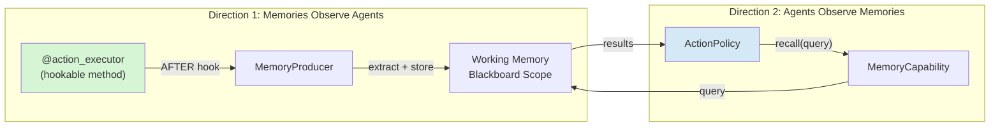
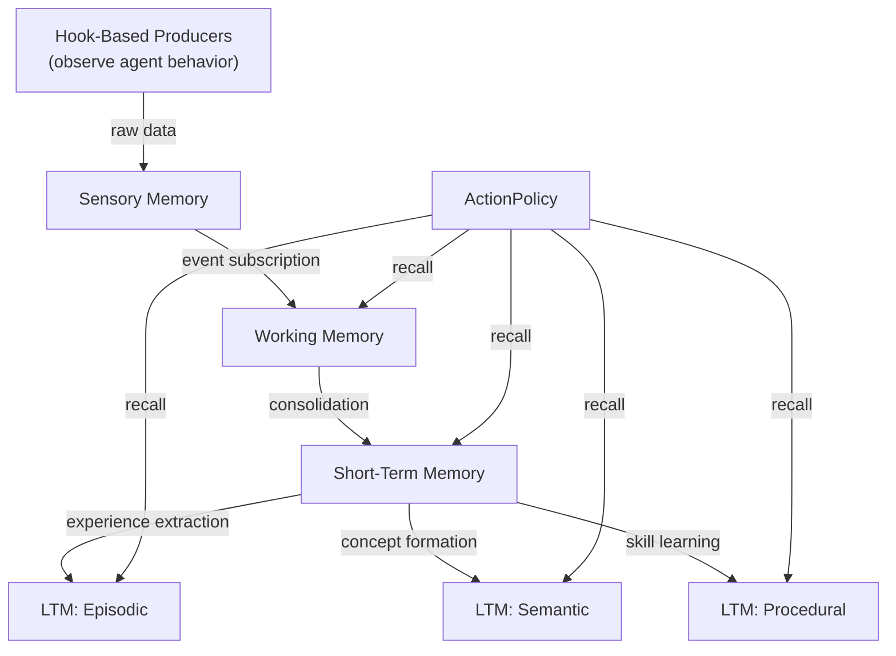

# Memory as Observer

Colony's memory system is not a passive store that agents write to and read from. It is a **bidirectional observer** -- memories observe agent behavior, and agents observe their memories. This pattern is the substrate on which emergent intelligence is built.

## The Conventional View Is Wrong

Most agent frameworks depict memory as separate from the agent's environment:

```
Agent Brain ←→ Memory (passive store)
     ↓
Environment (active, provides observations)
```

This separation is artificial and limiting. In Colony, memory is part of the agent's environment. An agent's reasoning loop can span long periods involving multiple interactions, and self-reflection requires the agent to reason over its own thoughts and actions -- which are stored in memory. Memory must be an active participant in cognition, not a filing cabinet.

## Bidirectional Observer Pattern

Colony implements memory as a bidirectional observer through two mechanisms:

### Direction 1: Memories Observe Agents

Memory formation uses hook-based producers (`MemoryProducerConfig`). A producer attaches an AFTER hook to a `@hookable` method and extracts storable data when that method executes:

```python
MemoryProducerConfig(
    pointcut=Pointcut.pattern("ActionDispatcher.dispatch"),
    extractor=extract_action_from_dispatch,  # (ctx, result) -> (data, tags, metadata)
    ttl_seconds=3600,
)
```

The agent does not explicitly write to memory after each action. The memory system captures it automatically via hooks. This means:

- Memory formation is **decoupled** from agent logic -- no `memory.store()` calls scattered through action executors
- Memory can observe **any hookable method** across all capabilities, not just actions
- New memory types can be added by registering new hooks, without modifying existing code

### Direction 2: Agents Observe Memories

The `ActionPolicy` can consciously decide to inspect, search, or manipulate memories:

- `MemoryCapability` exports `recall`, `store`, `forget`, and `deduplicate` as `@action_executors`
- The LLM planner can query available tags via `list_tags`
- The LLM planner can inspect the `MemoryMap` -- the complete layout of all memory scopes, their configurations, entry counts, and dataflow edges
- Memory retrieval is a **conscious cognitive process** -- the LLM decides when to search memory and what to search for



## Memory Levels as Blackboard Scopes

Every memory level is a blackboard scope. This is not an implementation detail -- it is the architectural foundation that makes the observer pattern work:

| Memory Level | Blackboard Scope | Observer Behavior |
|-------------|-----------------|-------------------|
| Sensory | `agent:{id}:sensory` | Observes raw events and observations |
| Working | `agent:{id}:working` | Observes recent actions and plans |
| Short-Term | `agent:{id}:stm` | Observes working memory (consolidation) |
| LTM Episodic | `agent:{id}:ltm:episodic` | Observes STM (experience extraction) |
| LTM Semantic | `agent:{id}:ltm:semantic` | Observes STM (concept formation) |
| LTM Procedural | `agent:{id}:ltm:procedural` | Observes STM (skill learning) |

Because blackboard writes produce events, each memory level can subscribe to events from the levels it observes. This creates a **dataflow graph** where data flows upward through successive levels of abstraction:



## Consolidation as a Subconscious Process

The flow from working memory to long-term memory is handled by **subconscious cognitive processes** -- background tasks that run without LLM involvement:

1. **Working → STM**: A `SummarizingTransformer` periodically consolidates recent working memory entries into summaries, using an LLM call. The summaries are stored in STM with appropriate tags.

2. **STM → LTM**: Experience extraction (episodic), concept formation (semantic), and skill learning (procedural) each use their own transformer to distill STM entries into long-term knowledge.

3. **Maintenance**: Each level independently runs decay (reduce relevance over time), pruning (remove entries below threshold), deduplication (merge similar entries), and reindexing (update embeddings).

These processes are triggered by blackboard events or timer intervals, not by the LLM planner. They run at different time scales -- working memory consolidation happens frequently (minutes), while LTM formation happens less often (hours or session boundaries).

## The Dataflow Graph Is Not Linear

The memory hierarchy is often depicted as a linear pipeline (sensory → working → STM → LTM). In Colony, it is an **arbitrary dataflow graph**:

- Multiple working memory scopes can feed into the same STM scope
- STM can feed into multiple LTM types simultaneously
- Collective and team memory scopes can receive data from multiple agents
- Any memory level can be the target of both hook-based producers and explicit writes

The edges in this graph are `MemorySubscription` objects -- each defines a source scope, an optional transformer, and filter criteria. Adding a new edge creates a new dataflow path without modifying existing code.

## Cross-Agent Memory Sharing

The observer pattern extends across agent boundaries through shared blackboard scopes:

- **Team memories**: Multiple agents share a blackboard scope, with each agent's memory capability subscribing to the shared scope
- **Collective memories**: System-wide knowledge managed by `MemoryManagementAgent`
- **Generational transfer**: Long-term memories from one agent generation can be transferred to the next via collective memory

A `MemoryManagementAgent` is a service agent that manages shared memory nodes across the system -- consolidating team memories, transferring knowledge between agent generations, and maintaining system-wide facts.

## Why This Design Matters

The bidirectional observer pattern produces several properties that passive memory stores cannot:

1. **Emergent memory formation**: The agent does not need to decide what to remember. Hook-based producers capture relevant information automatically from any cognitive process.

2. **Decoupled evolution**: The memory system can evolve independently of agent reasoning. Adding a new memory type or consolidation strategy requires no changes to action executors or planning logic.

3. **Introspectable cognition**: Because all memory state is in blackboards with events, the entire memory system is observable, queryable, and debuggable. There is no hidden state in instance variables.

4. **Self-aware agents**: Agents can reason *about* their memory -- inspecting the memory map, discovering gaps in their knowledge, and consciously deciding to search, consolidate, or forget. This meta-cognitive ability is what separates Colony from frameworks where memory is a black box.

!!! note "No out-of-band state"
    The unified storage principle -- all state in blackboards -- is not just a software engineering preference. It is what makes memory observable, shareable, and introspectable. If some state lived in instance variables or thread-local storage, it would be invisible to the memory system, invisible to other agents, and lost on suspension/resumption.
