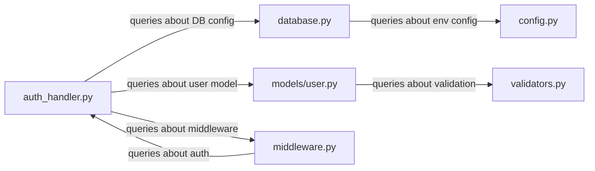
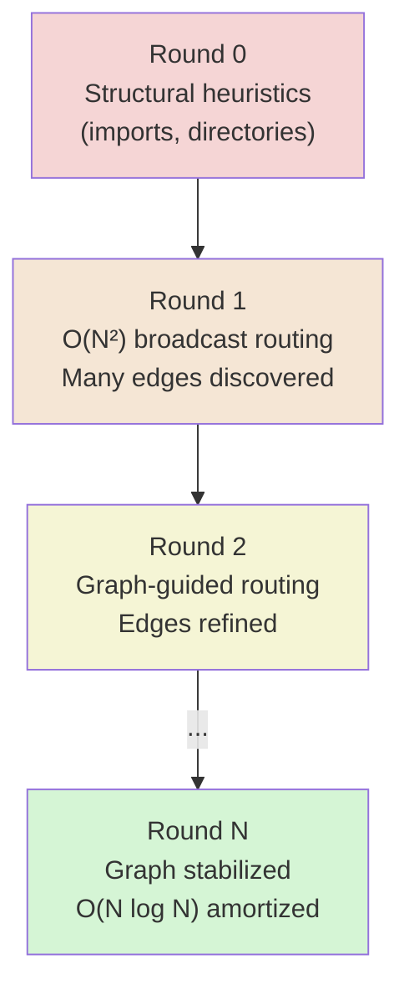

# Page Graphs

The **page attention graph** is the data structure that makes Colony's cache-aware reasoning efficient. It captures which context pages answer queries from which other pages, and it is the mechanism by which Colony reduces amortized inference cost from $O(N^2)$ to $O(N \log N)$ over successive reasoning rounds.

## What Is a Page Graph?

When an agent reasons over a set of context pages, it generates queries: "What authentication mechanism does module X use?" "Where is the database connection configured?" Each query is generated from one page and answered by one or more other pages. The page graph records these query-resolution relationships as directed edges.



The graph is **dynamic** -- it is built and refined as agents explore the context. In the first reasoning round, the graph is sparse or empty. By round N, it captures the actual semantic dependency structure of the context.

## Why Page Graphs Matter

Without a page graph, routing a query requires broadcasting it to all $N$ pages: $O(N)$ per query, $O(N^2)$ per round (each of $N$ pages generates queries). With a stabilized page graph, queries are routed along known edges: $O(\log N)$ per query on average, $O(N \log N)$ per round.

### Amortized Cost Analysis

The amortized cost per reasoning round is:

$$O\left(N \log N + c \cdot \frac{N^2}{R}\right) \approx O(N \log N) \text{ when } R \approx N$$

where:

- $N$ = number of context pages
- $R$ = number of reasoning rounds
- $c$ = constant factor for the initial broadcast round

Deep reasoning tasks inherently require many rounds ($R$ grows with task complexity), so the quadratic startup cost is amortized away. This is the same insight behind amortized analysis of persistent data structures: pay a high upfront cost to build structure that makes all subsequent operations cheaper.

## Building the Graph

The page graph starts as an approximation and converges on the true dependency structure:

### Initial Graph (Round 0)

Before any reasoning, the graph can be bootstrapped from structural heuristics:

- **File imports**: If file A imports file B, add edge A → B
- **Directory co-location**: Files in the same directory get weak edges
- **Naming conventions**: Files with matching names across directories (e.g., `auth/handler.py` and `auth/tests/test_handler.py`) get edges
- **Configuration**: Explicit relationships declared in project configuration

### Graph Refinement (Rounds 1-N)

During reasoning, agents discover actual semantic relationships:

1. Agent analyzes page A and generates queries
2. Queries are routed (initially broadcast, later via graph edges)
3. Pages that successfully answer queries get edges from A
4. Edge weights increase with query frequency and answer quality
5. Edges that are never used decay and are eventually pruned



## Page Groups

Pages that should be loaded together are organized into `PageGroup` instances:

```python
class PageGroup(BaseModel):
    group_id: str
    page_ids: list[str]
    priority: int = 0
    metadata: dict[str, Any] = {}
```

### Advisory vs. Mandatory Groups

| Type | Loading Semantics | Use Case |
|------|------------------|----------|
| **Advisory** | Best-effort co-loading; pages can be loaded independently | Related files likely to be accessed together |
| **Mandatory** | Atomic co-loading; all pages in group load together or not at all | Files that are meaningless without their companions (e.g., header + implementation) |

Groups exploit **spatial locality**: if one page in a group is needed, the others are likely needed soon. This reduces page faults by preloading related pages.

## Agent-Page Affinity

Agents can declare affinity for specific pages, guiding the scheduler to co-locate computation with data:

### Soft Affinity

Best-effort scheduling to replicas where preferred pages are already cached. The agent can run elsewhere if no good match exists. Improves cache hit rates when possible without blocking execution.

### Hard Affinity

The agent must run on a replica with the specified pages. Used when a cache miss would make execution impractical (e.g., analyzing a large module that takes minutes to load into KV cache).

This is analogous to NUMA-aware scheduling in operating systems: computation should be co-located with the data it needs.

## Working Set Dynamics

The **working set** is the set of pages currently loaded in KV caches across the cluster. It is constrained by total cache capacity and must be managed actively.

### Episodic Behavior

Colony hypothesizes that working set drift exhibits **episodic behavior**: periods of high stability (agents working within a consistent set of pages) interspersed with sharp transitions (agents shifting focus to a different region of the context).

Drift is measured using **Jaccard similarity** between working sets at different time steps:

$$J(t, t + \Delta t) = \frac{|W_t \cap W_{t+\Delta t}|}{|W_t \cup W_{t+\Delta t}|}$$

Within an episode, Jaccard similarity is high (the working set is stable). Across episodes, it drops significantly. The working sets of different episodes may overlap but are not identical.

### Cache-Aware Scheduling

The episodic behavior conjecture drives a specific scheduling strategy:

1. **During stable episodes**: Accumulate queries targeting pages outside the current working set
2. **At transition points**: Batch page replacements -- evict pages that are no longer generating queries, load pages that have accumulated pending queries
3. **Preservation rule**: Do not evict pages that generated the accumulated queries, because these will likely be part of the new working set when their queries are resolved

This avoids the pathological case of continuous one-page-at-a-time swapping, which destroys cache locality.

## Page Size Constraints

Page size affects graph quality in non-obvious ways:

| Problem | Cause | Effect |
|---------|-------|--------|
| **Spurious edges** | Pages too large | Unrelated content shares a page, creating false dependencies in the graph |
| **Externalized work** | Pages too small | Relationships that should be handled within a single LLM context window require inter-page coordination |

Colony supports **nonuniform page sizes** to match the natural structure of the data. A concise configuration file might be one page; a large module might be split across several. The optimal page size range for code analysis is typically 20,000-40,000 tokens -- large enough to contain coherent units of code, small enough to avoid spurious co-location.

## Integration with Planning

Every plan includes a `CacheContext` that references the page graph:

```python
class CacheContext(BaseModel):
    working_set: list[str]                  # Pages this plan needs
    page_graph_summary: dict[str, Any]      # Cluster info, relationships
    estimated_access_pattern: dict[str, int] # page_id -> access count
    access_sequence: list[str]              # Expected order of access
    prefetch_pages: list[str]               # Pages to load before execution
    exclusive_pages: list[str]              # Pages that must not be evicted
    shareable_pages: list[str]              # Pages safe for concurrent access
```

The LLM planner uses page graph information to:

- **Order actions** to maximize cache locality (process pages in the same graph cluster together)
- **Declare prefetch needs** for pages that will be needed in upcoming actions
- **Size the plan** to fit available cache capacity
- **Detect conflicts** with other agents' working sets

## Query Routing Strategies

The page graph supports multiple query routing strategies:

| Strategy | Mechanism | When to Use |
|----------|-----------|-------------|
| **Attention-based** | Semantic similarity + LLM scoring | Early rounds when graph is sparse |
| **Graph-based** | BFS traversal with edge weights | Later rounds when graph has structure |
| **Hybrid** | Weighted combination (configurable) | General use; adapts as graph matures |

The hybrid strategy typically uses 60% attention-based + 40% graph-based weights, shifting toward graph-based as the graph stabilizes and edges become reliable.

## Current Implementation Status

The page graph is partially implemented:

- `VirtualContextPage` and `PageGroup` models are complete in `polymathera.colony.vcm.models`
- Page table state tracking (`VirtualPageTableState`) supports page locations, groups, and locks
- `PageAffinityRouter` and `ContextAwareRouter` use page locality for routing decisions
- `CacheContext` is included in plans and used by `CacheAwareActionPolicy`
- Graph construction from agent-discovered relationships is a work in progress
- Amortized cost optimizations (graph-guided routing) are designed but not yet fully operational

The core infrastructure is in place. As the VCM matures, the page graph will evolve from a planning aid into the central data structure governing all cache-aware scheduling decisions.
