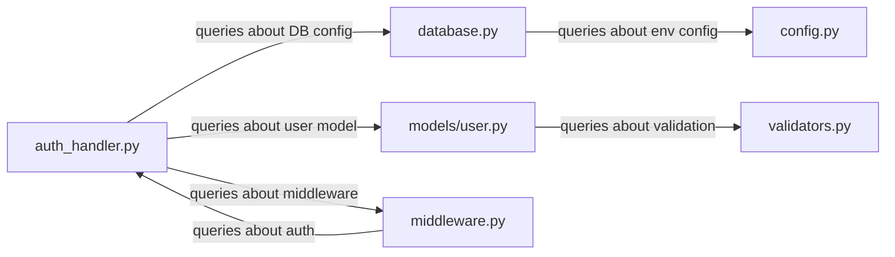
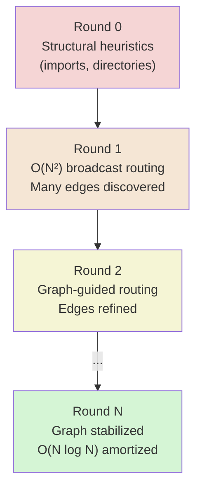

# Page Graphs

The **page attention graph** is the data structure that makes Colony's cache-aware reasoning efficient. It captures which context pages answer queries from which other pages, and it is the mechanism by which Colony reduces amortized inference cost from $O(N^2)$ to $O(N \log N)$ over successive reasoning rounds.

!!! tip "Key Insight"
    The page graph is the key to unlocking efficient reasoning over large contexts. By learning and exploiting the actual semantic relationships between pages, Colony avoids the combinatorial explosion of naive query routing and achieves scalable, cache-aware reasoning.

!!! danger "Critical Implementation Note"
    Add a graph showing how the total input tokens per round decreases as the page graph stabilizes, demonstrating the amortized cost reduction in practice. This is a critical piece of evidence for the value of the page graph and should be included in the documentation.


## What Is a Page Graph?

When an agent reasons over a set of context pages, it generates queries: "What authentication mechanism does module X use?" "Where is the database connection configured?" Each query is generated from one page and answered by one or more other pages. The page graph records these query-resolution relationships as directed edges.



The graph is **dynamic** -- it is built and refined as agents explore the context. In the first reasoning round, the graph is sparse or empty. By round $R$, it captures the actual semantic dependency structure of the context.

!!! tip "Fully Connected but Weighted"
    The page graph is a **probabilistic knowledge graph** that captures the relationships between different pages in the VCM and the confidence in these relationships. So, in a sense, it is always fully connected because we can always infer some relationship (even if it's a low-confidence one) between any two pages based on their content, metadata, or usage patterns. The confidence of the edges can be updated over time as the system gathers more information about the pages and their relationships. Initially, the page graph has **high entropy** but that entropy decreases over time as the system learns more about the pages and their relationships.

    - At the beginning, the page graph should be fully connected (at least with **low-confidence edges**) because we don't have any information about the relationships between pages (except for the high-confidence relationships discovered by the context page source). As the system runs and gathers information about the pages (e.g., through agent interactions, memory retrievals, etc.), it can start to learn and infer the relationships between pages and update the page graph accordingly. This can be done through a combination of heuristic rules (e.g., if two pages are often retrieved together, they might be related) and machine learning techniques (e.g., using embeddings to measure page similarity). The page graph can also be updated based on feedback from agents (e.g., if an agent finds that certain pages are not relevant to its task, it can signal that to the system to update the graph). The goal is to have a dynamic page graph that evolves over time based on the system's interactions with the pages and the feedback from agents.


## Why Page Graphs Matter

Without a page graph, routing a query requires broadcasting it to all $N$ pages: $O(N)$ per query, $O(N^2)$ per round (each of $N$ pages generates queries). With a stabilized page graph, queries are routed along known edges: $O(\log N)$ per query on average, $O(N \log N)$ per round.

### Amortized Cost Analysis

!!! bug "Merge this section with `philosophy/cache-awareness.md`"

!!! bug "Merge this section with `philosophy/no-rag.md`"

The amortized cost per reasoning round is:

$$O\left(N \log N + c \cdot \frac{N^2}{R}\right) \approx O(N \log N) \text{ when } R \approx N$$

where:

- $N$ = number of context pages
- $R$ = number of reasoning rounds
- $c$ = constant factor for the initial broadcast round

Deep reasoning tasks inherently require many rounds ($R$ grows with task complexity), so the quadratic startup cost is amortized away. This is the same insight behind amortized analysis of persistent data structures: <u>*pay a high upfront cost to build structure that makes all subsequent operations cheaper*</u>.

## Building the Graph

The page graph starts as an approximation and converges on the true relational structure:

### Initial Graph (Round 0)

Before any reasoning, the graph can be bootstrapped from *structural heuristics* such as file imports (if file A imports file B, add edge A → B). The `PageGraphCapability` provides the LLM-plannable interface for graph operations. It wraps a NetworkX directed graph loaded from `PageStorage`:

```python
class PageGraphCapability(AgentCapability):
    """Traverses and updates the page relationship graph.
    Graph is stored via PageStorage.store_page_graph() (EFS/S3)."""

    def __init__(self, agent: Agent, scope_id: str | None = None):
        super().__init__(agent=agent, scope_id=scope_id)
        self._page_graph: nx.DiGraph | None = None  # Lazy-loaded

    @action_executor()
    async def get_neighbors(
        self, page_ids: list[str], direction: str = "both", max_per_page: int | None = None,
    ) -> dict[str, Any]:
        """Get graph neighbors of pages.
        Use for cache-aware traversal — load neighbors together for spatial locality."""
        ...

    @action_executor()
    async def traverse(
        self, start_pages: list[str], strategy: str = "bfs",
        max_depth: int = 2, prefer_cached: bool = False,
    ) -> dict[str, Any]:
        """Traverse graph from starting pages. Use for discovering related pages.
        prefer_cached: When True, prioritize pages already in working set."""
        ...

    @action_executor()
    async def update_edge(
        self, source: str, target: str,
        weight_delta: float = 0.1, relationship_type: str = "query_resolution",
    ) -> dict[str, Any]:
        """Update edge weight — called when a query from source is resolved by target."""
        ...
```

### Graph Refinement (Rounds 1-N)

During reasoning, agents discover actual *semantic relationships*:

1. Agent analyzes page A and generates queries
2. Queries are routed (initially broadcast, later via graph edges)
3. Pages that successfully answer queries get edges from A
4. Edge weights increase with query frequency and answer quality
5. Edges that are never used decay and are eventually pruned



## Page Groups

Pages that should be loaded together are organized into `PageGroup` instances:

```python
class PageGroup(BaseModel):
    group_id: str
    colony_id: str  # A shared address space for multiple page sources
    tenant_id: str
    page_ids: list[str]
    priority: int = 0
    metadata: dict[str, Any] = {}
```


### Advisory vs. Mandatory Groups

| Type | Loading Semantics | Use Case |
|------|------------------|----------|
| **Advisory** | Best-effort co-loading; pages can be loaded independently | Related files likely to be accessed together |
| **Mandatory** | Atomic co-loading; all pages in group load together or not at all | Files that are meaningless without their companions (e.g., header + implementation) |

Groups exploit **spatial locality**: if one page in a group is needed, the others are likely needed soon. This reduces page faults by preloading related pages.

## Agent-Page Affinity

Agents can declare affinity for specific pages, guiding the scheduler to co-locate computation with data:

### Soft Affinity

Best-effort scheduling to replicas where preferred pages are already cached. The agent can run elsewhere if no good match exists. Improves cache hit rates when possible without blocking execution.

### Hard Affinity

The agent must run on a replica with the specified pages. Used when a cache miss would make execution impractical (e.g., analyzing a large module that takes minutes to load into KV cache).

This is analogous to NUMA-aware scheduling in operating systems: computation should be co-located with the data it needs.

The `WorkingSetCapability` manages the cluster-wide set of loaded pages:

```python
class WorkingSetCapability(AgentCapability):
    """Manages CLUSTER-WIDE working set of loaded VCM pages.
    State stored in blackboard for visibility across all agents."""

    @action_executor()
    async def get_working_set(self) -> dict[str, Any]:
        """Get current working set state (pages, access counts, temperatures)."""
        ...

    @action_executor()
    async def request_pages(self, page_ids: list[str], priority: int = 0) -> dict[str, Any]:
        """Request pages be loaded into working set."""
        ...

    @action_executor()
    async def release_pages(self, page_ids: list[str]) -> dict[str, Any]:
        """Release pages from working set (candidates for eviction)."""
        ...

    @action_executor()
    async def identify_eviction_candidates(self, count: int = 5) -> dict[str, Any]:
        """Identify pages to evict using configured eviction policy."""
        ...
```

## Working Set Dynamics

The **working set** is the set of pages currently loaded in KV caches across the cluster. It is constrained by total cache capacity and must be managed actively.

### Episodic Behavior

Colony hypothesizes that working set drift exhibits **episodic behavior**: periods of high stability (agents working within a consistent set of pages) interspersed with sharp transitions (agents shifting focus to a different region of the context).

Drift is measured using **Jaccard similarity** between working sets at different time steps:

$$J(t, t + \Delta t) = \frac{|W_t \cap W_{t+\Delta t}|}{|W_t \cup W_{t+\Delta t}|}$$

Within an episode, Jaccard similarity is high (the working set is stable). Across episodes, it drops significantly. The working sets of different episodes may overlap but are not identical.

### Cache-Aware Scheduling

The episodic behavior conjecture drives a specific scheduling strategy:

1. **During stable episodes**: Accumulate queries targeting pages outside the current working set
2. **At transition points**: Batch page replacements -- evict pages that are no longer generating queries, load pages that have accumulated pending queries
3. **Preservation rule**: Do not evict pages that generated the accumulated queries, because these will likely be part of the new working set when their queries are resolved

This avoids the pathological case of continuous one-page-at-a-time swapping, which destroys cache locality.

!!! tip "Tiled Matrix Multiplication Analogy"
    This is analogous to tiled matrix multiplication: you want to load a tile of the matrix into cache and perform as many operations as possible on that tile before evicting it. If you keep swapping out individual elements, you lose all the benefits of caching. By batching page replacements at episode boundaries, Colony maximizes the amount of work done per page load and minimizes the number of page faults. The challenge is identifying *appropriately sized* **cohesive subgraphs** of the page graph and accurately detecting episode boundaries and managing the transition, which is where the page graph and query accumulation strategies come into play.


Page scoring strategies determine eviction and loading priority:

```python
class PageScorer(ABC):
    """Abstract base for page scoring strategies."""

    @abstractmethod
    async def score_page(self, page_id: str) -> float: ...


class SimplePageScorer(PageScorer):
    """Scores based on query history frequency."""
    ...

class EdgePageScorer(PageScorer):
    """Scores based on edge weights in page graph."""
    ...

class CompositePageScorer(PageScorer):
    """Combines multiple scoring strategies with configurable weights."""
    ...


class PageEvictionPolicy(ABC):
    """Abstract base for page eviction strategies."""

    @abstractmethod
    async def score_for_eviction(
        self, page_id: str, page_status: dict[str, Any],
    ) -> float:
        """Score page for eviction (higher = more likely to evict)."""
        ...
```

## Page Size Constraints

Page size affects graph quality in non-obvious ways:

| Problem | Cause | Effect |
|---------|-------|--------|
| **Spurious edges** | Pages too large | Unrelated content shares a page, creating false dependencies in the graph |
| **Externalized work** | Pages too small | Relationships that should be handled within a single LLM context window require inter-page coordination |

Colony supports **nonuniform page sizes** to match the natural structure of the data. A concise configuration file might be one page; a large module might be split across several. The optimal page size range for code analysis is typically 20,000-40,000 tokens -- <u>*large enough to contain coherent units of code, small enough to avoid spurious co-location*</u>.

## Integration with Planning

Every plan includes a `CacheContext` that references the page graph:

```python
class CacheContext(BaseModel):
    working_set: list[str]                  # Pages this plan needs
    page_graph_summary: dict[str, Any]      # Cluster info, relationships
    estimated_access_pattern: dict[str, int] # page_id -> access count
    access_sequence: list[str]              # Expected order of access
    prefetch_pages: list[str]               # Pages to load before execution
    exclusive_pages: list[str]              # Pages that must not be evicted
    shareable_pages: list[str]              # Pages safe for concurrent access
```

The LLM planner uses page graph information to:

- **Order actions** to maximize cache locality (process pages in the same graph cluster together)
- **Declare prefetch needs** for pages that will be needed in upcoming actions
- **Size the plan** to fit available cache capacity
- **Detect conflicts** with other agents' working sets

## Query Routing Strategies

The page graph supports multiple (and user-defined) query routing strategies:

| Strategy | Mechanism | When to Use |
|----------|-----------|-------------|
| **Attention-based** | Semantic similarity + LLM scoring | Early rounds when graph is sparse |
| **Graph-based** | BFS traversal with edge weights | Later rounds when graph has structure |
| **Hybrid** | Weighted combination (configurable) | General use; adapts as graph matures |

The hybrid strategy typically uses 60% attention-based + 40% graph-based weights, shifting toward graph-based as the graph stabilizes and edges become reliable.

The `QueryAttentionCapability` implements query routing with cache-aware boosting:

```python
class QueryAttentionCapability(AgentCapability):
    """Core primitives for query generation and routing."""

    @action_executor()
    async def generate_queries(
        self,
        findings: list[dict[str, Any]],
        context: dict[str, Any] | None = None,
        max_queries: int = 5,
    ) -> dict[str, Any]:
        """Generate queries from analysis findings."""
        ...

    @action_executor()
    async def route_query(
        self,
        query: PageQuery | dict[str, Any],
        available_pages: list[str] | None = None,
        max_results: int = 10,
        min_relevance: float = 0.5,
        boost_ws: bool = False,         # Boost pages already in working set
        prefer_locality: str = "none",  # "none", "group", "cluster"
    ) -> dict[str, Any]:
        """Route query to find relevant pages.
        Cache-aware: boost_ws promotes pages in working set to reduce page faults."""
        ...
```

## Current Implementation Status

The page graph is partially implemented:

- `VirtualContextPage` and `PageGroup` models are complete in `polymathera.colony.vcm.models`
- Page table state tracking (`VirtualPageTableState`) supports page locations, groups, and locks
- `PageAffinityRouter` and `ContextAwareRouter` use page locality for routing decisions
- `CacheContext` is included in plans and used by `CacheAwareActionPolicy`
- Graph construction from agent-discovered relationships is a work in progress
- Amortized cost optimizations (graph-guided routing) are designed but not yet fully operational

The core infrastructure is in place. As the VCM matures, the page graph will evolve from a planning aid into the central data structure governing all cache-aware scheduling decisions.
