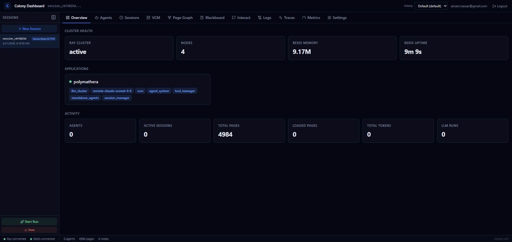
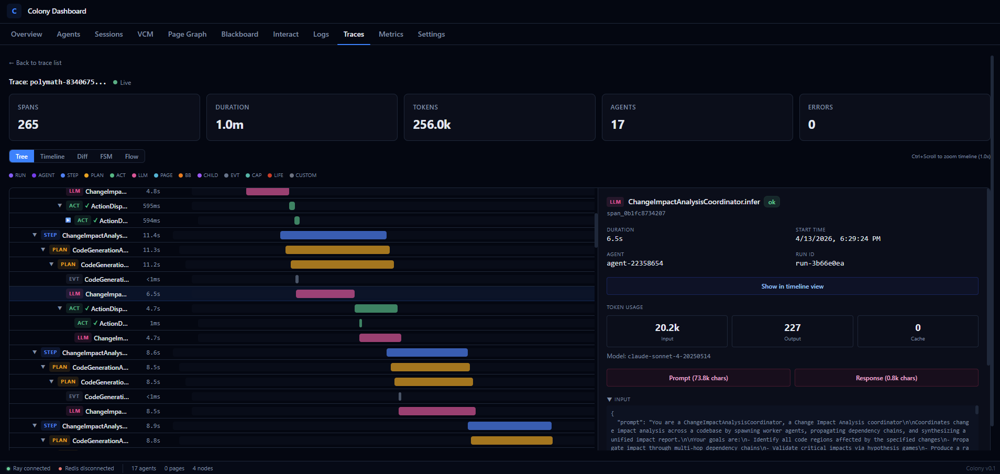

# Web Dashboard

Colony includes a built-in web dashboard for monitoring agents, sessions, and the virtual context memory.

## Accessing the Dashboard

The dashboard starts automatically with `colony-env up` at [localhost:8080](http://localhost:8080).

```bash
colony-env dashboard   # Opens in your browser
```

## Dashboard Sections

### Overview

Cluster health, application deployments, and quick statistics at a glance.




### Agents

Browse registered agents with:

- Current state (`RUNNING`, `IDLE`, `STOPPED`)
- Attached capabilities
- Action history
- Agent details and configuration

### Sessions

Session history showing:

- Agent runs within each session
- Token usage per run
- Input/output history
- Intermediate events

### VCM (Virtual Context Memory)

Virtual context memory statistics:

- Page table state
- Working sets per agent
- Cache hit/miss rates
- Page loading activity


### Traces and Spans

Detailed tracing of agent actions, VCM operations, and system events for debugging and performance analysis.




!!! bug "Add details on how to tracing on user code and custom capabilities."
    Document the tracing API for user code and custom capabilities, and how those traces appear in the dashboard. Include examples of how to use it for debugging and performance analysis. See `colony_docs/markdown/agents/observability_plan.md`


## Frontend Development

For developing the dashboard frontend with hot-reload:

```bash
cd src/polymathera/colony/web_ui/frontend
npm install
npm run dev     # Starts on localhost:5173, proxies /api to localhost:8080
```

The frontend is built with React, TypeScript, Tailwind CSS, and Vite. The backend is FastAPI.

## API

The dashboard backend exposes a REST API at `/api/`. Key endpoints:

- `GET /api/agents` — List agents
- `GET /api/sessions` — List sessions
- `GET /api/sessions/{id}/runs` — Runs within a session
- `GET /api/vcm/pages` — VCM page table
- `GET /api/health` — Health check
