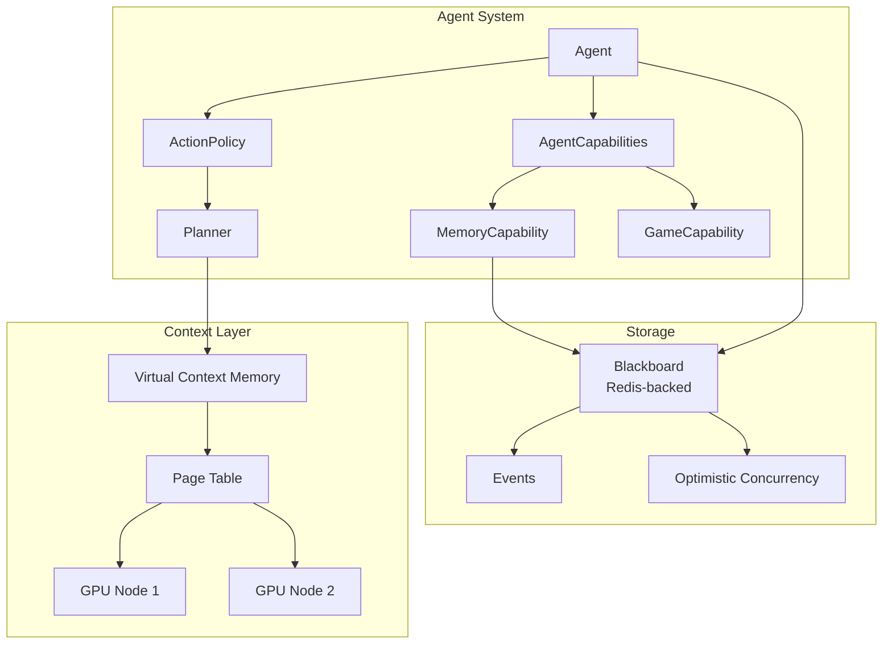

# Colony

**Polymathera's no-RAG, cache-aware multi-agent framework for extremely long, dense contexts (1B+ tokens).**

Colony is a framework for building *tightly-coupled, self-evolving, self-improving multi-agent systems* (**agent colonies**) that reason over extremely long context without retrieval-augmented generation (RAG). Instead of fragmenting context into chunks and retrieving snippets, Colony keeps the entire context "live" over a cluster of *one or more* LLMs through a cluster-level virtual memory system that manages LLM KV caches in the same way an operating system manages (almost unlimited) virtual memory over finite physical memory.

## Key Ideas

- **NoRAG**: Deep reasoning requires the full context to remain live and accessible, not filtered through retrieval. Colony manages context through distributed KV cache paging, not vector search.

- **Cache-Aware Agents**: Agents are aware of what's in GPU memory and plan their work to maximize cache reuse. Cache awareness emerges from the LLM planner composing primitives, not from hardcoded optimization.

- **Agents All the Way Down**: General intelligence emerges from the right composition of *agent capabilities*. Every cognitive process is a pluggable policy with a default implementation.

- **Game-Theoretic Correctness**: Multi-agent game protocols (hypothesis games, contract nets, negotiation) combat specific LLM failure modes like hallucination, laziness, and goal drift.

## Getting Started

```bash
pip install polymathera-colony
```

See the [Installation](getting-started/installation.md) guide and [Quick Start](getting-started/quickstart.md) tutorial.

## Architecture at a Glance



## Documentation

| Section | Description |
|---------|-------------|
| [Philosophy](philosophy/index.md) | Why Colony exists and what makes it different |
| [Architecture](architecture/index.md) | Technical architecture of each subsystem |
| [Design Insights](design-insights/index.md) | Deep dives into novel design decisions |
| [Guides](guides/colony-env.md) | Practical how-to guides |
| [Contributing](contributing.md) | How to contribute to Colony |
