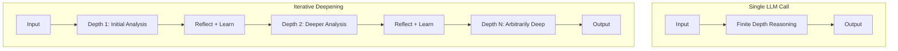
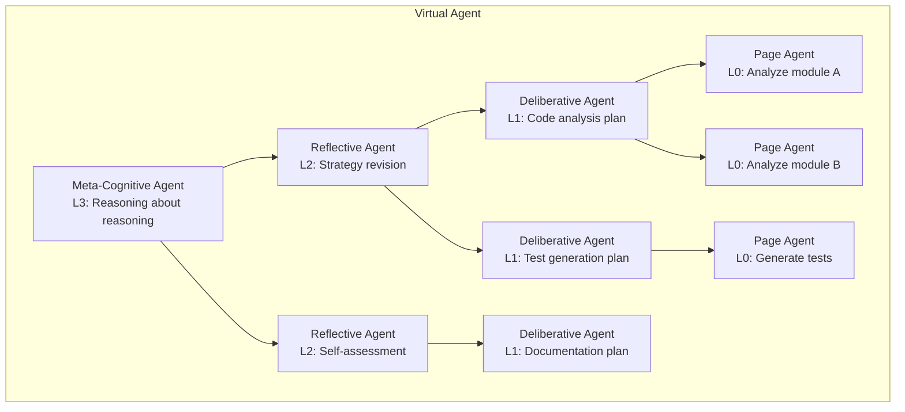

# Agents All the Way Down

Colony is built on a single, testable conjecture:

> **General intelligence is emergent from the right composition of LLM-based reasoning agents.**

This is not a vague aspiration. It is a specific architectural claim with specific consequences for how the framework is built.

## The Argument from Bounded Depth

A single LLM call has finite reasoning depth. No matter how capable the model, its forward pass executes a fixed number of layers, and the chain-of-thought it produces in a single generation has practical limits. This is not a flaw -- it is a fundamental property of any finite computational process.

But many real-world tasks require reasoning depth that exceeds what any single call can produce. Understanding the full implications of a change across a million-line codebase. Tracing a causal chain through hundreds of scientific papers. Synthesizing a legal argument that accounts for thousands of precedents.

Colony's answer: **iterative deepening**. If a single LLM call produces finite-depth reasoning, then iterative deepening of that reasoning -- with reflection, learning, and accumulated context -- produces unbounded-depth reasoning. Each iteration builds on the findings of the previous one, effectively traversing arbitrary path lengths through the implicit knowledge graph.

!!! tip "Unbounded Depth, Unbounded Context"
    Iterative deepening gives unbounded reasoning *depth* (arbitrary path length in the knowledge graph). Distributed reasoning over partitioned context gives unbounded reasoning *breadth* (relationships with arbitrary degree in the knowledge hypergraph). Colony combines both.

## The Argument from Bounded Context

A single LLM has a finite context window. Even with million-token windows, many tasks involve context that exceeds what one model instance can hold. And for tasks requiring dense reasoning, the *quality* of reasoning degrades well before the context window is technically exhausted.

Colony's answer: **distributed reasoning** over extremely long context. Multiple agents, each with their own context window, collectively reason over a corpus that no single agent could process. A cache-aware scheduler ensures that agents are routed to nodes where their required pages are already loaded, and a page attention graph guides which pages to load next.

This produces reasoning over unbounded-length context: relationships with arbitrary degree in the knowledge hypergraph, discovered by agents that coordinate their exploration.

## The Virtual Agent

Here is Colony's most provocative architectural idea: a multi-agent system is not a collection of independent agents collaborating on a task. It is the **different cognitive levels of a single virtual agent**.

Consider how human cognition works at different levels:

| Level | Human Cognition | Colony Implementation |
|---|---|---|
| L0: Reflexive | Immediate reactions, pattern matching | Rule-based guards, reactive policies |
| L1: Deliberative | Goal-oriented planning, sequencing | LLM-based action policies, plan generation |
| L2: Reflective | Self-assessment, strategy revision | Reflection capabilities, meta-reasoning agents |
| L3: Meta-cognitive | Reasoning about reasoning itself | Supervisor agents, capability orchestration |

In Colony, each level can be implemented by different agents with different capabilities. The top-level agent has higher-level, more abstract capabilities (strategic planning, meta-reasoning). Lower-level agents have specialized, fine-grained capabilities (page analysis, code inspection, hypothesis testing). Together, they implement the cognitive architecture of a single virtual agent whose reasoning depth and breadth exceed what any individual agent could achieve.

!!! note "Not Just a Metaphor"
    This is not a loose analogy. Colony's `AgentCapability` system directly implements this: capabilities export `@action_executors` for **conscious cognitive processes** (deliberate actions interleaved with reasoning) and can run **subconscious cognitive processes** (consolidation, rehearsal, concept formation) in the background. The distinction between conscious and subconscious is architectural, not metaphorical.

## The Consciousness-Intuition Interface

Colony draws a specific analogy between its architecture and cognitive science:

- **Intuition layer** = the LLM itself. Fast, pattern-matching, associative, capable of remarkable leaps but also hallucination and overconfidence.
- **Consciousness layer** = the collection of cognitive processes and policies that orchestrate LLM calls. Slower, deliberate, capable of planning, reflection, and error correction.

Every cognitive process in Colony is a pluggable **policy** with a well-defined interface and a default implementation. Planning, reflection, conflict resolution, memory consolidation, hypothesis evaluation -- each is a policy that can be swapped, customized, or composed. The LLM provides the "intuition" that each policy step draws on, while the policy structure provides the "consciousness" that sequences and governs those intuitions.

This maps directly to `polymathera.colony`'s capability system:

- `AgentCapabilities` are **aspects** in the aspect-oriented programming sense. Each encapsulates a coherent set of actions, events, services, hooks, and interaction protocols.
- The `ActionPolicy` is the **aspect weaver** -- it decides which capabilities to activate and how to compose them, based on current context and goals.
- The result is emergent behavior from the combinatorial explosion of possible action interleavings, without explicitly modeling all possible paths in code.

## Software Complexity: O(log N)

A common objection to multi-agent systems is that they add complexity. Colony argues the opposite: the right multi-agent abstractions *reduce* complexity growth from $O(N)$ to $O(\log N)$, where $N$ is the size of the system's components.

The key is **minimal ontological commitment**. Higher-level abstractions do not force specific structures on lower levels. Primitives are independently usable and composable into arbitrary algorithms. Specific strategies (clustering, batching, coordination) are implemented as pluggable policies, not hardcoded control flow.

When you add a new `AgentCapability`, existing capabilities continue to work. New primitives are **additive**. The LLM-based action policy handles the combinatorial complexity of composing capabilities, which is exactly the kind of problem LLMs are good at -- pattern-matching over a large space of possibilities given context about the current situation.

!!! warning "The Monolithic Alternative"
    A monolithic agent with all capabilities hardcoded must handle every interaction between features explicitly. Adding feature N+1 requires considering its interaction with all N existing features: $O(N)$ integration work. Colony's capability system decouples features and delegates composition to the action policy, reducing integration work to $O(\log N)$ because each capability only needs to interact with the policy interface and the shared memory system.

## What This Means in Practice

The "agents all the way down" philosophy is not just theory. It produces concrete architectural decisions:

1. **No hardcoded control flow.** The framework gives context, asks the LLM "what's next?", executes the chosen action, and feeds back results. Plans are the LLM's current thinking plus history, not fixed sequences.

2. **Dynamic hierarchies.** The agent hierarchy is not fixed at design time. Agents spawn sub-agents, form teams, play games, and dissolve -- all decided at runtime by the action policy based on the task.

3. **Games as correctness mechanisms.** Hypothesis games catch hallucination. Contract nets prevent laziness. Objective guards detect goal drift. These are not social simulations -- they are formal mechanisms with game-theoretic foundations (VCG incentives, no-regret learning, social choice aggregation).

4. **Memory as environment.** Agent memory is not a passive store. It is an `AgentCapability` -- part of the agent's environment -- that provides actions to read, write, consolidate, and forget. Memories observe agent behavior via hooks. Agents observe their memories via retrieval. This bidirectional observer relationship is the substrate on which emergent intelligence is built.

The conjecture is bold: compose enough LLM-based agents with the right abstractions, and general intelligence emerges. Colony is the testbed for that conjecture.
