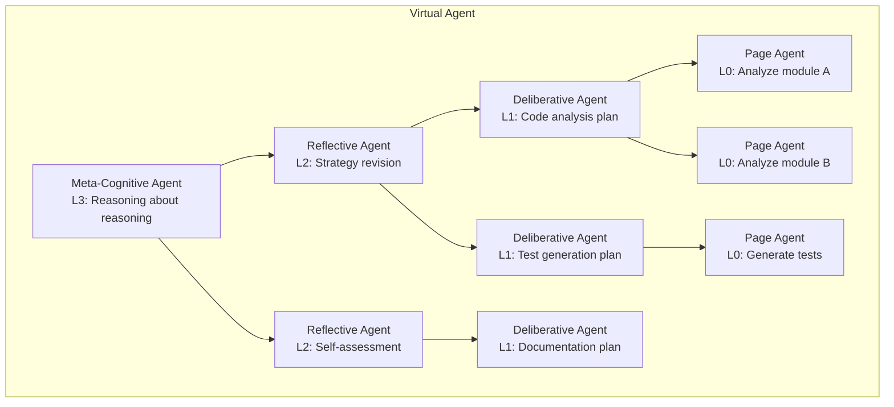

# Agents All the Way Down

Colony is built on a single, testable conjecture:

> **General intelligence is emergent from the right composition of LLM-based reasoning policy and action space.**

!!! tip "General Intelligence Emerges from Composition"
    The **action space** is as important to foster intelligent behavior as the reasoning model itself. By providing the right set of actions, we can guide the LLM to both **learn** (*at training time*) and **reason** (*at inference time*) in more effective ways. This is corroborated by embodied AI research which shows that <u>*the action space available to an agent significantly influences its ability to learn and perform tasks*.</u>

The conjecture is bold: compose enough LLM-based agents with the right mix of capabilities, and general intelligence emerges. Colony is the testbed for that conjecture.

This architectural claim has specific consequences for how the framework is built.

!!! danger "Nested Action Policies"

    Add explanation here of how nested recursive action policies enable the emergence of general intelligence, but we can exploit agents to emulate this recursive structure.

!!! danger "Nested Action Policies"

    Add explanation here of how the action policy is an aspect weaver that decides control and data flow inside an agent.

## The Virtual Agent

Here is Colony's most provocative architectural idea: a multi-agent system is not a collection of independent agents collaborating on a task. It is the **different cognitive levels of a single virtual agent**.

Consider how human cognition works at different levels:

| Level | Human Cognition | Colony Implementation |
|---|---|---|
| L0: Reflexive | Immediate reactions, pattern matching | Rule-based guards, reactive policies |
| L1: Deliberative | Goal-oriented planning, sequencing | LLM-based action policies, plan generation |
| L2: Reflective | Self-assessment, strategy revision | Reflection capabilities, meta-reasoning agents |
| L3: Meta-cognitive | Reasoning about reasoning itself | Supervisor agents, capability orchestration |

In Colony, each level can be implemented by different agents with different capabilities. The top-level agent has higher-level, more abstract capabilities (strategic planning, meta-reasoning). Lower-level agents have specialized, fine-grained capabilities (page analysis, code inspection, hypothesis testing). Together, they implement the cognitive architecture of a single virtual agent whose reasoning depth and breadth exceed what any individual agent could achieve.

## What This Means in Practice

The "agents all the way down" philosophy produces concrete architectural decisions:
1. **Dynamic hierarchies.** The agent hierarchy is not fixed at design time. Agents spawn sub-agents and agent pools, form teams and coalitions, play games, and dissolve -- all decided at runtime by the action policy based on the task.

