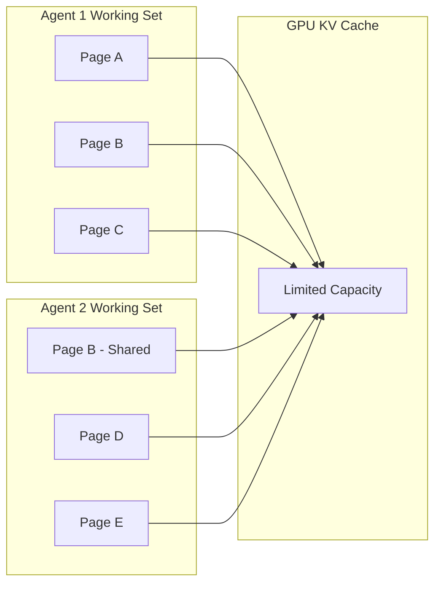
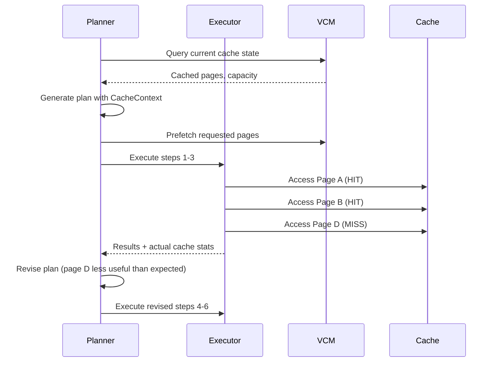

# Cache-Aware Patterns

!!! bug "Merge This File with `design-insights/page-graphs.md`"
    Nonuniform Page Sizes, Working Set Dynamics, Amortized Cost.


!!! bug "Merge This File with `philosophy/no-rag.md`"
    Amortized Efficiency.


When context spans billions of tokens across a GPU cluster, *cache misses dominate execution time*.

!!! info "GPU Cluster Size Matters"
    Add a graph showing cache misses vs hits as a function of cluster size and context size, demonstrating the point at which cache management becomes critical.


!!! tip "The Key Insight"
    Cache awareness is a property of the multi-agent system as a whole, not of individual agents or tools. Individual agents need to *collaboratively* generate their plans that are aware of cache constraints and to schedule actions in a way that optimizes cache locality and minimizes costly misses *for the system as a whole*. Colony provides the infrastructure and coordination mechanisms to enable this transparently.

This distinction matters. You cannot make individual tools or actions or agents "cache-aware" in isolation. The most efficient strategy for managing KV cache pages depends on the *data being analyzed at runtime*: the structure of the context, the relationships between pages, the current state of the reasoning process. Only the planner, which sees the full picture, can make cache-aware decisions.

Colony's architecture reflects this: cache awareness is woven into the planning layer, not bolted onto the execution layer.

## Working Sets as Resources

In Colony's Virtual Context Manager (VCM), context pages are **limited resources** that must be allocated and coordinated across agents, exactly like physical memory pages in an operating system.



This creates planning constraints that traditional agent frameworks never consider:

- **Cache contention**: Two agents needing different pages that compete for the same KV cache slots
- **Working set overflow**: An agent's plan requires more pages than cache capacity allows
- **Exclusive pages**: Some pages must not be evicted while a plan is active (high-frequency access pages)
- **Shareable pages**: Read-only pages that multiple agents can access without conflict

!!! note "Plan Conflicts Include Cache Contention"
    In Colony, conflict detection between agent plans is not limited to logical dependencies (data conflicts, ordering constraints). Cache contention is a first-class conflict type. Two plans that are logically independent may still conflict if their combined working sets exceed cache capacity.

## `CacheContext` in Plans

Every plan in Colony includes comprehensive cache context as a core part of the plan that the planner reasons about:

```python
class CacheContext(BaseModel):
    # What pages does this plan need?
    working_set: list[str]
    working_set_priority: dict[str, float]  # page_id -> 0.0 to 1.0

    # How will pages be accessed?
    estimated_access_pattern: dict[str, int]  # page_id -> access count
    access_sequence: list[str]  # Expected order of access

    # Page graph context
    page_graph_summary: dict[str, Any]  # Clusters, relationships, density

    # Cache requirements
    min_cache_size: int   # Can tolerate some misses
    ideal_cache_size: int # Optimal performance

    # Coordination with other agents
    shareable_pages: list[str]   # Safe to share
    exclusive_pages: list[str]   # Do not evict

    # Prefetching
    prefetch_pages: list[str]
    prefetch_priority: dict[str, float]
```

The LLM planner uses this context to make decisions that a cache-unaware system would get wrong:

- **Action ordering**: Group actions that access the same pages together to maximize cache hits
- **Prefetch scheduling**: Declare page needs upfront so the VCM can load pages before they are needed
- **Working set sizing**: Scale the plan's ambition to fit available cache capacity
- **Cache-conscious revision**: When revising a plan mid-execution, preserve cache locality when possible

## Amortized Cost: From $O(N^2)$ to $O(N \log N)$

The initial cost of reasoning over $N$ pages is $O(N^2)$: in the first round, queries generated by each page may need to be routed to any other page. This is expensive, but it builds the **page attention graph**: a record of which pages actually answer queries from which other pages.

As the page attention graph stabilizes over successive reasoning rounds, two efficiency gains emerge:

1. **Smarter routing**: Queries are routed using the graph rather than broadcast to all pages, reducing per-round cost to $O(N \log N)$
2. **Better cache locality**: Pages that frequently exchange queries are identified as belonging to the same working set and co-located in cache

The amortized cost per round is:

$$O(N \log N + c \cdot N^2 / R) \approx O(N \log N) \text{ when } R \approx N$$

where $R$ is the number of reasoning rounds. Deep reasoning tasks inherently require many rounds ($R$ grows with task complexity), so the quadratic startup cost is amortized away.


<style>
/* ── modular agents Diagrams ── */
.ci-svg { width: 100%; display: block; }
.ci-svg text { font-family: -apple-system, BlinkMacSystemFont, "Segoe UI", Roboto, Helvetica, Arial, sans-serif; }

/* Naive diagram */
.ci-svg .r-llm-naive  { fill: #fffbeb; stroke: #f59e0b; }
.ci-svg .r-tool-naive  { fill: #f9fafb; stroke: #9ca3af; }
.ci-svg .t-title       { font-size: 14px; font-weight: 600; fill: #1e1b4b; }
.ci-svg .t-body        { font-size: 11.5px; fill: #374151; }
.ci-svg .t-detail      { font-size: 10.5px; fill: #6b7280; }
.ci-svg .t-muted       { font-size: 11px; fill: #9ca3af; }
.ci-svg .r-policy      { fill: #f5f3ff; stroke: #8b5cf6; }

/* LLM infusion arrows */
.ci-svg .arrow-infuse  { stroke: #f59e0b; stroke-width: 1.2; fill: none; stroke-dasharray: 4 3; }
@keyframes infusePulse { to { stroke-dashoffset: -14; } }
.ci-svg .arrow-infuse  { animation: infusePulse 1.2s linear infinite; }
.ci-svg .arrow-compose { stroke: #8b5cf6; stroke-width: 1.4; fill: none; }

/* ── Dark mode ── */
[data-md-color-scheme="slate"] .ci-svg .t-title      { fill: #e0e7ff; }
[data-md-color-scheme="slate"] .ci-svg .t-body       { fill: #cbd5e1; }
[data-md-color-scheme="slate"] .ci-svg .t-detail     { fill: #94a3b8; }
[data-md-color-scheme="slate"] .ci-svg .t-muted      { fill: #64748b; }
[data-md-color-scheme="slate"] .ci-svg .r-llm-naive  { fill: #422006; stroke: #d97706; }
[data-md-color-scheme="slate"] .ci-svg .r-tool-naive { fill: #1e1b4b; stroke: #52525b; }
[data-md-color-scheme="slate"] .ci-svg .r-policy     { fill: #1e1b4b; stroke: #6d28d9; }
</style>

<div style="margin:1.5rem 0;">
<svg class="ci-svg" viewBox="0 0 600 720" xmlns="http://www.w3.org/2000/svg" style="max-width:520px;">
  <defs>
    <marker id="ci-ah-purple" markerWidth="8" markerHeight="6" refX="7" refY="3" orient="auto">
      <path d="M0,0 L8,3 L0,6 Z" fill="#8b5cf6"/>
    </marker>
    <marker id="ci-ah-amber" markerWidth="8" markerHeight="6" refX="7" refY="3" orient="auto">
      <path d="M0,0 L8,3 L0,6 Z" fill="#f59e0b"/>
    </marker>
  </defs>

  <rect class="r-llm-naive" x="200" y="0" width="400" height="56" rx="8" ry="8" stroke-width="1.6"/>
  <text class="t-title" x="400" y="35" text-anchor="middle">Round 1: O(N^2) - Full routing</text>
  <line class="arrow-compose" x1="400" y1="55" x2="400" y2="100" marker-end="url(#ci-ah-purple)"/>

  <rect class="r-tool-naive" x="200"  y="100" width="400" height="56" rx="6" ry="6" stroke-width="1.2"/>
  <text class="t-title" x="400" y="135" text-anchor="middle">Page Graph: Sparse</text>
  <line class="arrow-compose" x1="400" y1="155" x2="400" y2="200" marker-end="url(#ci-ah-purple)"/>

  <rect class="r-llm-naive" x="200" y="200" width="400" height="56" rx="8" ry="8" stroke-width="1.6"/>
  <text class="t-title" x="400" y="235" text-anchor="middle">Round 2: Cheaper routing via graph</text>
  <line class="arrow-compose" x1="400" y1="255" x2="400" y2="300" marker-end="url(#ci-ah-purple)"/>

  <rect class="r-tool-naive" x="200"  y="300" width="400" height="56" rx="6" ry="6" stroke-width="1.2"/>
  <text class="t-title" x="400" y="335" text-anchor="middle">Page Graph: Denser</text>
  <line class="arrow-compose" x1="400" y1="355" x2="400" y2="400" marker-end="url(#ci-ah-purple)"/>

  <rect class="r-llm-naive" x="200" y="400" width="400" height="56" rx="8" ry="8" stroke-width="1.6"/>
  <text class="t-title" x="400" y="435" text-anchor="middle">Round 3: Even cheaper</text>
  <line class="arrow-compose" x1="400" y1="455" x2="400" y2="500" marker-end="url(#ci-ah-purple)"/>

  <rect class="r-tool-naive" x="200"  y="500" width="400" height="56" rx="6" ry="6" stroke-width="1.2"/>
  <text class="t-title" x="400" y="535" text-anchor="middle">Page Graph: Stabilizing</text>
  <line class="arrow-compose" x1="400" y1="555" x2="400" y2="600" marker-end="url(#ci-ah-purple)"/>

  <rect class="r-llm-naive" x="200" y="600" width="400" height="56" rx="8" ry="8" stroke-width="1.6"/>
  <text class="t-title" x="400" y="635" text-anchor="middle">Round 100: O(N log N) amortized</text>


  <!-- Caption -->
  <text class="t-muted" x="400" y="700" text-anchor="middle" font-style="italic">Evolution of the page graph over inference rounds</text>
</svg>
</div>


!!! tip "The Working Set Conjecture"
    Colony hypothesizes that working set drift (measured by Jaccard similarity between page sets at different time steps) exhibits **episodic behavior**: periods of high stability interspersed with sharp transitions as agents shift focus. Cache-aware scheduling exploits this by accumulating out-of-working-set queries during stable episodes and batching page replacements at transition points.


!!! bug "Missing Implementation"
    - Query routing based on page graph. Does attention-based query routing modify the page graph?
    - Query routing should rank all pages by attention/page-graph proximity, and route the query to the top K pages until a satisfactory answer is found or all pages are exhausted. This is a fundamental primitive for cache-aware scheduling, but its implementation status is not clear.


## Model-Predictive Control for Plans

Colony does not execute plans to completion. It uses a **Model-Predictive Control (MPC)** approach: execute part of the plan, observe the results, re-evaluate, and adapt.

This is essential for cache-aware planning because:

1. **Cache state changes**: Other agents load and evict pages, invalidating assumptions about what is cached
2. **Page graph updates**: New relationships are discovered during execution, changing the optimal access pattern
3. **Working set drift**: The reasoning process may discover that different pages are more relevant than initially predicted

The MPC approach means plans are living documents. The planner generates a plan with cache context, the executor runs the first few steps, the planner observes actual cache hit rates and page access patterns, and then revises the remaining plan accordingly.



## Page Affinity Routing

In NUMA-aware scheduling in operating systems, computation should be co-located with the data it needs.

Similarly, an agent can be bound to one or more context pages. The **`PageAffinityRouter`** (used by the LLM cluster to route agent spawn requests) selects the Ray node where the most relevant pages are already cached:

- **Soft affinity**: Best-effort scheduling to nodes with relevant pages. The agent can run elsewhere if no good match exists.
- **Hard affinity**: The agent *must* run on a node with specific pages. Used when cache miss penalty would make execution impractical.

## Cache-Aware Conflict Resolution

!!! bug "This Section Needs Attention"
    Add specific details and code examples from the codebase.

When two plans conflict over cache resources, Colony resolves it through a hierarchy of strategies:

1. **Page sharing**: If all overlapping pages are read-only, both plans can proceed. Mark pages as shared.
2. **Priority-based allocation**: Higher-priority plans keep contested pages. Lower-priority plans adjust their working sets.
3. **Temporal separation**: Stagger execution so plans run sequentially, reusing cached pages.
4. **Working set partitioning**: Split contested pages between plans based on access frequency -- assign each page to the plan that will access it more often.

!!! warning "Cache Thrashing"
    The worst outcome is two plans with high working set overlap running simultaneously, causing continuous eviction and reloading of the same pages. Colony's conflict detection flags this as a high-severity conflict when overlap exceeds 70% of either plan's working set.

## Nonuniform Page Sizes

Page size affects cache efficiency in non-obvious ways:

- **Too large**: Spurious edges in the page graph (pages appear related because they contain unrelated content that happens to share a page). This causes unnecessary page loads.
- **Too small**: Edges that should be *internalized* (handled by in-context learning within a single page) are *externalized* (handled by inter-page context exchange). This increases coordination overhead.

Colony supports nonuniform page sizes to match the natural structure of the data. A concise configuration file might be one page; a large module might be split across several. The page graph captures the actual semantic relationships regardless of page boundaries.

## What This Looks Like in Practice

!!! bug "Add Concrete Code"
    Add the exact code snippets where these behaviors arise.

A concrete example: an agent tasked with understanding a dependency chain across a large codebase.

1. The planner analyzes the task and identifies 40 relevant pages (source files, configs, tests)
2. Cache capacity on the target node is 25 pages
3. The planner generates a plan that:
    - Groups the 40 pages into 3 phases based on the page graph (module boundaries)
    - Schedules Phase 1 (15 pages) with prefetch hints for Phase 2
    - Marks 5 central pages (interfaces, shared types) as exclusive -- they span all phases
    - Declares 10 pages as shareable with other agents analyzing the same codebase
4. During execution, Phase 1 discovers unexpected dependencies to 3 pages not in the original plan
5. The planner revises Phase 2 to include those pages, dropping 3 low-priority pages to stay within cache capacity
6. Phase 3 benefits from the stabilized page graph: cache hit rate is 85% vs 40% in Phase 1

The total execution time is dominated by Phase 1's cache misses. Phases 2 and 3 run significantly faster because the page graph guides routing and the cache contains the right pages. This is the amortized cost argument made concrete.
