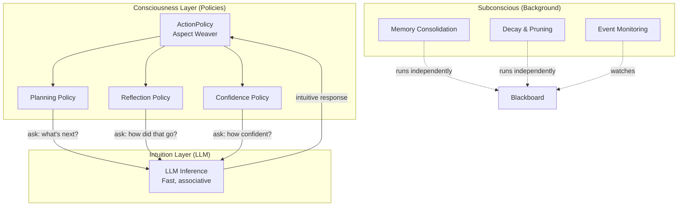

# The Consciousness-Intuition Interface

Colony draws a specific, architecturally consequential analogy between its multi-agent system and cognitive science. This is not a metaphor used for marketing -- it maps directly to code and determines how agents are structured.

## Two Layers of Cognition

| Layer | Cognitive Analogy | Colony Implementation | Properties |
|-------|------------------|-----------------------|------------|
| **Intuition** | Fast, associative, pattern-matching | The LLM itself | Parallel, immediate, prone to hallucination and overconfidence |
| **Consciousness** | Slow, deliberate, sequential | Cognitive policies + action policy | Planning, reflection, error correction, goal tracking |

The LLM provides raw reasoning power -- remarkable leaps of insight, but also confabulation, laziness, and drift. The policy layer provides structure -- sequencing, verification, and correction of those intuitions into reliable behavior.

Every cognitive process in Colony is a pluggable **policy** with a well-defined interface and a default implementation. Planning, reflection, conflict resolution, memory consolidation, hypothesis evaluation, confidence tracking -- each is a policy that can be swapped, customized, or composed. The LLM provides the "intuition" that each policy step draws on, while the policy structure provides the "consciousness" that sequences and governs those intuitions.

!!! info "Why this matters"
    Most agent frameworks treat the LLM as the complete behavior: prompt in, action out. Colony treats the LLM as one layer -- the intuition layer -- wrapped in a policy layer that adds the deliberative, reflective, and meta-cognitive processes that the LLM alone cannot sustain over long reasoning chains.

## Conscious vs. Subconscious Processes

Colony's `AgentCapability` system directly implements the conscious/subconscious distinction:

### Conscious Processes

Capabilities export `@action_executor` methods -- deliberate actions that the `ActionPolicy` can choose to invoke during its reasoning loop. These are interleaved with LLM reasoning and directly alter agent behavior:

- Planning: create, revise, or backtrack plans
- Reflection: assess past actions and adjust strategy
- Memory retrieval: consciously search for relevant past experiences
- Tool use: invoke external tools to gather information
- Communication: send structured messages to other agents

The LLM planner decides *which* conscious process to invoke and *when*, based on current context and goals.

### Subconscious Processes

Capabilities also run background processes that operate without LLM involvement:

- **Memory consolidation**: Periodically summarize and compress working memory into short-term and long-term stores
- **Rehearsal**: Strengthen important memories by replaying recent experiences
- **Concept formation**: Extract patterns from accumulated observations
- **Decay and pruning**: Reduce relevance of stale memories, remove duplicates
- **Event monitoring**: Watch for blackboard events that may require attention

These run continuously or periodically as async tasks, at different time scales, triggered by blackboard events or timer intervals. They keep the agent's cognitive infrastructure healthy without consuming LLM inference cycles.

## The BDI Model

Colony's cognitive architecture maps to the Belief-Desire-Intention (BDI) model from agent theory:

| BDI Component | Colony Implementation |
|--------------|----------------------|
| **Beliefs** | References to blackboard entries the agent considers true. Updated by observation, inference, and peer correction. |
| **Desires** | Explicit `Goal` objects with success criteria and priority. Goals can be hierarchical and can conflict. |
| **Intentions** | Current plans and sub-tasks. The active plan represents the agent's committed course of action. |

The BDI mapping is not decorative. It structures how agents reason about their own state:

- An agent can examine its **beliefs** (blackboard queries) and discover inconsistencies
- An agent can evaluate its **goals** against current progress and adjust priorities
- An agent can inspect its **intentions** (current plan) and decide to revise or abandon them

This self-inspection capability -- reasoning *about* one's own cognitive state -- is what distinguishes Colony's approach from frameworks where agents simply execute a prompt-to-action loop.

## AgentSelfConcept

Each agent carries an `AgentSelfConcept` that defines its identity independently of its capabilities:

- **Identity**: Who the agent is (name, description, persona)
- **Goals**: What the agent is trying to achieve
- **Motivations**: Why the agent pursues its goals
- **Values**: Constraints on how the agent should behave

`SelfConcept` is distinct from *role*. An agent's role is defined by its `AgentCapabilities` -- the actions it can perform, the events it can observe, the protocols it can participate in. The `SelfConcept` provides the "why" that guides how those capabilities are used.

## Levels of Cognition

Colony organizes agent behavior into levels, each with distinct processing characteristics:

| Level | Name | Description | Memory Needs | Implementation |
|-------|------|-------------|--------------|----------------|
| L0 | Reflexive | Immediate reactions, pattern matching | Sensory buffer | Rule-based guards, reactive hooks |
| L1 | Deliberative | Goal-oriented planning, action sequencing | Working memory | LLM-based action policies, plan generation |
| L2 | Reflective | Self-assessment, strategy revision | Short-term memory | Reflection capabilities, meta-reasoning |
| L3 | Meta-cognitive | Reasoning about reasoning itself | Long-term memory | Supervisor agents, capability orchestration |

A multi-agent system implements these levels through the **virtual agent** concept: different agents with different capabilities collectively implement the cognitive architecture of a single virtual agent whose reasoning depth and breadth exceed what any individual agent could achieve.

The top-level agent operates at L2-L3 (strategic planning, meta-reasoning). It spawns lower-level agents at L1 (task execution, page analysis). L0 behavior is handled by reactive hooks and rule-based guards that fire automatically without LLM involvement.

!!! tip "Not a metaphor"
    The virtual agent concept is not an analogy. When a supervisor agent spawns child agents, assigns them goals, monitors their progress, and synthesizes their results, it is literally implementing the meta-cognitive level of a single reasoning process distributed across multiple LLM instances. The children are the "hands" and the supervisor is the "executive function."

## How This Differs from Other Frameworks

Most multi-agent frameworks model agents as independent actors that communicate via messages. Colony models a multi-agent system as **the cognitive architecture of a single virtual agent**, where:

- **CrewAI** assigns roles via system prompts. Colony assigns roles via composable capabilities with conscious and subconscious processes.
- **AutoGen** uses conversation turns as the coordination mechanism. Colony uses policy-driven cognitive processes with blackboard-mediated state sharing.
- **LangGraph** encodes agent behavior as explicit state graphs. Colony lets the LLM planner synthesize control flow dynamically from available capabilities.
- **MetaGPT** prescribes Standard Operating Procedures. Colony provides policies with defaults that the LLM can override based on context.

The key difference: in Colony, the cognitive architecture is *layered and introspectable*. An agent can examine its own beliefs, goals, plans, confidence levels, and memory state -- and reason about whether to change them. This self-awareness is not bolted on; it emerges from the policy-based design where every cognitive process is a first-class, queryable component.
