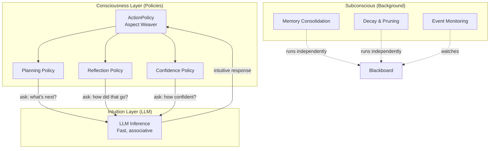

# The Consciousness-Intuition Interface

<!--
Colony draws a specific, architecturally consequential analogy between its multi-agent system and cognitive science.
-->

Most agent frameworks treat the LLM as the complete behavior: prompt in, actions out.

<style>
/* ── Consciousness-Intuition Diagrams ── */
.ci-svg { width: 100%; display: block; }
.ci-svg text { font-family: -apple-system, BlinkMacSystemFont, "Segoe UI", Roboto, Helvetica, Arial, sans-serif; }

/* Naive diagram */
.ci-svg .r-llm-naive  { fill: #fffbeb; stroke: #f59e0b; }
.ci-svg .r-tool-naive  { fill: #f9fafb; stroke: #9ca3af; }
.ci-svg .t-title       { font-size: 14px; font-weight: 600; fill: #1e1b4b; }
.ci-svg .t-body        { font-size: 11.5px; fill: #374151; }
.ci-svg .t-detail      { font-size: 10.5px; fill: #6b7280; }
.ci-svg .t-muted       { font-size: 11px; fill: #9ca3af; }

/* Colony diagram */
.ci-svg .r-policy      { fill: #f5f3ff; stroke: #8b5cf6; }
.ci-svg .r-llm-col     { fill: #fffbeb; stroke: #f59e0b; }
.ci-svg .r-cap-tool    { fill: #f9fafb; stroke: #9ca3af; }
.ci-svg .r-cap-game    { fill: #fef3c7; stroke: #f59e0b; }
.ci-svg .r-cap-cache   { fill: #ecfdf5; stroke: #10b981; }
.ci-svg .r-cap-reason  { fill: #eff6ff; stroke: #3b82f6; }
.ci-svg .r-cap-cog     { fill: #ede9fe; stroke: #a78bfa; }
.ci-svg .t-cap-title   { font-size: 11px; font-weight: 600; }
.ci-svg .t-cap-title-tool   { fill: #374151; }
.ci-svg .t-cap-title-game   { fill: #92400e; }
.ci-svg .t-cap-title-cache  { fill: #064e3b; }
.ci-svg .t-cap-title-reason { fill: #1e3a5f; }
.ci-svg .t-cap-title-cog    { fill: #5b21b6; }
.ci-svg .t-cap-body    { font-size: 9.5px; fill: #374151; }
.ci-svg .t-llm-label   { font-size: 13px; font-weight: 700; fill: #92400e; }
.ci-svg .t-llm-sub     { font-size: 9px; fill: #92400e; }

/* LLM infusion arrows */
.ci-svg .arrow-infuse  { stroke: #f59e0b; stroke-width: 1.2; fill: none; stroke-dasharray: 4 3; }
@keyframes infusePulse { to { stroke-dashoffset: -14; } }
.ci-svg .arrow-infuse  { animation: infusePulse 1.2s linear infinite; }
.ci-svg .arrow-compose { stroke: #8b5cf6; stroke-width: 1.4; fill: none; }

/* ── Dark mode ── */
[data-md-color-scheme="slate"] .ci-svg .t-title      { fill: #e0e7ff; }
[data-md-color-scheme="slate"] .ci-svg .t-body       { fill: #cbd5e1; }
[data-md-color-scheme="slate"] .ci-svg .t-detail     { fill: #94a3b8; }
[data-md-color-scheme="slate"] .ci-svg .t-muted      { fill: #64748b; }
[data-md-color-scheme="slate"] .ci-svg .t-cap-title-tool   { fill: #cbd5e1; }
[data-md-color-scheme="slate"] .ci-svg .t-cap-title-game   { fill: #fbbf24; }
[data-md-color-scheme="slate"] .ci-svg .t-cap-title-cache  { fill: #6ee7b7; }
[data-md-color-scheme="slate"] .ci-svg .t-cap-title-reason { fill: #93c5fd; }
[data-md-color-scheme="slate"] .ci-svg .t-cap-title-cog    { fill: #c4b5fd; }
[data-md-color-scheme="slate"] .ci-svg .t-cap-body   { fill: #94a3b8; }
[data-md-color-scheme="slate"] .ci-svg .t-llm-label  { fill: #fbbf24; }
[data-md-color-scheme="slate"] .ci-svg .t-llm-sub    { fill: #d97706; }
[data-md-color-scheme="slate"] .ci-svg .r-llm-naive  { fill: #422006; stroke: #d97706; }
[data-md-color-scheme="slate"] .ci-svg .r-tool-naive { fill: #1e1b4b; stroke: #52525b; }
[data-md-color-scheme="slate"] .ci-svg .r-policy     { fill: #1e1b4b; stroke: #6d28d9; }
[data-md-color-scheme="slate"] .ci-svg .r-llm-col    { fill: #422006; stroke: #d97706; }
[data-md-color-scheme="slate"] .ci-svg .r-cap-tool   { fill: #18181b; stroke: #52525b; }
[data-md-color-scheme="slate"] .ci-svg .r-cap-game   { fill: #451a03; stroke: #d97706; }
[data-md-color-scheme="slate"] .ci-svg .r-cap-cache  { fill: #052e16; stroke: #059669; }
[data-md-color-scheme="slate"] .ci-svg .r-cap-reason { fill: #172554; stroke: #2563eb; }
[data-md-color-scheme="slate"] .ci-svg .r-cap-cog    { fill: #2e1065; stroke: #7c3aed; }
</style>

<div style="margin:1.5rem 0;">
<svg class="ci-svg" viewBox="0 0 520 170" xmlns="http://www.w3.org/2000/svg" style="max-width:520px;">
  <!-- LLM monolith -->
  <rect class="r-llm-naive" x="60" y="10" width="400" height="56" rx="8" ry="8" stroke-width="1.6"/>
  <text class="t-title" x="260" y="35" text-anchor="middle">LLM</text>
  <text class="t-detail" x="260" y="52" text-anchor="middle">prompt in → actions out</text>

  <!-- Tools row -->
  <rect class="r-tool-naive" x="60"  y="82" width="88" height="50" rx="6" ry="6" stroke-width="1.2"/>
  <text class="t-body" x="104" y="112" text-anchor="middle">Tool 1</text>
  <rect class="r-tool-naive" x="158" y="82" width="88" height="50" rx="6" ry="6" stroke-width="1.2"/>
  <text class="t-body" x="202" y="112" text-anchor="middle">Tool 2</text>
  <rect class="r-tool-naive" x="256" y="82" width="88" height="50" rx="6" ry="6" stroke-width="1.2"/>
  <text class="t-body" x="300" y="112" text-anchor="middle">Tool 3</text>
  <text class="t-muted" x="362" y="112" text-anchor="middle">...</text>
  <rect class="r-tool-naive" x="372" y="82" width="88" height="50" rx="6" ry="6" stroke-width="1.2"/>
  <text class="t-body" x="416" y="112" text-anchor="middle">Tool N</text>

  <!-- Caption -->
  <text class="t-muted" x="260" y="156" text-anchor="middle" font-style="italic">Flat tools, no cognitive structure — the LLM is the entire agent</text>
</svg>
</div>


!!! info "Two Layers of Cognition"
    The LLM provides raw reasoning power -- remarkable **leaps of insight**, but also confabulation, laziness, and drift. By design, Colony provides structure -- sequencing, verification, and correction of those intuitions into reliable behavior. Colony enforces the most useful cognitive processes, general reasoning tasks and multi-agent collaboration patterns by factoring them out into `AgentCapabilities` and treating the LLM as the source of **intuition** to be infused in all those capabilities. Colony then uses an `ActionPolicy` to compose all these deliberative, reflective, and meta-cognitive processes that the LLM alone cannot sustain over long reasoning chains.


| Layer | Cognitive Analogy | Colony Implementation | Properties |
|-------|------------------|-----------------------|------------|
| **Intuition** | Fast, associative, pattern-matching | The LLM itself | Parallel, immediate, capable of remarkable leaps but also prone to hallucination and overconfidence |
| **Consciousness** | Slow, deliberate, sequential | Cognitive policies + action policy | Planning, reflection, error correction, goal tracking |


Any cognitive process in Colony is a pluggable `AgentCapability` with a well-defined interface and a default implementation. Planning, reflection, conflict resolution, memory consolidation, hypothesis evaluation, confidence tracking -- each is an `AgentCapability` that can be swapped, customized, or composed. The LLM provides the "**intuition**" that drives each `AgentCapability` as well as the agent's `ActionPolicy` composing them, while the `ActionPolicy` structure provides the "consciousness" that sequences and governs those intuitions.


<div style="margin:1.5rem 0;">
<svg class="ci-svg" viewBox="0 0 820 340" xmlns="http://www.w3.org/2000/svg" style="max-width:820px;">
  <defs>
    <marker id="ci-ah-purple" markerWidth="8" markerHeight="6" refX="7" refY="3" orient="auto">
      <path d="M0,0 L8,3 L0,6 Z" fill="#8b5cf6"/>
    </marker>
    <marker id="ci-ah-amber" markerWidth="8" markerHeight="6" refX="7" refY="3" orient="auto">
      <path d="M0,0 L8,3 L0,6 Z" fill="#f59e0b"/>
    </marker>
  </defs>

  <!-- ── LLM column (right side) ── -->
  <rect class="r-llm-col" x="720" y="10" width="84" height="296" rx="10" ry="10" stroke-width="1.8"/>
  <text class="t-llm-label" x="762" y="100" text-anchor="middle">L</text>
  <text class="t-llm-label" x="762" y="120" text-anchor="middle">L</text>
  <text class="t-llm-label" x="762" y="140" text-anchor="middle">M</text>
  <text class="t-llm-sub" x="762" y="175" text-anchor="middle">intuition</text>
  <text class="t-llm-sub" x="762" y="188" text-anchor="middle">layer</text>

  <!-- Infusion arrows from LLM to each capability group -->
  <line class="arrow-infuse" x1="720" y1="80"  x2="688" y2="120"/>
  <line class="arrow-infuse" x1="720" y1="130" x2="688" y2="155"/>
  <line class="arrow-infuse" x1="720" y1="170" x2="688" y2="190"/>
  <line class="arrow-infuse" x1="720" y1="210" x2="688" y2="225"/>
  <line class="arrow-infuse" x1="720" y1="250" x2="688" y2="260"/>
  <!-- Infusion arrow to ActionPolicy -->
  <line class="arrow-infuse" x1="720" y1="42"  x2="688" y2="42"/>

  <!-- ── ActionPolicy bar (top) ── -->
  <rect class="r-policy" x="16" y="14" width="674" height="56" rx="8" ry="8" stroke-width="1.6"/>
  <text class="t-title" x="353" y="38" text-anchor="middle">ActionPolicy</text>
  <text class="t-detail" x="353" y="54" text-anchor="middle">composes capabilities · sequences cognition · LLM-driven planning</text>

  <!-- Compose arrows from ActionPolicy down to capability groups -->
  <line class="arrow-compose" x1="80"  y1="70" x2="80"  y2="96" marker-end="url(#ci-ah-purple)"/>
  <line class="arrow-compose" x1="216" y1="70" x2="216" y2="96" marker-end="url(#ci-ah-purple)"/>
  <line class="arrow-compose" x1="353" y1="70" x2="353" y2="96" marker-end="url(#ci-ah-purple)"/>
  <line class="arrow-compose" x1="489" y1="70" x2="489" y2="96" marker-end="url(#ci-ah-purple)"/>
  <line class="arrow-compose" x1="625" y1="70" x2="625" y2="96" marker-end="url(#ci-ah-purple)"/>

  <!-- ── Capability group 1: Tool Capabilities ── -->
  <!-- Back cards (stacked effect) -->
  <rect class="r-cap-tool" x="24" y="104" width="130" height="190" rx="6" ry="6" stroke-width="0.8" opacity="0.35"/>
  <rect class="r-cap-tool" x="20" y="100" width="130" height="190" rx="6" ry="6" stroke-width="0.8" opacity="0.55"/>
  <!-- Front card -->
  <rect class="r-cap-tool" x="16" y="96" width="130" height="190" rx="6" ry="6" stroke-width="1.2"/>
  <text class="t-cap-title t-cap-title-tool" x="81" y="115" text-anchor="middle">Tool</text>
  <text class="t-cap-title t-cap-title-tool" x="81" y="129" text-anchor="middle">Capabilities</text>
  <line x1="32" y1="136" x2="130" y2="136" stroke="#d1d5db" stroke-width="0.6"/>
  <text class="t-cap-body" x="81" y="152" text-anchor="middle">MCP servers</text>
  <text class="t-cap-body" x="81" y="166" text-anchor="middle">File I/O, APIs</text>
  <text class="t-cap-body" x="81" y="180" text-anchor="middle">Code execution</text>
  <text class="t-cap-body" x="81" y="194" text-anchor="middle">Search, browse</text>
  <!-- Nested tools box -->
  <rect class="r-cap-tool" x="36" y="208" width="90" height="40" rx="4" ry="4" stroke-width="0.8" stroke-dasharray="3 2"/>
  <text class="t-cap-body" x="81" y="224" text-anchor="middle" font-style="italic">Tools 1…N</text>
  <text class="t-cap-body" x="81" y="238" text-anchor="middle" font-style="italic">(pluggable)</text>
  <text class="t-detail" x="81" y="274" text-anchor="middle">@action_executor</text>

  <!-- ── Capability group 2: Game Capabilities ── -->
  <rect class="r-cap-game" x="160" y="104" width="130" height="190" rx="6" ry="6" stroke-width="0.8" opacity="0.35"/>
  <rect class="r-cap-game" x="156" y="100" width="130" height="190" rx="6" ry="6" stroke-width="0.8" opacity="0.55"/>
  <rect class="r-cap-game" x="152" y="96" width="130" height="190" rx="6" ry="6" stroke-width="1.2"/>
  <text class="t-cap-title t-cap-title-game" x="217" y="115" text-anchor="middle">Game</text>
  <text class="t-cap-title t-cap-title-game" x="217" y="129" text-anchor="middle">Capabilities</text>
  <line x1="168" y1="136" x2="266" y2="136" stroke="#fbbf24" stroke-width="0.6"/>
  <text class="t-cap-body" x="217" y="152" text-anchor="middle">Hypothesis</text>
  <text class="t-cap-body" x="217" y="166" text-anchor="middle">Negotiation</text>
  <text class="t-cap-body" x="217" y="180" text-anchor="middle">Contract Net</text>
  <text class="t-cap-body" x="217" y="194" text-anchor="middle">Coalition</text>
  <text class="t-cap-body" x="217" y="208" text-anchor="middle">Consensus</text>
  <text class="t-detail" x="217" y="274" text-anchor="middle">error correction</text>

  <!-- ── Capability group 3: Cache-Awareness ── -->
  <rect class="r-cap-cache" x="296" y="104" width="130" height="190" rx="6" ry="6" stroke-width="0.8" opacity="0.35"/>
  <rect class="r-cap-cache" x="292" y="100" width="130" height="190" rx="6" ry="6" stroke-width="0.8" opacity="0.55"/>
  <rect class="r-cap-cache" x="288" y="96" width="130" height="190" rx="6" ry="6" stroke-width="1.2"/>
  <text class="t-cap-title t-cap-title-cache" x="353" y="115" text-anchor="middle">Cache-Aware</text>
  <text class="t-cap-title t-cap-title-cache" x="353" y="129" text-anchor="middle">Capabilities</text>
  <line x1="304" y1="136" x2="402" y2="136" stroke="#6ee7b7" stroke-width="0.6"/>
  <text class="t-cap-body" x="353" y="152" text-anchor="middle">Working Set</text>
  <text class="t-cap-body" x="353" y="166" text-anchor="middle">Page Graph</text>
  <text class="t-cap-body" x="353" y="180" text-anchor="middle">VCM analysis</text>
  <text class="t-cap-body" x="353" y="194" text-anchor="middle">Prefetching</text>
  <text class="t-cap-body" x="353" y="208" text-anchor="middle">Query routing</text>
  <text class="t-detail" x="353" y="274" text-anchor="middle">O(N log N) amortized</text>

  <!-- ── Capability group 4: Reasoning ── -->
  <rect class="r-cap-reason" x="432" y="104" width="130" height="190" rx="6" ry="6" stroke-width="0.8" opacity="0.35"/>
  <rect class="r-cap-reason" x="428" y="100" width="130" height="190" rx="6" ry="6" stroke-width="0.8" opacity="0.55"/>
  <rect class="r-cap-reason" x="424" y="96" width="130" height="190" rx="6" ry="6" stroke-width="1.2"/>
  <text class="t-cap-title t-cap-title-reason" x="489" y="115" text-anchor="middle">Reasoning</text>
  <text class="t-cap-title t-cap-title-reason" x="489" y="129" text-anchor="middle">Capabilities</text>
  <line x1="440" y1="136" x2="538" y2="136" stroke="#93c5fd" stroke-width="0.6"/>
  <text class="t-cap-body" x="489" y="152" text-anchor="middle">Reflection</text>
  <text class="t-cap-body" x="489" y="166" text-anchor="middle">Refinement</text>
  <text class="t-cap-body" x="489" y="180" text-anchor="middle">Grounding</text>
  <text class="t-cap-body" x="489" y="194" text-anchor="middle">Goal alignment</text>
  <text class="t-cap-body" x="489" y="208" text-anchor="middle">Consistency</text>
  <text class="t-detail" x="489" y="274" text-anchor="middle">deliberation</text>

  <!-- ── Capability group 5: Cognitive ── -->
  <rect class="r-cap-cog" x="568" y="104" width="130" height="190" rx="6" ry="6" stroke-width="0.8" opacity="0.35"/>
  <rect class="r-cap-cog" x="564" y="100" width="130" height="190" rx="6" ry="6" stroke-width="0.8" opacity="0.55"/>
  <rect class="r-cap-cog" x="560" y="96" width="130" height="190" rx="6" ry="6" stroke-width="1.2"/>
  <text class="t-cap-title t-cap-title-cog" x="625" y="115" text-anchor="middle">Cognitive</text>
  <text class="t-cap-title t-cap-title-cog" x="625" y="129" text-anchor="middle">Capabilities</text>
  <line x1="576" y1="136" x2="674" y2="136" stroke="#c4b5fd" stroke-width="0.6"/>
  <text class="t-cap-body" x="625" y="152" text-anchor="middle">Memory (WM,</text>
  <text class="t-cap-body" x="625" y="166" text-anchor="middle">STM, LTM)</text>
  <text class="t-cap-body" x="625" y="180" text-anchor="middle">Consciousness</text>
  <text class="t-cap-body" x="625" y="194" text-anchor="middle">Attention</text>
  <text class="t-cap-body" x="625" y="208" text-anchor="middle">Self-concept</text>
  <text class="t-detail" x="625" y="274" text-anchor="middle">meta-cognition</text>

  <!-- Caption -->
  <text class="t-muted" x="353" y="318" text-anchor="middle" font-style="italic">Structured capabilities — the LLM infuses intelligence into every component</text>
  <text class="t-muted" x="353" y="334" text-anchor="middle" font-style="italic">The ActionPolicy composes them into coherent cognitive behavior</text>
</svg>
</div>


## Conscious vs. Subconscious Processes

Colony's `AgentCapability` system directly implements the conscious/subconscious distinction:

### Conscious Processes

Capabilities export `@action_executor` methods -- deliberate actions that the `ActionPolicy` can choose to invoke during its reasoning loop. These are interleaved with LLM reasoning and directly alter agent behavior:

- Planning: create, revise, or backtrack plans
- Reflection: assess past actions and adjust strategy
- Memory retrieval: consciously search for relevant past experiences
- Tool use: invoke external tools to gather information
- Communication: send structured messages to other agents

The LLM planner decides *which* conscious process to invoke and *when*, based on current context and goals.

```python
class ReflectionCapability(AgentCapability):
    # Conscious: LLM planner selects this action during its reasoning loop
    @action_executor()
    async def reflect_on_progress(self, goal: str) -> Reflection:
        """Assess progress toward a goal and suggest strategy adjustments."""
        ...

    # Conscious: exposed to planner for deliberate memory search
    @action_executor()
    async def recall_similar_experiences(self, query: str) -> list[MemoryEntry]:
        """Search episodic memory for relevant past experiences."""
        ...
```

### Subconscious Processes

Capabilities also run background processes that operate without LLM involvement:

- **Memory consolidation**: Periodically summarize and compress working memory into short-term and long-term stores
- **Rehearsal**: Strengthen important memories by replaying recent experiences
- **Concept formation**: Extract patterns from accumulated observations
- **Decay and pruning**: Reduce relevance of stale memories, remove duplicates
- **Event monitoring**: Watch for blackboard events that may require attention

These run continuously or periodically as `async` tasks, at different time scales, triggered by blackboard events or timer intervals. They keep the agent's cognitive infrastructure healthy without consuming LLM inference cycles.


```python
# Subconscious: memory consolidation runs via MemoryCapability subscriptions
stm = MemoryCapability(
    agent=agent,
    scope_id=MemoryScope.agent_stm(agent_id),
    ingestion_policy=MemoryIngestPolicy(
        subscriptions=[
            MemorySubscription(source_scope_id=MemoryScope.agent_working(agent_id)),
        ],
        transformer=SummarizingTransformer(agent=agent, prompt="..."),
    ),
    maintenance=MaintenanceConfig(decay_rate=0.01, prune_threshold=0.1),
)

# Subconscious: auto-capture agent behavior via hooks
MemoryProducerConfig(
    pointcut=Pointcut.pattern("ActionDispatcher.dispatch"),
    extractor=extract_action_from_dispatch,  # (ctx, result) -> (data, tags, metadata)
    ttl_seconds=3600,
)
```



## The BDI Model

Colony's cognitive architecture maps to the Belief-Desire-Intention (BDI) model from agent theory:

| BDI Component | Colony Implementation |
|--------------|----------------------|
| **Beliefs** | References to blackboard entries the agent considers true. Updated by observation, inference, and peer correction. |
| **Desires** | Explicit `Goal` objects with success criteria and priority. Goals can be hierarchical and can conflict. |
| **Intentions** | Current plans and sub-tasks. The active plan represents the agent's committed course of action. |

The BDI mapping is not decorative. It structures how agents reason about their own state:

- An agent can examine its **beliefs** (blackboard queries) and discover inconsistencies
- An agent can evaluate its **goals** against current progress and adjust priorities
- An agent can inspect its **intentions** (current plan) and decide to revise or abandon them

This self-inspection capability -- reasoning *about* one's own cognitive state -- is what distinguishes Colony's approach from frameworks where agents simply execute a prompt-to-action loop.

## `AgentSelfConcept`

Each agent carries an `AgentSelfConcept` that defines its identity independently of its capabilities:

- **Identity**: Who the agent is (name, description, persona)
- **Goals**: What the agent is trying to achieve
- **Motivations**: Why the agent pursues its goals
- **Values**: Constraints on how the agent should behave

`SelfConcept` is distinct from *role*. An agent's role is defined by its `AgentCapabilities` -- the actions it can perform, the events it can observe, the protocols it can participate in. The `SelfConcept` provides the "why" that guides how those capabilities are used.

## Levels of Cognition

Colony organizes agent behavior into levels, each with distinct processing characteristics:

| Level | Name | Description | Memory Needs | Implementation |
|-------|------|-------------|--------------|----------------|
| L0 | Reflexive | Immediate reactions, pattern matching | Sensory buffer | Rule-based guards, reactive hooks |
| L1 | Deliberative | Goal-oriented planning, action sequencing | Working memory | LLM-based action policies, plan generation |
| L2 | Reflective | Self-assessment, strategy revision | Short-term memory | Reflection capabilities, meta-reasoning |
| L3 | Meta-cognitive | Reasoning about reasoning itself | Long-term memory | Supervisor agents, capability orchestration |

A multi-agent system implements these levels through the **virtual agent** concept: different agents with different capabilities collectively implement the cognitive architecture of a single virtual agent whose reasoning depth and breadth exceed what any individual agent could achieve.

The top-level agent operates at L2-L3 (strategic planning, meta-reasoning). It spawns lower-level agents at L1 (task execution, page analysis). L0 behavior is handled by reactive hooks and rule-based guards that fire automatically without LLM involvement.

!!! tip "Not a metaphor"
    The virtual agent concept is not an analogy. When a supervisor agent spawns child agents, assigns them goals, monitors their progress, and synthesizes their results, it is literally implementing the meta-cognitive level of a single reasoning process distributed across multiple LLM instances. The children are the "hands" and the supervisor is the "executive function."

## How This Differs from Other Frameworks

Most multi-agent frameworks model agents as independent actors that communicate via messages. Colony models a multi-agent system as **the cognitive architecture of a single virtual agent**, where:

- **CrewAI** assigns roles via system prompts. Colony assigns roles via composable capabilities with conscious and subconscious processes.
- **AutoGen** uses conversation turns as the coordination mechanism. Colony uses policy-driven cognitive processes with blackboard-mediated state sharing.
- **LangGraph** encodes agent behavior as explicit state graphs. Colony lets the LLM planner synthesize control flow dynamically from available capabilities.
- **MetaGPT** prescribes Standard Operating Procedures. Colony provides policies with defaults that the LLM can override based on context.

The key difference: in Colony, the cognitive architecture is *layered and introspectable*. An agent can examine its own beliefs, goals, plans, confidence levels, and memory state -- and reason about whether to change them. This self-awareness is not bolted on; it emerges from the policy-based design where every cognitive process is a first-class, queryable component.
