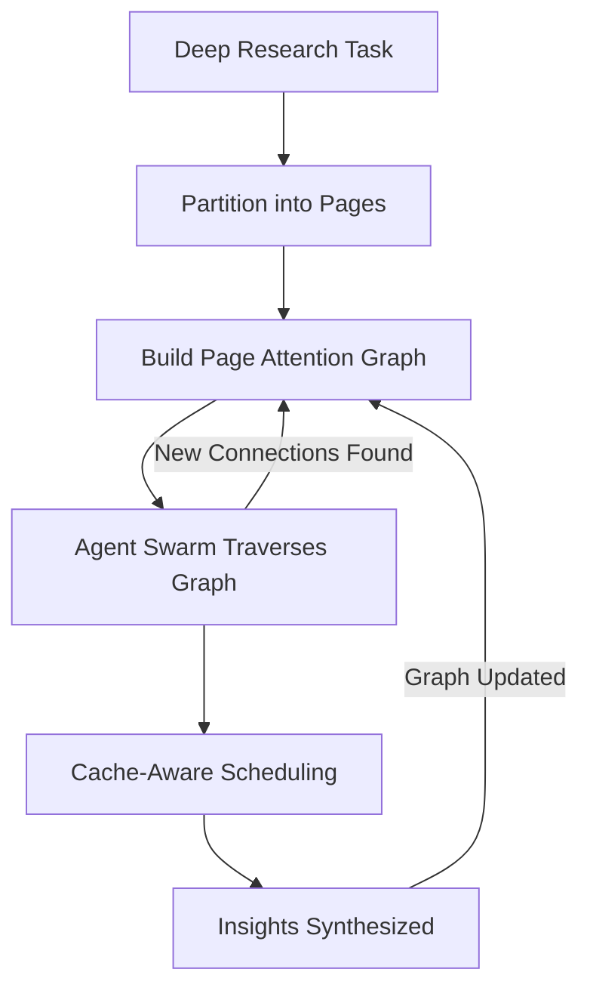

# Philosophy

Colony is built on a set of unorthodox ideas about how multi-agent systems should work. These ideas challenge conventional assumptions in the LLM application ecosystem -- particularly around retrieval-augmented generation, monolithic agent design, and the treatment of inference infrastructure as an afterthought.

The framework's name during early development was **Syaq** (from the Arabic word for "context"), reflecting the core conviction that *context is everything*. Not retrieved context. Not summarized context. Live, active, exhaustive context -- managed with the same rigor that operating systems bring to virtual memory.

## Core Convictions

Three philosophical pillars support Colony's architecture:

1. **The NoRAG Paradigm** -- Deep reasoning requires keeping the entire context live, not filtering it through retrieval. RAG activates sparse subsets and misses the dense, cross-cutting connections where breakthroughs happen.

2. **Agents All the Way Down** -- General intelligence is not a property of any single model. It emerges from the right composition of LLM-based reasoning agents that communicate, coordinate, and collaborate across unbounded context.

3. **Cache-Aware Patterns** -- When context spans billions of tokens distributed across a GPU cluster, cache management is not an optimization -- it is the dominant factor in whether reasoning succeeds or fails. Cache awareness must be an emergent property of planning, not bolted on after the fact.

These are not incremental improvements on existing agent frameworks. They represent a different mental model for what multi-agent systems are *for* and how they should be built.

## The Unifying Idea

Colony reconceptualizes deep research as a **game**: the moves available to agents are combinations of facts that offer the smallest leap to new insights. The entire context must remain live -- not filtered through retrieval -- because breakthroughs emerge from unpredictable connections between distant pieces of information.

A dynamic group of agents iteratively walks a page graph, accumulating state, communicating findings, and coordinating their traversal to maximize KV cache reuse. The page graph itself is built and refined as agents explore, creating a self-improving map of how context relates to itself.

## Read More

- [The NoRAG Paradigm](no-rag.md) -- Why retrieval-augmented generation is the wrong abstraction for deep reasoning
- [Agents All the Way Down](agents-all-the-way-down.md) -- How general intelligence emerges from composition
- [Cache-Aware Patterns](cache-awareness.md) -- Why cache management is a first-class concern, not an optimization
- [The Consciousness-Intuition Interface](consciousness-intuition.md) -- How Colony models cognition as layered intuition + deliberate policies
