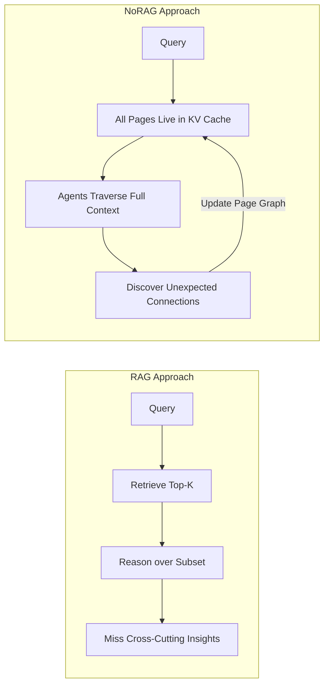
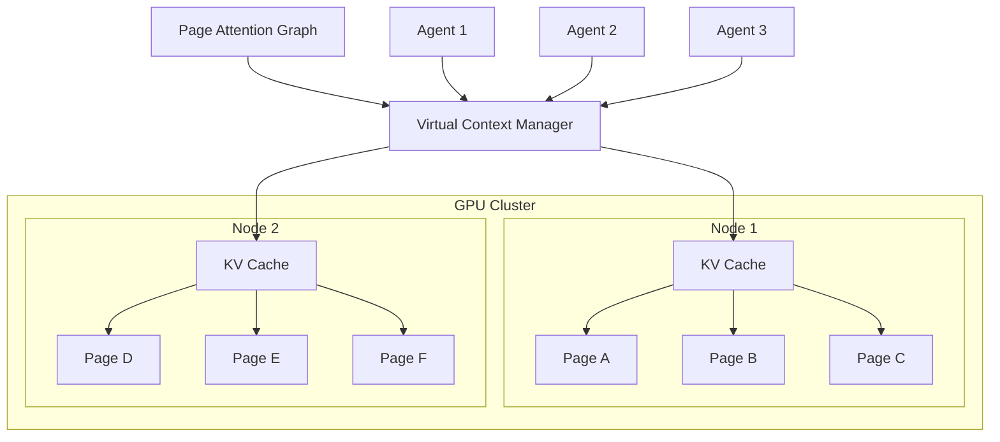

# The NoRAG Paradigm

Colony rejects retrieval-augmented generation (RAG) as the foundation for deep reasoning over extremely long context. This is not a minor architectural preference -- it is a fundamental disagreement about what reasoning requires.

## Explicit Context Is Better Than Implicit Context

LLMs learn vast amounts of knowledge during training, but this knowledge is *implicit* -- encoded in weights, distributed across layers, accessible only through the model's finite-depth forward pass. When a task requires deep, systemic reasoning (understanding a complex codebase, conducting multi-step scientific research, synthesizing a legal argument across thousands of documents), the model must first *explicate* the relevant implicit knowledge into explicit, live context before it can reason over it.

This is why chain-of-thought (CoT) prompting works: it forces the model to externalize intermediate reasoning steps as explicit text. But CoT has a ceiling. Reproducing *all* the implicit context necessary for a successful inference through CoT alone is not possible. The benefits plateau because the model cannot reconstruct, through sequential token generation, the full web of implicit associations that the task demands.

!!! tip "The Design Principle"
    If CoT plateaus because it cannot externalize enough implicit context, the solution is not better prompting -- it is providing more explicit context to reason over. Colony emphasizes reasoning over extremely long context (potentially billions of tokens) precisely because of this principle.

## Why Not RAG?

RAG activates only sparse subsets of a corpus at a time. For tasks that require **local (sparse) reasoning** -- adding type annotations to a codebase, answering factual questions from a knowledge base -- this is fine. But Colony targets a different class of problems: tasks requiring **global (systemic, dense) reasoning** that synthesize insights from many disparate parts of the context across many iterative passes.

In dense reasoning tasks, breakthroughs are unlocked by new insights synthesized from *unpredictable* combinations of previously known facts. A retrieval system, by definition, must predict which facts are relevant before the reasoning happens. This creates a chicken-and-egg problem: the most valuable connections are precisely the ones a retrieval model would not predict, because they span distant and seemingly unrelated parts of the context.

## Deep Research as a Game

Colony views deep research as a **game** where the moves available to agents are combinations of facts that offer the smallest leap to new insights. This framing has concrete architectural consequences:

- The **game state** is the full set of live context pages plus accumulated findings
- A **move** is a synthesis step that connects facts from different pages into a new insight
- The **strategy** is the order and combination in which pages are visited and cross-referenced
- **Winning** means reaching the deepest insights that the context can support

For this game to work, the entire context must remain live. You cannot play chess if most of the board is hidden behind a retrieval layer that only shows you the squares it thinks are relevant.

!!! warning "The Retrieval Trap"
    Retrieval systems optimize for *recall of known-relevant information*. Deep reasoning requires *discovery of unknown-relevant connections*. These are fundamentally different objectives, and optimizing for the first actively harms the second by hiding context that "seems" irrelevant.

## Why Not RNNs or State Space Models?

Recurrent neural networks and state space models (SSMs like Mamba) offer an alternative to transformers for processing long sequences: they compress context into a fixed-size hidden state. This sounds efficient, but it has a fatal flaw for deep reasoning.

Once an RNN or SSM decides to forget some context, **it cannot recover it**. The compression is irreversible. Information that seemed unimportant in early layers may turn out to be critical ten reasoning steps later, and there is no mechanism to retrieve it.

LLMs with external memory (Colony's architecture) can always retrieve forgotten context from external storage -- blackboard state, VCM pages, agent findings -- when the reasoning process discovers it is needed. This is the same advantage that random-access memory has over streaming tape: you can go back.

!!! note "Irreversible Forgetting"
    This is not a limitation that better training will fix. It is a structural property of recurrent architectures. The hidden state has finite capacity, and any compression scheme must discard information. Deep reasoning over extremely long context requires that *nothing* be permanently discarded until the task is complete.

## Virtual Memory for LLMs

If you cannot retrieve-and-forget, you need a system that can manage context at the scale of billions of tokens. Colony's answer is to treat KV cache management like an operating system treats virtual memory.

| OS Virtual Memory | Colony VCM |
|---|---|
| Virtual address space | Virtual context pages |
| Physical RAM | GPU KV cache capacity |
| Page tables | Page table state (per-agent) |
| Page faults | Cache misses on page access |
| Working set | Active pages for current reasoning |
| Page replacement (LRU, etc.) | Cache-aware eviction policies |
| Prefetching | Speculative page loading from page graph |

Context is partitioned into **pages** and managed through a **Virtual Context Manager (VCM)** that operates at the cluster level -- across GPU nodes, not just within a single device. Pages are loaded into and evicted from KV caches based on access patterns, with a dynamically-updated **page attention graph** that captures which pages answer queries from which other pages.

This is not a metaphor. Colony implements actual page fault semantics, working set tracking, and cache-aware scheduling -- the same fundamental mechanisms that made virtual memory one of the most successful abstractions in computing history. The difference is that "physical memory" is GPU KV cache capacity distributed across a cluster, and "addresses" are semantic page identifiers rather than integers.

## The Payoff: Amortized Efficiency

The initial cost of reasoning over all pages is high: $O(N^2)$ for routing queries among $N$ pages. But as the page attention graph stabilizes over successive reasoning rounds, the amortized cost per round drops to $O(N \log N)$. Deep reasoning tasks inherently require many rounds, so the graph has time to stabilize and the amortized cost dominates.

This is the same insight behind persistent data structures and amortized analysis in algorithms: pay a high upfront cost to build structure that makes all subsequent operations cheaper. Colony applies this principle to multi-agent reasoning over extremely long context.
